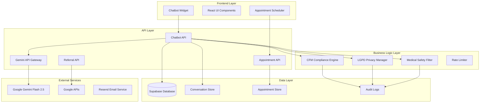

# Design Document

## Overview

The AI Chatbot Widget is a comprehensive medical-compliant conversational interface that integrates Google's Gemini Flash 2.5 model with the existing Saraiva Vision clinic infrastructure. The system provides intelligent patient interaction while maintaining strict adherence to CFM (Conselho Federal de Medicina) regulations and LGPD (Lei Geral de Proteção de Dados) compliance. The design leverages the existing appointment scheduling system, Supabase database, and security infrastructure while introducing advanced AI capabilities for enhanced patient experience.

## Architecture

### High-Level Architecture



### System Components

#### 1. Frontend Widget Architecture
- **React-based Widget**: Responsive, accessible chatbot interface
- **State Management**: Context API for conversation state and user preferences
- **Real-time Updates**: WebSocket connection for live appointment availability
- **Accessibility**: WCAG 2.1 AA compliance with screen reader support
- **Mobile Optimization**: Touch-friendly interface with gesture support

#### 2. API Gateway Architecture
- **Gemini Integration**: Direct integration with Google Gemini Flash 2.5 API
- **Request Processing**: Input validation, sanitization, and security filtering
- **Response Processing**: Medical compliance filtering and safety guardrails
- **Rate Limiting**: Advanced rate limiting with IP-based and session-based controls
- **Caching**: Intelligent response caching for common queries

#### 3. Compliance Engine Architecture
- **CFM Compliance Module**: Medical ethics validation and disclaimer injection
- **LGPD Privacy Module**: Data protection, consent management, and user rights
- **Audit System**: Comprehensive logging for regulatory compliance
- **Security Framework**: End-to-end encryption and secure data handling

## Components and Interfaces

### Core Components

#### 1. ChatbotWidget Component
```typescript
interface ChatbotWidgetProps {
  initialMessage?: string;
  theme?: 'light' | 'dark' | 'auto';
  position?: 'bottom-right' | 'bottom-left' | 'center';
  enableAppointmentBooking?: boolean;
  enableReferralRequests?: boolean;
  complianceMode?: 'strict' | 'standard';
}

interface ChatMessage {
  id: string;
  role: 'user' | 'assistant' | 'system';
  content: string;
  timestamp: Date;
  metadata?: {
    containsMedicalContent: boolean;
    requiresDisclaimer: boolean;
    suggestsAppointment: boolean;
    isEmergency: boolean;
  };
}
```

#### 2. GeminiService Integration
```typescript
interface GeminiServiceConfig {
  apiKey: string;
  model: 'gemini-2.5-flash';
  maxTokens: number;
  temperature: number;
  safetySettings: SafetySettings[];
  systemInstruction: string;
}

interface GeminiResponse {
  content: string;
  safetyRatings: SafetyRating[];
  finishReason: string;
  usage: TokenUsage;
}
```

#### 3. ComplianceEngine
```typescript
interface ComplianceResult {
  isCompliant: boolean;
  requiredDisclaimers: string[];
  emergencyDetected: boolean;
  medicalAdviceDetected: boolean;
  recommendedActions: ComplianceAction[];
}

interface LGPDConsent {
  userId: string;
  consentType: 'data_processing' | 'medical_data' | 'marketing';
  granted: boolean;
  timestamp: Date;
  ipAddress: string;
  userAgent: string;
}
```

### API Interfaces

#### 1. Chatbot API Endpoint
```typescript
// POST /api/chatbot/chat
interface ChatRequest {
  message: string;
  sessionId?: string;
  conversationHistory?: ChatMessage[];
  userConsent?: LGPDConsent[];
  context?: {
    appointmentIntent?: boolean;
    referralIntent?: boolean;
    emergencyContext?: boolean;
  };
}

interface ChatResponse {
  success: boolean;
  data: {
    response: string;
    sessionId: string;
    complianceInfo: ComplianceResult;
    suggestedActions: SuggestedAction[];
    appointmentAvailability?: AvailabilitySlot[];
  };
  metadata: {
    tokensUsed: number;
    responseTime: number;
    safetyScore: number;
  };
}
```

#### 2. Appointment Integration API
```typescript
// POST /api/chatbot/appointment/check-availability
interface AvailabilityRequest {
  preferredDates?: string[];
  timePreferences?: 'morning' | 'afternoon' | 'any';
  appointmentType?: string;
}

interface AvailabilityResponse {
  availableSlots: AvailabilitySlot[];
  nextAvailable: AvailabilitySlot;
  waitlistAvailable: boolean;
}

// POST /api/chatbot/appointment/book
interface BookingRequest {
  slotId: string;
  patientInfo: PatientInfo;
  appointmentType: string;
  notes?: string;
  consentGiven: boolean;
}
```

#### 3. Referral Management API
```typescript
// POST /api/chatbot/referral/request
interface ReferralRequest {
  patientInfo: PatientInfo;
  symptoms: string[];
  urgencyLevel: 'routine' | 'urgent' | 'emergency';
  specialtyRequested?: string;
  medicalHistory?: string;
}

interface ReferralResponse {
  referralId: string;
  recommendedSpecialists: Specialist[];
  estimatedWaitTime: string;
  requiredDocuments: string[];
  nextSteps: string[];
}
```

## Data Models

### Database Schema Extensions

#### 1. Chatbot Conversations Table
```sql
CREATE TABLE chatbot_conversations (
    id UUID PRIMARY KEY DEFAULT gen_random_uuid(),
    session_id VARCHAR(255) NOT NULL,
    user_message TEXT NOT NULL,
    bot_response TEXT NOT NULL,
    message_metadata JSONB,
    compliance_flags JSONB,
    created_at TIMESTAMP WITH TIME ZONE DEFAULT NOW(),
    updated_at TIMESTAMP WITH TIME ZONE DEFAULT NOW(),
    
    -- LGPD Compliance
    user_consent_id UUID REFERENCES user_consents(id),
    data_retention_until TIMESTAMP WITH TIME ZONE,
    anonymized BOOLEAN DEFAULT FALSE,
    
    -- Indexes
    INDEX idx_session_id (session_id),
    INDEX idx_created_at (created_at),
    INDEX idx_compliance_flags USING GIN (compliance_flags)
);
```

#### 2. User Consents Table
```sql
CREATE TABLE user_consents (
    id UUID PRIMARY KEY DEFAULT gen_random_uuid(),
    session_id VARCHAR(255),
    consent_type VARCHAR(100) NOT NULL,
    consent_granted BOOLEAN NOT NULL,
    consent_text TEXT NOT NULL,
    ip_address INET,
    user_agent TEXT,
    created_at TIMESTAMP WITH TIME ZONE DEFAULT NOW(),
    expires_at TIMESTAMP WITH TIME ZONE,
    revoked_at TIMESTAMP WITH TIME ZONE,
    
    -- LGPD Compliance
    legal_basis VARCHAR(100) NOT NULL,
    data_controller VARCHAR(255) NOT NULL DEFAULT 'Saraiva Vision',
    
    INDEX idx_session_id (session_id),
    INDEX idx_consent_type (consent_type),
    INDEX idx_created_at (created_at)
);
```

#### 3. Medical Referrals Table
```sql
CREATE TABLE medical_referrals (
    id UUID PRIMARY KEY DEFAULT gen_random_uuid(),
    patient_name VARCHAR(255) NOT NULL,
    patient_contact VARCHAR(255) NOT NULL,
    referring_symptoms TEXT[],
    specialty_requested VARCHAR(100),
    urgency_level VARCHAR(20) NOT NULL,
    status VARCHAR(50) DEFAULT 'pending',
    created_via VARCHAR(50) DEFAULT 'chatbot',
    session_id VARCHAR(255),
    
    -- CFM Compliance
    medical_disclaimer_shown BOOLEAN DEFAULT TRUE,
    requires_in_person_evaluation BOOLEAN DEFAULT TRUE,
    
    created_at TIMESTAMP WITH TIME ZONE DEFAULT NOW(),
    updated_at TIMESTAMP WITH TIME ZONE DEFAULT NOW(),
    
    INDEX idx_status (status),
    INDEX idx_urgency_level (urgency_level),
    INDEX idx_created_at (created_at)
);
```

### Configuration Models

#### 1. Medical Safety Configuration
```typescript
interface MedicalSafetyConfig {
  emergencyKeywords: string[];
  medicalTerms: string[];
  prohibitedAdvice: string[];
  requiredDisclaimers: {
    general: string;
    emergency: string;
    appointment: string;
    referral: string;
  };
  cfmCompliance: {
    disclaimerRequired: boolean;
    emergencyRedirectRequired: boolean;
    diagnosticProhibited: boolean;
    prescriptionProhibited: boolean;
  };
}
```

#### 2. LGPD Configuration
```typescript
interface LGPDConfig {
  dataRetentionPeriod: number; // days
  consentTypes: ConsentType[];
  userRights: UserRight[];
  dataProcessingPurposes: ProcessingPurpose[];
  encryptionSettings: {
    algorithm: string;
    keyRotationPeriod: number;
    encryptInTransit: boolean;
    encryptAtRest: boolean;
  };
}
```

## Error Handling

### Error Classification System

#### 1. Medical Safety Errors
```typescript
enum MedicalSafetyError {
  EMERGENCY_DETECTED = 'EMERGENCY_DETECTED',
  DIAGNOSTIC_ATTEMPT = 'DIAGNOSTIC_ATTEMPT',
  PRESCRIPTION_ATTEMPT = 'PRESCRIPTION_ATTEMPT',
  MEDICAL_ADVICE_VIOLATION = 'MEDICAL_ADVICE_VIOLATION'
}
```

#### 2. Compliance Errors
```typescript
enum ComplianceError {
  CONSENT_REQUIRED = 'CONSENT_REQUIRED',
  DATA_RETENTION_EXPIRED = 'DATA_RETENTION_EXPIRED',
  UNAUTHORIZED_DATA_ACCESS = 'UNAUTHORIZED_DATA_ACCESS',
  CFM_VIOLATION = 'CFM_VIOLATION'
}
```

#### 3. Technical Errors
```typescript
enum TechnicalError {
  GEMINI_API_ERROR = 'GEMINI_API_ERROR',
  RATE_LIMIT_EXCEEDED = 'RATE_LIMIT_EXCEEDED',
  DATABASE_ERROR = 'DATABASE_ERROR',
  VALIDATION_ERROR = 'VALIDATION_ERROR'
}
```

### Error Response Strategy

#### 1. Medical Safety Fallbacks
- Emergency detection → Immediate emergency contact information
- Medical advice attempt → Redirect to appointment booking
- Diagnostic request → CFM-compliant disclaimer with consultation recommendation

#### 2. Technical Fallbacks
- API failure → Cached responses or human handoff
- Database error → Graceful degradation with contact information
- Rate limiting → Queue system with estimated wait times

## Testing Strategy

### Testing Pyramid

#### 1. Unit Tests
- **Medical Safety Filters**: Test keyword detection and response filtering
- **LGPD Compliance**: Test consent management and data protection
- **API Integration**: Test Gemini API calls and error handling
- **Data Validation**: Test input sanitization and validation

#### 2. Integration Tests
- **End-to-End Conversations**: Test complete conversation flows
- **Appointment Booking**: Test integration with existing appointment system
- **Referral Processing**: Test referral creation and specialist coordination
- **Compliance Workflows**: Test CFM and LGPD compliance scenarios

#### 3. Compliance Tests
- **CFM Regulation Tests**: Verify medical ethics compliance
- **LGPD Privacy Tests**: Verify data protection and user rights
- **Security Tests**: Test encryption, authentication, and authorization
- **Audit Trail Tests**: Verify comprehensive logging and monitoring

### Test Scenarios

#### 1. Medical Compliance Scenarios
```typescript
const medicalTestCases = [
  {
    input: "Estou com dor no olho, o que pode ser?",
    expectedBehavior: "redirect_to_appointment",
    requiredDisclaimer: true,
    emergencyCheck: false
  },
  {
    input: "Perdi a visão de repente, socorro!",
    expectedBehavior: "emergency_response",
    requiredDisclaimer: true,
    emergencyCheck: true
  },
  {
    input: "Que remédio posso tomar para conjuntivite?",
    expectedBehavior: "no_prescription_advice",
    requiredDisclaimer: true,
    emergencyCheck: false
  }
];
```

#### 2. LGPD Compliance Scenarios
```typescript
const lgpdTestCases = [
  {
    scenario: "data_deletion_request",
    userAction: "delete_my_data",
    expectedResponse: "data_deletion_confirmation",
    timeframe: "30_days"
  },
  {
    scenario: "consent_withdrawal",
    userAction: "withdraw_consent",
    expectedResponse: "consent_withdrawal_processed",
    dataHandling: "stop_processing"
  }
];
```

### Performance Testing

#### 1. Load Testing
- **Concurrent Users**: Test 100+ simultaneous conversations
- **Response Time**: Maintain <3 second response times
- **API Rate Limits**: Test Gemini API rate limiting and fallbacks
- **Database Performance**: Test conversation logging under load

#### 2. Security Testing
- **Input Validation**: Test XSS, SQL injection, and other attacks
- **Authentication**: Test session management and security
- **Data Encryption**: Verify end-to-end encryption
- **Audit Logging**: Test comprehensive security event logging

## Security Considerations

### Data Protection Framework

#### 1. Encryption Strategy
- **In-Transit**: TLS 1.3 for all API communications
- **At-Rest**: AES-256 encryption for sensitive data
- **Key Management**: Automated key rotation every 90 days
- **PII Protection**: Tokenization of personally identifiable information

#### 2. Access Control
- **Role-Based Access**: Granular permissions for different user types
- **Session Management**: Secure session handling with automatic expiration
- **API Authentication**: JWT tokens with short expiration times
- **Audit Trails**: Comprehensive logging of all data access

#### 3. Privacy by Design
- **Data Minimization**: Collect only necessary information
- **Purpose Limitation**: Use data only for stated purposes
- **Storage Limitation**: Automatic data deletion after retention period
- **Transparency**: Clear privacy notices and consent mechanisms

### Compliance Monitoring

#### 1. Real-time Monitoring
- **Medical Safety Violations**: Immediate alerts for compliance breaches
- **Data Access Monitoring**: Track all personal data access
- **Consent Status Tracking**: Monitor consent validity and expiration
- **Security Event Detection**: Automated threat detection and response

#### 2. Audit and Reporting
- **Compliance Reports**: Automated CFM and LGPD compliance reports
- **Data Processing Records**: Detailed logs of all data processing activities
- **User Rights Fulfillment**: Track and report on user rights requests
- **Security Incident Reports**: Comprehensive incident documentation

This design provides a robust, compliant, and scalable foundation for the AI chatbot widget while maintaining the highest standards of medical ethics and data protection.