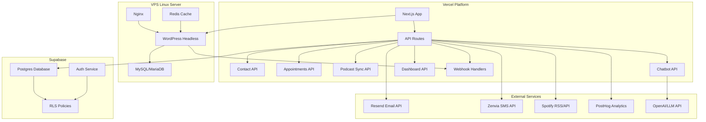

# Design Document

## Overview

This design implements a hybrid architecture combining Vercel's serverless platform with a VPS Linux server to modernize Saraiva Vision's backend infrastructure. The solution uses Next.js on Vercel for the frontend and API routes, headless WordPress on VPS for content management, Supabase Postgres for operational data, and integrates multiple third-party services for email, SMS, analytics, and AI chatbot functionality.

## Architecture

### High-Level Architecture



### Component Architecture

The system follows a microservices-inspired architecture optimized for serverless deployment:

1. **Frontend Layer**: Next.js 14 with App Router on Vercel
2. **API Gateway Layer**: Vercel serverless functions as API endpoints
3. **Content Management Layer**: Headless WordPress on VPS Linux
4. **Data Persistence Layer**: Supabase Postgres with Row Level Security
5. **Integration Layer**: Third-party service connectors
6. **Monitoring Layer**: Centralized logging and analytics

## Components and Interfaces

### Frontend Components

#### WordPress Content Integration
- **Purpose**: Consume headless WordPress content via GraphQL
- **Key Features**:
  - ISR (Incremental Static Regeneration) for performance
  - Webhook-triggered revalidation for real-time updates
  - SEO optimization with dynamic meta tags
  - Responsive design with Tailwind CSS

#### Appointment Booking Interface
- **Purpose**: Patient-facing appointment scheduling system
- **Key Features**:
  - Real-time availability checking
  - Brazilian timezone handling (America/Sao_Paulo)
  - Multi-step booking flow with confirmation
  - Accessibility compliance (WCAG 2.1 AA)

#### Podcast Player Integration
- **Purpose**: Display and play podcast episodes from Spotify
- **Key Features**:
  - Embedded Spotify player
  - Episode metadata display
  - Responsive grid layout
  - Loading states and error handling

#### AI Chatbot Widget
- **Purpose**: Interactive patient triage and FAQ system
- **Key Features**:
  - Floating chat interface
  - Context-aware responses
  - Escalation to human contact
  - LGPD-compliant data handling

### Backend Components

#### WordPress Headless CMS (VPS)
- **Purpose**: Content management system for clinic website
- **Technology Stack**:
  - WordPress 6.5 with PHP 8.2-FPM
  - MySQL/MariaDB 10.6
  - Nginx reverse proxy
  - Redis object cache
  - Docker Compose deployment

#### API Route Handlers (Vercel)

##### Contact API (`/api/contact`)
- **Purpose**: Handle contact form submissions with Resend integration
- **Features**:
  - Zod validation schema
  - Rate limiting with IP hashing
  - Outbox pattern for reliable delivery
  - LGPD consent validation

##### Appointments API (`/api/appointments`)
- **Purpose**: Manage appointment booking and confirmations
- **Endpoints**:
  - `GET /api/availability` - Available time slots
  - `POST /api/appointments` - Create appointment
  - `GET /api/appointments/confirm` - Confirm via token
- **Features**:
  - Conflict detection and prevention
  - Automated email/SMS confirmations
  - Reminder scheduling (T-24h, T-2h)

##### Podcast Sync API (`/api/podcast/sync`)
- **Purpose**: Synchronize Spotify episodes with local database
- **Features**:
  - RSS feed parsing
  - Spotify API integration
  - Incremental updates
  - Error handling with retry logic

##### Chatbot API (`/api/chatbot`)
- **Purpose**: AI-powered patient interaction system
- **Features**:
  - OpenAI GPT integration
  - Medical guardrails and limitations
  - Context management
  - Conversation logging (anonymized)

##### Dashboard API (`/api/status`)
- **Purpose**: Operational metrics and system health monitoring
- **Features**:
  - Real-time KPI calculation
  - Service status checking
  - Queue monitoring
  - Error rate tracking

#### Message Outbox System
- **Purpose**: Reliable message delivery with retry mechanisms
- **Features**:
  - Transactional outbox pattern
  - Exponential backoff retry logic
  - Dead letter queue for failed messages
  - Webhook handling for delivery status

## Data Models

### Supabase Database Schema

#### Contact Messages
```sql
CREATE TABLE contact_messages (
  id UUID PRIMARY KEY DEFAULT gen_random_uuid(),
  name VARCHAR(100) NOT NULL,
  email VARCHAR(255) NOT NULL,
  phone VARCHAR(20) NOT NULL,
  message TEXT NOT NULL,
  consent_given BOOLEAN NOT NULL DEFAULT false,
  ip_hash VARCHAR(64), -- SHA-256 hashed IP
  created_at TIMESTAMPTZ DEFAULT NOW(),
  updated_at TIMESTAMPTZ DEFAULT NOW()
);
```

#### Appointments
```sql
CREATE TABLE appointments (
  id UUID PRIMARY KEY DEFAULT gen_random_uuid(),
  patient_name VARCHAR(100) NOT NULL,
  patient_email VARCHAR(255) NOT NULL,
  patient_phone VARCHAR(20) NOT NULL,
  appointment_date DATE NOT NULL,
  appointment_time TIME NOT NULL,
  status VARCHAR(20) DEFAULT 'pending', -- pending, confirmed, cancelled
  confirmation_token VARCHAR(64) UNIQUE,
  notes TEXT,
  created_at TIMESTAMPTZ DEFAULT NOW(),
  confirmed_at TIMESTAMPTZ,
  reminder_24h_sent BOOLEAN DEFAULT false,
  reminder_2h_sent BOOLEAN DEFAULT false
);
```

#### Message Outbox
```sql
CREATE TABLE message_outbox (
  id UUID PRIMARY KEY DEFAULT gen_random_uuid(),
  message_type VARCHAR(20) NOT NULL, -- email, sms
  recipient VARCHAR(255) NOT NULL,
  subject VARCHAR(255),
  content TEXT NOT NULL,
  template_data JSONB,
  status VARCHAR(20) DEFAULT 'pending', -- pending, sent, failed
  retry_count INTEGER DEFAULT 0,
  max_retries INTEGER DEFAULT 3,
  send_after TIMESTAMPTZ DEFAULT NOW(),
  sent_at TIMESTAMPTZ,
  error_message TEXT,
  created_at TIMESTAMPTZ DEFAULT NOW()
);
```

#### Podcast Episodes
```sql
CREATE TABLE podcast_episodes (
  id UUID PRIMARY KEY DEFAULT gen_random_uuid(),
  spotify_id VARCHAR(255) UNIQUE,
  title VARCHAR(255) NOT NULL,
  description TEXT,
  duration_ms INTEGER,
  published_at TIMESTAMPTZ,
  spotify_url VARCHAR(500),
  embed_url VARCHAR(500),
  image_url VARCHAR(500),
  created_at TIMESTAMPTZ DEFAULT NOW(),
  updated_at TIMESTAMPTZ DEFAULT NOW()
);
```

#### Event Log
```sql
CREATE TABLE event_log (
  id UUID PRIMARY KEY DEFAULT gen_random_uuid(),
  event_type VARCHAR(50) NOT NULL,
  event_data JSONB,
  severity VARCHAR(20) DEFAULT 'info', -- debug, info, warn, error
  source VARCHAR(50), -- api endpoint or service name
  created_at TIMESTAMPTZ DEFAULT NOW()
);
```

### WordPress Data Models

#### Custom Post Types
- **Services**: Ophthalmology services and procedures
- **Team Members**: Doctor and staff profiles
- **Testimonials**: Patient reviews and success stories

#### Custom Fields (ACF)
- Service details (duration, preparation, recovery)
- Doctor specializations and certifications
- Testimonial ratings and patient demographics

## Error Handling

### Error Classification System

#### Client Errors (4xx)
- **400 Bad Request**: Invalid input data, missing required fields
- **401 Unauthorized**: Invalid authentication tokens
- **403 Forbidden**: Insufficient permissions
- **429 Too Many Requests**: Rate limit exceeded

#### Server Errors (5xx)
- **500 Internal Server Error**: Unexpected application errors
- **502 Bad Gateway**: WordPress or external service unavailable
- **503 Service Unavailable**: Temporary service overload
- **504 Gateway Timeout**: External API timeout

### Error Response Format
```typescript
interface ErrorResponse {
  success: false;
  error: {
    code: string;
    message: string;
    details?: Record<string, any>;
    timestamp: string;
    requestId: string;
  };
}
```

### Retry Strategies
- **Exponential Backoff**: 1s, 2s, 4s, 8s, 16s for transient failures
- **Circuit Breaker**: Fail fast after consecutive failures
- **Dead Letter Queue**: Store permanently failed messages for manual review

## Testing Strategy

### Unit Testing
- **API Routes**: Test request/response handling, validation, error scenarios
- **Business Logic**: Test appointment scheduling, conflict detection, availability calculation
- **Integration Services**: Mock external APIs (Resend, Zenvia, Spotify, OpenAI)
- **Database Operations**: Test CRUD operations and RLS policies

### Integration Testing
- **End-to-End Workflows**: Complete user journeys from form submission to confirmation
- **External Service Integration**: Test actual API calls with sandbox environments
- **WordPress Integration**: Test GraphQL queries and webhook delivery
- **Message Delivery**: Test email/SMS delivery with real providers

### Performance Testing
- **Load Testing**: Simulate concurrent users and appointment bookings
- **Cold Start Optimization**: Minimize serverless function initialization time
- **Database Performance**: Test query performance under load
- **CDN Performance**: Test static asset delivery and caching

### Security Testing
- **Input Validation**: Test XSS, SQL injection, and other attack vectors
- **Authentication**: Test JWT token validation and RLS policies
- **Rate Limiting**: Verify spam protection and legitimate user access
- **Data Privacy**: Ensure LGPD compliance and PII protection

## Deployment Configuration

### VPS Linux Setup (Ubuntu 22.04)

#### Docker Compose Configuration
```yaml
version: "3.9"
services:
  db:
    image: mariadb:10.6
    restart: unless-stopped
    environment:
      - MYSQL_DATABASE=wordpress
      - MYSQL_USER=wp
      - MYSQL_PASSWORD=${MYSQL_PASSWORD}
      - MYSQL_ROOT_PASSWORD=${MYSQL_ROOT_PASSWORD}
    volumes:
      - db_data:/var/lib/mysql

  redis:
    image: redis:6-alpine
    restart: unless-stopped
    command: ["redis-server", "--appendonly", "yes"]
    volumes:
      - redis_data:/data

  wp:
    image: wordpress:6.5-php8.2-fpm
    restart: unless-stopped
    environment:
      - WORDPRESS_DB_HOST=db
      - WORDPRESS_DB_USER=wp
      - WORDPRESS_DB_PASSWORD=${MYSQL_PASSWORD}
      - WORDPRESS_DB_NAME=wordpress
    volumes:
      - wp_data:/var/www/html

  nginx:
    image: nginx:stable
    restart: unless-stopped
    ports:
      - "80:80"
      - "443:443"
    volumes:
      - wp_data:/var/www/html:ro
      - ./nginx/conf.d:/etc/nginx/conf.d
      - /etc/letsencrypt:/etc/letsencrypt
    depends_on:
      - wp
      - redis

volumes:
  db_data:
  wp_data:
  redis_data:
```

#### Nginx Configuration
```nginx
server {
    listen 443 ssl http2;
    server_name cms.saraivavision.com.br;
    root /var/www/html;
    index index.php;

    ssl_certificate /etc/letsencrypt/live/cms.saraivavision.com.br/fullchain.pem;
    ssl_certificate_key /etc/letsencrypt/live/cms.saraivavision.com.br/privkey.pem;

    location / {
        try_files $uri $uri/ /index.php?$args;
    }

    location ~ \.php$ {
        include fastcgi_params;
        fastcgi_param SCRIPT_FILENAME $document_root$fastcgi_script_name;
        fastcgi_pass wp:9000;
    }

    location ~* \.(jpg|jpeg|png|gif|ico|css|js|svg)$ {
        expires 7d;
        access_log off;
    }
}
```

### Vercel Configuration

#### Environment Variables
```bash
# WordPress Integration
WORDPRESS_GRAPHQL_ENDPOINT=https://cms.saraivavision.com.br/graphql
WP_REVALIDATE_SECRET=supersecret_revalidate_token

# Database
SUPABASE_URL=https://your-project.supabase.co
SUPABASE_ANON_KEY=your_anon_key
SUPABASE_SERVICE_ROLE_KEY=your_service_role_key

# Email & SMS
RESEND_API_KEY=re_your_api_key
DOCTOR_EMAIL=philipe_cruz@outlook.com
ZENVIA_API_TOKEN=your_zenvia_token
ZENVIA_FROM_NUMBER=+5511999999999

# External Services
SPOTIFY_RSS_URL=https://anchor.fm/s/your-podcast/podcast/rss
OPENAI_API_KEY=sk-your_openai_key
POSTHOG_KEY=phc_your_posthog_key

# System Configuration
TIMEZONE=America/Sao_Paulo
RATE_LIMIT_WINDOW=15
RATE_LIMIT_MAX=10
NODE_ENV=production
```

#### Vercel Functions Configuration
```json
{
  "functions": {
    "api/contact.js": { "maxDuration": 10 },
    "api/appointments.js": { "maxDuration": 15 },
    "api/podcast/sync.js": { "maxDuration": 30 },
    "api/chatbot.js": { "maxDuration": 20 }
  },
  "crons": [
    {
      "path": "/api/outbox/drain",
      "schedule": "*/5 * * * *"
    },
    {
      "path": "/api/podcast/sync",
      "schedule": "0,30 * * * *"
    }
  ]
}
```

### Security Configuration

#### Row Level Security (RLS) Policies
```sql
-- Enable RLS on all tables
ALTER TABLE contact_messages ENABLE ROW LEVEL SECURITY;
ALTER TABLE appointments ENABLE ROW LEVEL SECURITY;
ALTER TABLE message_outbox ENABLE ROW LEVEL SECURITY;
ALTER TABLE event_log ENABLE ROW LEVEL SECURITY;

-- Service role has full access
CREATE POLICY srv_all_contact ON contact_messages FOR ALL TO service_role USING (true);
CREATE POLICY srv_all_appointments ON appointments FOR ALL TO service_role USING (true);
CREATE POLICY srv_all_outbox ON message_outbox FOR ALL TO service_role USING (true);
CREATE POLICY srv_all_events ON event_log FOR ALL TO service_role USING (true);

-- Admin users can read operational data
CREATE POLICY admin_read_contact ON contact_messages 
  FOR SELECT TO authenticated 
  USING (auth.jwt() ->> 'role' = 'admin');

CREATE POLICY admin_read_appointments ON appointments 
  FOR SELECT TO authenticated 
  USING (auth.jwt() ->> 'role' = 'admin');
```

#### CORS Configuration
```typescript
// api/cors.ts
export const corsHeaders = {
  'Access-Control-Allow-Origin': 'https://saraivavision.com.br',
  'Access-Control-Allow-Methods': 'GET, POST, PUT, DELETE, OPTIONS',
  'Access-Control-Allow-Headers': 'Content-Type, Authorization',
  'Access-Control-Max-Age': '86400',
};
```

### Monitoring and Observability

#### Structured Logging Format
```typescript
interface LogEntry {
  timestamp: string;
  level: 'debug' | 'info' | 'warn' | 'error';
  message: string;
  service: string;
  requestId: string;
  userId?: string;
  metadata?: Record<string, any>;
}
```

#### Health Check Endpoints
- `/api/health` - Basic service health
- `/api/health/detailed` - Comprehensive system status
- `/api/health/dependencies` - External service connectivity

This design ensures a robust, scalable, and compliant backend system that meets all requirements for Saraiva Vision's digital transformation while maintaining optimal performance and security standards.