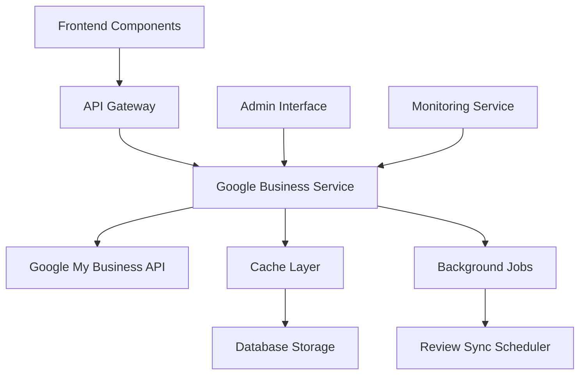

# Design Document

## Overview

The Google Business Reviews integration will leverage the Google My Business API (v4) to fetch and display live reviews, ratings, and business statistics on the website. The system will implement a robust caching strategy, real-time updates, and fallback mechanisms to ensure reliable display of customer testimonials while maintaining optimal performance.

The integration will consist of backend API endpoints for data fetching, a caching layer for performance optimization, frontend components for display, and an admin interface for configuration and monitoring.

## Architecture

### High-Level Architecture



### Component Breakdown

1. **Frontend Layer**
   - React components for review display
   - Admin dashboard for configuration
   - Real-time updates via WebSocket/SSE

2. **Backend Services**
   - Google Business API integration service
   - Caching and data persistence layer
   - Background job processing for scheduled updates
   - Monitoring and alerting system

3. **Data Storage**
   - Primary cache (Redis) for fast access
   - Database storage (PostgreSQL) for persistence
   - Encrypted credential storage

## Components and Interfaces

### 1. Google Business API Service

**Purpose**: Handle all interactions with Google My Business API

**Key Methods**:
```javascript
class GoogleBusinessService {
  async fetchReviews(locationId, options = {})
  async fetchBusinessInfo(locationId)
  async getReviewStats(locationId)
  async authenticateAPI()
  async handleRateLimit()
}
```

**Configuration**:
- API credentials management
- Rate limiting (1000 requests per day default)
- Error handling and retry logic
- Request/response logging

### 2. Review Cache Manager

**Purpose**: Optimize performance through intelligent caching

**Key Methods**:
```javascript
class ReviewCacheManager {
  async getCachedReviews(locationId)
  async setCachedReviews(locationId, reviews, ttl)
  async invalidateCache(locationId)
  async getLastUpdateTime(locationId)
}
```

**Caching Strategy**:
- Redis for fast access (TTL: 24 hours)
- Database backup for persistence
- Stale-while-revalidate pattern
- Cache warming for critical data

### 3. Frontend Components

#### ReviewsContainer Component
```jsx
const ReviewsContainer = ({
  locationId,
  displayCount = 5,
  showStats = true,
  enableFiltering = true
}) => {
  // Main container for all review functionality
}
```

#### ReviewCard Component
```jsx
const ReviewCard = ({
  review,
  showReply = true,
  expandable = true,
  showDate = true
}) => {
  // Individual review display
}
```

#### BusinessStats Component
```jsx
const BusinessStats = ({
  locationId,
  showTrends = false,
  showDistribution = true
}) => {
  // Aggregate statistics display
}
```

### 4. Admin Configuration Interface

**Features**:
- API key management (encrypted storage)
- Location ID configuration
- Display preferences
- Monitoring dashboard
- Manual sync triggers

### 5. Background Job System

**Scheduled Jobs**:
- Daily review sync (configurable interval)
- API quota monitoring
- Cache cleanup
- Error notification dispatch

## Data Models

### Review Model
```javascript
{
  id: string,
  reviewId: string,
  locationId: string,
  reviewer: {
    displayName: string,
    profilePhotoUrl: string,
    isAnonymous: boolean
  },
  starRating: number, // 1-5
  comment: string,
  createTime: Date,
  updateTime: Date,
  reviewReply: {
    comment: string,
    updateTime: Date
  },
  isFeatured: boolean,
  isVisible: boolean,
  cachedAt: Date
}
```

### Business Stats Model
```javascript
{
  locationId: string,
  averageRating: number,
  totalReviews: number,
  ratingDistribution: {
    1: number,
    2: number,
    3: number,
    4: number,
    5: number
  },
  lastUpdated: Date,
  trends: {
    period: string,
    averageRating: number,
    reviewCount: number
  }[]
}
```

### Configuration Model
```javascript
{
  locationId: string,
  apiCredentials: string, // encrypted
  displaySettings: {
    maxReviews: number,
    minRating: number,
    showAnonymous: boolean,
    enableFiltering: boolean
  },
  syncSettings: {
    interval: number, // hours
    autoSync: boolean,
    notifyOnErrors: boolean
  },
  isActive: boolean
}
```

## Error Handling

### API Error Scenarios

1. **Authentication Failures**
   - Retry with exponential backoff
   - Alert administrators
   - Fall back to cached data

2. **Rate Limit Exceeded**
   - Implement intelligent queuing
   - Extend cache TTL temporarily
   - Schedule retry after quota reset

3. **Network Timeouts**
   - 10-second timeout limit
   - Graceful degradation to cached content
   - Background retry mechanism

4. **Invalid Location ID**
   - Validation during configuration
   - Clear error messages
   - Fallback to manual review entry

### Frontend Error Handling

```jsx
const ErrorBoundary = ({ children, fallback }) => {
  // Catch and handle component errors
  // Display fallback UI
  // Log errors for monitoring
}
```

## Testing Strategy

### Unit Tests
- Google Business Service methods
- Cache manager functionality
- Data model validation
- Component rendering

### Integration Tests
- API authentication flow
- End-to-end review fetching
- Cache invalidation scenarios
- Error handling workflows

### Performance Tests
- API response time monitoring
- Cache hit/miss ratios
- Component rendering performance
- Memory usage optimization

### Security Tests
- API credential encryption
- Input sanitization
- XSS prevention
- Rate limiting effectiveness

## Security Considerations

### API Security
- Encrypted credential storage using AES-256
- Environment variable management
- API key rotation capability
- Request signing and validation

### Data Privacy
- LGPD/GDPR compliance for review data
- Personal information sanitization
- User consent management
- Data retention policies

### Frontend Security
- XSS prevention through sanitization
- CSP headers for external content
- Secure image loading from Google
- Input validation for admin interface

## Performance Optimization

### Caching Strategy
- Multi-layer caching (Redis + Database)
- Stale-while-revalidate pattern
- Preemptive cache warming
- Intelligent cache invalidation

### Frontend Optimization
- Lazy loading for review images
- Virtual scrolling for large review lists
- Component memoization
- Bundle splitting for admin interface

### API Optimization
- Request batching where possible
- Selective field fetching
- Compression for large responses
- Connection pooling

## Monitoring and Analytics

### Key Metrics
- API response times
- Cache hit ratios
- Error rates by type
- Review display engagement

### Alerting
- API quota approaching limits
- Authentication failures
- Extended downtime
- Cache performance degradation

### Logging
- Structured logging with correlation IDs
- API request/response logging
- Error tracking with stack traces
- Performance metrics collection

## Deployment Considerations

### Environment Configuration
- Separate API keys for dev/staging/production
- Environment-specific cache settings
- Feature flags for gradual rollout
- Database migration scripts

### Scalability
- Horizontal scaling for API services
- Redis cluster for cache layer
- CDN integration for static assets
- Load balancing for high traffic

### Backup and Recovery
- Regular database backups
- Cache data persistence
- API credential backup
- Disaster recovery procedures