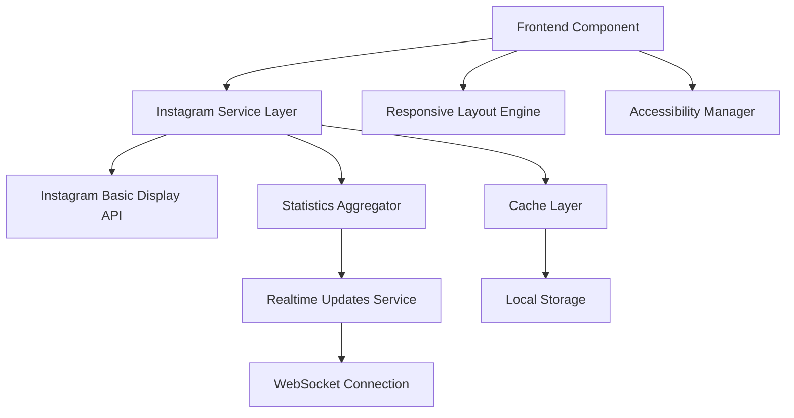

# Design Document

## Overview

The Instagram Embedded System is a comprehensive solution that integrates Instagram content directly into the website, displaying the 4 most recent posts with realtime engagement statistics. The system leverages the existing Instagram API infrastructure while adding enhanced features for statistics tracking, responsive design, and accessibility compliance.

## Architecture

### System Components



### Data Flow

1. **Initial Load**: Component requests posts from service layer
2. **Cache Check**: Service checks for valid cached data (5-minute TTL)
3. **API Fetch**: If cache miss, fetch from Instagram API
4. **Statistics Enhancement**: Aggregate engagement metrics
5. **Realtime Updates**: Establish WebSocket connection for live stats
6. **Responsive Rendering**: Adapt layout based on device capabilities

## Components and Interfaces

### Core Components

#### 1. InstagramFeedContainer
- **Purpose**: Main container component managing state and data flow
- **Props**: 
  - `maxPosts: number` (default: 4)
  - `showStats: boolean` (default: true)
  - `refreshInterval: number` (default: 300000ms)
  - `layout: 'grid' | 'carousel'` (default: 'grid')
- **State Management**: Uses React hooks for posts, loading, and error states

#### 2. InstagramPost
- **Purpose**: Individual post display component
- **Props**:
  - `post: InstagramPostData`
  - `showStats: boolean`
  - `onPostClick: (post) => void`
- **Features**: Image optimization, caption truncation, accessibility attributes

#### 3. InstagramStats
- **Purpose**: Realtime statistics display component
- **Props**:
  - `postId: string`
  - `initialStats: StatsData`
  - `realtime: boolean`
- **Features**: Auto-refresh, tooltip details, loading indicators

#### 4. InstagramFallback
- **Purpose**: Error state and offline content display
- **Props**:
  - `fallbackPosts: InstagramPostData[]`
  - `errorMessage: string`
- **Features**: Graceful degradation, retry mechanisms

### Service Layer

#### InstagramService
```typescript
interface InstagramService {
  fetchPosts(limit?: number): Promise<InstagramPostData[]>
  getPostStats(postId: string): Promise<PostStats>
  subscribeToStats(postId: string, callback: (stats: PostStats) => void): () => void
  clearCache(): Promise<void>
}
```

#### CacheManager
```typescript
interface CacheManager {
  get<T>(key: string): T | null
  set<T>(key: string, value: T, ttl?: number): void
  invalidate(key: string): void
  isExpired(key: string): boolean
}
```

## Data Models

### InstagramPostData
```typescript
interface InstagramPostData {
  id: string
  caption: string
  media_type: 'IMAGE' | 'VIDEO' | 'CAROUSEL_ALBUM'
  media_url: string
  thumbnail_url?: string
  permalink: string
  timestamp: string
  username: string
  stats?: PostStats
  fallback?: boolean
}
```

### PostStats
```typescript
interface PostStats {
  likes: number
  comments: number
  engagement_rate: number
  reach?: number
  impressions?: number
  last_updated: string
}
```

### ComponentConfig
```typescript
interface InstagramFeedConfig {
  maxPosts: number
  showStats: boolean
  refreshInterval: number
  layout: 'grid' | 'carousel'
  theme: 'light' | 'dark' | 'auto'
  enableLazyLoading: boolean
  enableAccessibility: boolean
}
```

## Error Handling

### Error Types and Responses

1. **API Rate Limiting**
   - Fallback to cached data
   - Display rate limit warning
   - Implement exponential backoff

2. **Network Connectivity Issues**
   - Show offline indicator
   - Use cached/fallback content
   - Auto-retry when connection restored

3. **Authentication Errors**
   - Log security events
   - Display generic error message
   - Notify administrators

4. **Invalid Data Responses**
   - Validate all API responses
   - Filter out malformed posts
   - Log data quality issues

### Error Recovery Strategies

```typescript
interface ErrorRecoveryStrategy {
  retryAttempts: number
  backoffMultiplier: number
  fallbackToCache: boolean
  showUserMessage: boolean
  logError: boolean
}
```

## Testing Strategy

### Unit Tests
- Component rendering with various props
- Service layer API interactions
- Cache management functionality
- Error handling scenarios
- Accessibility compliance

### Integration Tests
- End-to-end post fetching flow
- Realtime statistics updates
- Responsive layout behavior
- Cross-browser compatibility

### Performance Tests
- Load time measurements
- Memory usage monitoring
- API rate limit compliance
- Image loading optimization

### Accessibility Tests
- Screen reader compatibility
- Keyboard navigation
- Color contrast validation
- ARIA attributes verification

## Implementation Phases

### Phase 1: Core Infrastructure
- Extend existing Instagram API service
- Implement enhanced caching layer
- Create base React components
- Add error handling framework

### Phase 2: Statistics Integration
- Develop realtime statistics service
- Implement WebSocket connections
- Create statistics display components
- Add performance monitoring

### Phase 3: UI/UX Enhancement
- Implement responsive grid layout
- Add loading states and animations
- Create accessibility features
- Optimize image loading

### Phase 4: Configuration & Admin
- Build configuration interface
- Add admin controls
- Implement content filtering
- Create monitoring dashboard

## Security Considerations

### API Security
- Server-side token storage
- Request rate limiting
- Input validation and sanitization
- CORS policy enforcement

### Data Privacy
- Minimal data collection
- Secure data transmission
- Cache encryption for sensitive data
- GDPR compliance measures

### Content Security
- Image URL validation
- XSS prevention in captions
- Content filtering capabilities
- Safe external link handling

## Performance Optimizations

### Frontend Optimizations
- Lazy loading for images
- Virtual scrolling for large datasets
- Component memoization
- Bundle size optimization

### Backend Optimizations
- Intelligent caching strategies
- API response compression
- Database query optimization
- CDN integration for images

### Network Optimizations
- Image format optimization (WebP/AVIF)
- Progressive image loading
- Request batching
- Connection pooling