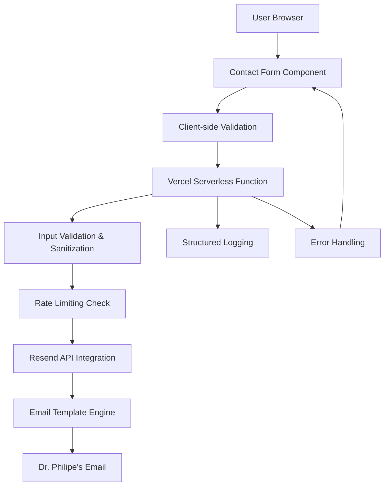

# Design Document

## Overview

This design outlines the technical implementation for integrating Resend API with the existing contact form, deployed on Vercel's serverless platform. The solution prioritizes reliability, security, and LGPD compliance while maintaining optimal performance for medical practice communications.

## Architecture

### High-Level Architecture



### Component Architecture

The system follows a layered architecture optimized for Vercel's serverless environment:

1. **Presentation Layer**: React contact form component with accessibility features
2. **API Layer**: Vercel serverless function handling requests
3. **Business Logic Layer**: Validation, rate limiting, and email processing
4. **Integration Layer**: Resend API communication
5. **Monitoring Layer**: Structured logging and error tracking

## Components and Interfaces

### Frontend Components

#### ContactForm Component
- **Purpose**: Enhanced existing contact form with Resend integration
- **Key Features**:
  - Real-time client-side validation
  - LGPD consent checkbox with privacy notice
  - Loading states and user feedback
  - Accessibility compliance (WCAG 2.1 AA)
  - Error message display with screen reader support

#### FormValidation Service
- **Purpose**: Client-side validation logic
- **Key Features**:
  - Brazilian phone number format validation
  - Email format validation
  - Required field validation
  - Real-time feedback

### Backend Components

#### Contact API Endpoint (`/api/contact`)
- **Purpose**: Vercel serverless function for form processing
- **Input**: Form data (name, email, phone, message, consent)
- **Output**: Success/error response with appropriate HTTP status codes
- **Key Features**:
  - Stateless design for serverless optimization
  - Input sanitization and validation
  - Rate limiting integration
  - Structured error responses

#### Validation Library
- **Purpose**: Server-side input validation using Zod
- **Key Features**:
  - Schema-based validation
  - XSS prevention through input sanitization
  - Brazilian phone number format validation
  - LGPD consent validation

#### Email Service
- **Purpose**: Resend API integration and email template management
- **Key Features**:
  - Professional medical email templates (HTML + text)
  - Template data mapping
  - Retry logic with exponential backoff
  - Delivery status tracking

#### Rate Limiting Service
- **Purpose**: Spam protection optimized for serverless
- **Key Features**:
  - IP-based rate limiting with hashed storage
  - Stateless implementation using global objects
  - Automatic cleanup of expired entries
  - Configurable rate limits

## Data Models

### ContactSubmission Model
```typescript
interface ContactSubmission {
  name: string;           // Required, 2-100 characters
  email: string;          // Required, valid email format
  phone: string;          // Required, Brazilian format (+55...)
  message: string;        // Required, 10-2000 characters
  consent: boolean;       // Required, must be true
  honeypot?: string;      // Hidden field for spam detection
  timestamp: Date;        // Auto-generated
  ipAddress: string;      // Hashed for privacy
}
```

### EmailTemplate Model
```typescript
interface EmailTemplate {
  to: string;             // Dr. Philipe's email
  subject: string;        // Formatted subject line
  html: string;           // Professional HTML template
  text: string;           // Plain text fallback
  replyTo: string;        // Patient's email
}
```

### RateLimitEntry Model
```typescript
interface RateLimitEntry {
  hashedIp: string;       // SHA-256 hashed IP
  attempts: number;       // Current attempt count
  windowStart: Date;      // Rate limit window start
  expiresAt: Date;        // Entry expiration
}
```

## Error Handling

### Error Classification

#### Validation Errors (400)
- Invalid email format
- Missing required fields
- Invalid phone number format
- Missing LGPD consent
- Message too long/short

#### Rate Limiting Errors (429)
- Too many requests from IP
- Spam detection triggered
- Honeypot field filled

#### Service Errors (500)
- Resend API failures
- Network connectivity issues
- Template generation errors
- Internal server errors

### Error Response Format
```typescript
interface ErrorResponse {
  success: false;
  error: {
    code: string;         // Error classification code
    message: string;      // User-friendly message
    field?: string;       // Specific field for validation errors
    retryAfter?: number;  // Seconds for rate limit errors
  };
}
```

### Retry Strategy
- **Client-side**: Exponential backoff for network errors (1s, 2s, 4s)
- **Server-side**: Resend API retry with circuit breaker pattern
- **User guidance**: Clear instructions for error recovery

## Testing Strategy

### Unit Testing
- **Validation Library**: Test all validation rules and edge cases
- **Email Service**: Mock Resend API responses and test template generation
- **Rate Limiting**: Test IP hashing, cleanup, and limit enforcement
- **API Endpoint**: Test request/response handling and error scenarios

### Integration Testing
- **End-to-End Flow**: Form submission to email delivery
- **Error Scenarios**: Network failures, API errors, validation failures
- **Rate Limiting**: Verify spam protection and legitimate user access
- **Email Delivery**: Verify template formatting and delivery to Dr. Philipe

### Performance Testing
- **Response Time**: Verify <3 second requirement including cold starts
- **Concurrent Requests**: Test serverless function scaling
- **Memory Usage**: Optimize for Vercel's memory limits
- **Cold Start Optimization**: Minimize function initialization time

### Accessibility Testing
- **WCAG 2.1 AA Compliance**: Automated and manual testing
- **Screen Reader Testing**: Verify form navigation and error announcements
- **Keyboard Navigation**: Test all interactive elements
- **Color Contrast**: Verify sufficient contrast ratios

### Security Testing
- **Input Sanitization**: Test XSS prevention and injection attacks
- **Rate Limiting**: Verify spam protection effectiveness
- **Data Privacy**: Ensure no PII exposure in logs
- **LGPD Compliance**: Verify consent handling and data minimization

## Deployment Configuration

### Vercel Configuration (`vercel.json`)
```json
{
  "functions": {
    "api/contact.js": {
      "maxDuration": 10
    }
  },
  "env": {
    "RESEND_API_KEY": "@resend-api-key",
    "DOCTOR_EMAIL": "@doctor-email",
    "NODE_ENV": "@node-env"
  }
}
```

### Environment Variables
- `RESEND_API_KEY`: Resend API authentication key
- `DOCTOR_EMAIL`: Dr. Philipe's email address
- `NODE_ENV`: Environment identifier (production/development)
- `RATE_LIMIT_WINDOW`: Rate limiting window in minutes
- `RATE_LIMIT_MAX`: Maximum requests per window

### Security Considerations
- API keys stored securely in Vercel environment variables
- Input sanitization at multiple layers
- Rate limiting to prevent abuse
- Structured logging without PII exposure
- HTTPS enforcement for all communications
- CORS configuration for API endpoints

This design ensures a robust, scalable, and compliant email integration system optimized for Vercel's serverless platform while meeting all medical practice requirements and LGPD compliance standards.