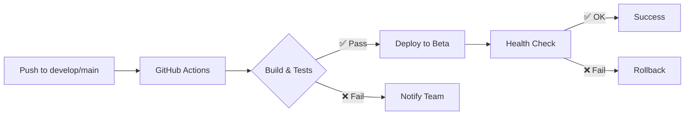
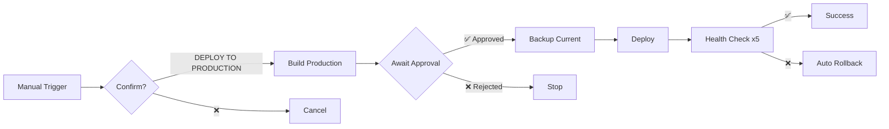

# 🚀 CI/CD Pipeline - Saraiva Vision

Pipeline completo de Continuous Integration/Continuous Deployment com ambientes Beta e Produção.

---

## 📋 Índice

1. [Visão Geral](#visão-geral)
2. [Arquitetura de Ambientes](#arquitetura-de-ambientes)
3. [Workflow de Deploy](#workflow-de-deploy)
4. [Configuração Inicial](#configuração-inicial)
5. [Uso do Pipeline](#uso-do-pipeline)
6. [Rollback e Recuperação](#rollback-e-recuperação)
7. [Monitoramento](#monitoramento)
8. [Troubleshooting](#troubleshooting)

---

## 🎯 Visão Geral

O pipeline CI/CD do Saraiva Vision implementa uma estratégia de **deployment em dois estágios** (Beta → Produção) com aprovação manual obrigatória para produção.

### Características Principais

- ✅ **Deploy Automático para Beta**: Toda alteração em `develop` ou `main` vai automaticamente para beta
- 🔒 **Deploy Manual para Produção**: Requer aprovação explícita e confirmação
- 🔄 **Rollback Rápido**: Sistema de releases versionadas permite rollback instantâneo
- 📊 **Health Checks**: Validação automática após cada deploy
- 💾 **Backups Automáticos**: Backup antes de cada deploy e rollback
- 🧹 **Cleanup Inteligente**: Mantém últimas N releases (10 prod, 5 beta)

### Stack Tecnológico

| Componente | Tecnologia |
|------------|-----------|
| **CI/CD** | GitHub Actions |
| **Frontend** | React 18 + Vite |
| **Backend** | Node.js 22+ + Express |
| **Web Server** | Nginx |
| **Hospedagem** | VPS (31.97.129.78) |
| **SSL** | Let's Encrypt (Certbot) |

---

## 🏗️ Arquitetura de Ambientes

### Ambiente Beta (Staging)

```
Domínio: beta.saraivavision.com.br
Path: /var/www/saraivavision/beta
Port API: 3002
Deploy: AUTOMÁTICO
Acesso: Equipe + Stakeholders
```

**Características:**
- Cache curto (5 minutos)
- Logs separados (`/var/log/nginx/beta-*`)
- Headers de debug ativados
- `robots.txt` bloqueia indexação
- Banner "BETA" visível no site

### Ambiente Produção

```
Domínio: saraivavision.com.br
Path: /var/www/saraivavision/current
Port API: 3001
Deploy: MANUAL (aprovação obrigatória)
Acesso: Público
```

**Características:**
- Cache agressivo (1 ano para assets)
- Logs de produção
- Security headers completos
- SEO otimizado
- Analytics ativado

### Estrutura de Diretórios

```
/var/www/saraivavision/
├── beta/                    # Symlink para release beta atual
├── current/                 # Symlink para release produção atual
├── releases/
│   ├── beta/
│   │   ├── 20251006_080517/
│   │   ├── 20251006_091234/
│   │   └── ...
│   └── production/
│       ├── 20251005_140000/
│       ├── 20251006_100000/
│       └── ...
└── backups/
    ├── beta/
    │   └── backup_20251006_080517/
    └── production/
        └── backup_20251006_100000/
```

---

## 🔄 Workflow de Deploy

### 1. Deploy para Beta (Automático)



**Trigger:**
- Push para branch `develop`
- Push para branch `main`
- Push para branches `feature/**`

**Processo:**
1. Checkout do código
2. Setup Node.js 22.x
3. Install dependencies (`npm ci`)
4. Lint code
5. Run tests
6. Build para beta (`ENVIRONMENT=beta`)
7. Upload artifacts
8. Deploy via SSH
9. Health check
10. Cleanup releases antigas

**Tempo Estimado:** 5-10 minutos

### 2. Deploy para Produção (Manual)



**Trigger:**
- Workflow dispatch (manual) via GitHub Actions UI

**Requisitos:**
1. Digitar exatamente: `DEPLOY TO PRODUCTION`
2. Aprovação de 1+ reviewer autorizado
3. Testes passando
4. Beta testado e validado

**Processo:**
1. Validação da confirmação
2. Build production otimizado
3. Validação de arquivos críticos
4. **Aguardar aprovação manual**
5. Backup produção atual
6. Deploy atômico (symlink swap)
7. Reload Nginx
8. 5 health checks consecutivos
9. Monitoring pós-deploy (60s)
10. Upload rollback script

**Tempo Estimado:** 15-20 minutos (+ tempo de aprovação)

---

## ⚙️ Configuração Inicial

### Passo 1: Configurar VPS

```bash
# Executar no VPS como root
cd /home/saraiva-vision-site
sudo bash scripts/setup-beta-environment.sh
```

Este script irá:
- ✅ Criar estrutura de diretórios
- ✅ Configurar Nginx para beta
- ✅ Obter certificado SSL (se DNS configurado)
- ✅ Criar página placeholder
- ✅ Validar configuração

### Passo 2: Configurar DNS

Adicionar registro no seu provedor de DNS:

```
Tipo: A
Nome: beta
Valor: 31.97.129.78
TTL: 300
```

**OU**

```
Tipo: CNAME
Nome: beta
Valor: saraivavision.com.br
TTL: 300
```

### Passo 3: Configurar GitHub Secrets

Acessar: `Settings > Secrets and variables > Actions`

Adicionar os seguintes secrets:

#### Secrets Obrigatórios

```bash
# Acesso VPS
VPS_HOST=31.97.129.78
VPS_SSH_KEY=<conteúdo da chave SSH privada>

# Google APIs - Beta
BETA_GOOGLE_MAPS_API_KEY=<key de desenvolvimento>
BETA_GOOGLE_PLACES_API_KEY=<key de desenvolvimento>

# Google APIs - Produção
GOOGLE_MAPS_API_KEY=<key de produção>
GOOGLE_PLACES_API_KEY=<key de produção>
GOOGLE_PLACE_ID=ChIJXxxxxxxxxxxxxxxxxxxx

# Analytics
GA_TRACKING_ID=G-XXXXXXXXXX
```

#### Como obter SSH_KEY

```bash
# No VPS, gerar nova chave (se necessário)
ssh-keygen -t ed25519 -C "github-actions@saraivavision" -f ~/.ssh/github-actions

# Adicionar ao authorized_keys
cat ~/.ssh/github-actions.pub >> ~/.ssh/authorized_keys

# Copiar chave privada (adicionar como secret VPS_SSH_KEY)
cat ~/.ssh/github-actions
```

### Passo 4: Configurar Environments no GitHub

Acessar: `Settings > Environments`

#### Environment: `beta`

```yaml
Protection rules: None
Deployment branches: develop, main, feature/**
```

#### Environment: `production`

```yaml
Protection rules:
  ✅ Required reviewers: 1 (adicionar usuários autorizados)
  ✅ Wait timer: 0 minutes
Deployment branches: main only
```

#### Environment: `production-build`

```yaml
Protection rules: None
Deployment branches: main only
```

### Passo 5: Configurar Branch Protection

Acessar: `Settings > Branches > Branch protection rules`

#### Rule para `main`:

```yaml
✅ Require a pull request before merging
   ✅ Require approvals: 1
✅ Require status checks to pass before merging
   ✅ Require branches to be up to date
   Status checks: build-and-test
✅ Include administrators
```

---

## 🚀 Uso do Pipeline

### Deploy para Beta

**Método 1: Push direto**

```bash
git checkout develop
git add .
git commit -m "feat: nova funcionalidade"
git push origin develop
```

**Método 2: Merge de PR**

```bash
# Criar PR de feature -> develop
# Após aprovação e merge, deploy é automático
```

**Acompanhar Deploy:**

1. Acessar: https://github.com/<seu-repo>/actions
2. Verificar workflow `🚀 Deploy to Beta`
3. Monitorar logs em tempo real
4. Verificar: https://beta.saraivavision.com.br

### Deploy para Produção

**Processo Completo:**

1. **Validar Beta:**
   ```bash
   # Testar exaustivamente em beta
   curl -I https://beta.saraivavision.com.br
   # Testar features críticas
   # Validar com stakeholders
   ```

2. **Iniciar Deploy:**
   - Acessar: `Actions > 🏭 Deploy to Production`
   - Click em `Run workflow`
   - Selecionar branch: `main`
   - Input: `DEPLOY TO PRODUCTION`
   - (Opcional) Release notes
   - Click `Run workflow`

3. **Aguardar Build:**
   - Build automático iniciará
   - Testes rodarão
   - Aguardar aprovação manual

4. **Aprovar Deploy:**
   - Reviewer receberá notificação
   - Acessar workflow em andamento
   - Review changes
   - Click `Approve and deploy`

5. **Monitorar Deploy:**
   - Acompanhar logs
   - Aguardar health checks (5x)
   - Verificar: https://saraivavision.com.br

6. **Pós-Deploy:**
   - Monitorar logs: `/var/log/nginx/saraivavision-*.log`
   - Verificar analytics
   - Testar funcionalidades críticas
   - Notificar equipe

**Tempo Total:** ~20-30 minutos

---

## 🔄 Rollback e Recuperação

### Rollback Automático

O pipeline possui rollback automático se:
- Health check falhar após deploy
- Nginx config inválida
- Arquivos críticos ausentes

### Rollback Manual

#### Via Script Local (VPS)

```bash
# Rollback para release anterior
sudo ./scripts/rollback.sh production

# Rollback para release específica
sudo ls /var/www/saraivavision/releases/production/
sudo ./scripts/rollback.sh production 20251006_100000
```

#### Via GitHub Actions

```bash
# Baixar rollback script dos artifacts
# Último workflow de produção > Artifacts > rollback-script
chmod +x rollback.sh
./rollback.sh
```

### Estratégias de Recuperação

#### Cenário 1: Deploy falhou no health check

```bash
# Rollback automático já executado
# Verificar logs
tail -f /var/log/nginx/saraivavision-error.log

# Investigar causa
# Corrigir código
# Testar em beta
# Redeploy quando pronto
```

#### Cenário 2: Bug descoberto em produção

```bash
# Rollback imediato
sudo ./scripts/rollback.sh production

# Hotfix em branch
git checkout -b hotfix/critical-bug main
# Fix bug
git commit -m "hotfix: critical bug"
git push

# Deploy hotfix
# Mesmo processo de produção
```

#### Cenário 3: Dados corrompidos

```bash
# Rollback code
sudo ./scripts/rollback.sh production

# Restaurar backup de dados
# (depende do tipo de dado)

# Verificar integridade
# Redeploy após validação
```

---

## 📊 Monitoramento

### Logs Disponíveis

```bash
# Beta
tail -f /var/log/nginx/beta-saraivavision-access.log
tail -f /var/log/nginx/beta-saraivavision-error.log

# Produção
tail -f /var/log/nginx/saraivavision-access.log
tail -f /var/log/nginx/saraivavision-error.log

# Deployment logs
tail -f /var/log/saraiva-deployments.log
```

### Health Checks

```bash
# Verificar status beta
curl -I https://beta.saraivavision.com.br

# Verificar status produção
curl -I https://saraivavision.com.br

# Verificar build info
curl https://saraivavision.com.br/BUILD_INFO.txt
```

### Métricas Importantes

- **Response Time**: < 2s para primeira carga
- **HTTP Status**: 200 para todas as rotas
- **SSL**: Válido e não expirado
- **Assets**: Todos carregando corretamente

---

## 🔧 Troubleshooting

### Deploy falha no build

**Sintoma:** Erro durante `npm run build:vite`

**Solução:**
```bash
# Testar build localmente
npm run build:vite

# Verificar variáveis de ambiente
# Verificar dependências
npm ci

# Verificar TypeScript errors
npm run lint
```

### Deploy falha no health check

**Sintoma:** HTTP 000 ou timeout

**Solução:**
```bash
# Verificar Nginx
sudo nginx -t
sudo systemctl status nginx

# Verificar SSL
openssl s_client -connect saraivavision.com.br:443

# Verificar DNS
dig saraivavision.com.br
```

### SSH connection failed

**Sintoma:** Permission denied ou timeout

**Solução:**
```bash
# Verificar chave SSH no GitHub Secrets
# Verificar authorized_keys no VPS
cat ~/.ssh/authorized_keys

# Testar conexão
ssh -i ~/.ssh/github-actions root@31.97.129.78

# Verificar firewall
sudo ufw status
```

### Rollback não funciona

**Sintoma:** Erro ao fazer rollback

**Solução:**
```bash
# Verificar releases disponíveis
ls -la /var/www/saraivavision/releases/production/

# Verificar backups
ls -la /var/www/saraivavision/backups/production/

# Rollback manual
sudo ln -sfn /var/www/saraivavision/backups/production/backup_XXX/www /var/www/saraivavision/current
sudo systemctl reload nginx
```

---

## 📝 Checklist de Deploy

### Pré-Deploy

- [ ] Código revisado e aprovado
- [ ] Testes passando em beta
- [ ] Features validadas com stakeholders
- [ ] Release notes preparadas
- [ ] Backup verificado
- [ ] Equipe notificada

### Durante Deploy

- [ ] Build completou sem erros
- [ ] Aprovação obtida
- [ ] Health checks passaram
- [ ] Nginx recarregado
- [ ] Logs sem erros críticos

### Pós-Deploy

- [ ] Site acessível
- [ ] Features funcionando
- [ ] Analytics tracking
- [ ] Formulário de contato OK
- [ ] Google Maps OK
- [ ] Performance OK
- [ ] SEO OK

---

## 🎓 Referências

### Documentos Relacionados

- [DEPLOY.md](../DEPLOY.md) - Guia de deploy manual
- [AGENTS.md](../AGENTS.md) - Comandos de build/test
- [CLAUDE.md](../CLAUDE.md) - Instruções de build

### Scripts Úteis

```bash
# Setup beta
sudo bash scripts/setup-beta-environment.sh

# Deploy para ambiente
sudo bash scripts/deploy-to-environment.sh [beta|production]

# Rollback
sudo bash scripts/rollback.sh [production]

# Health check
bash scripts/system-health-check.sh
```

### Suporte

- **Issues:** https://github.com/<seu-repo>/issues
- **Documentação:** https://docs.saraivavision.com.br
- **Email:** dev@saraivavision.com.br

---

**Última atualização:** 2025-10-06
**Versão:** 1.0.0
**Autor:** DevOps Team - Saraiva Vision
