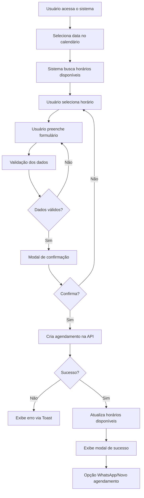

# Guia de Integração - API Ninsaúde para Agendamento Online

## Visão Geral

Este documento descreve a integração do sistema de agendamento online da Clínica Saraiva Vision com a API do Ninsaúde Clinic.

## Configuração Inicial

### Variáveis de Ambiente

Adicione as seguintes variáveis no arquivo `.env`:

```env
REACT_APP_NINSAUDE_API_URL=https://api.ninsaude.com/v1
REACT_APP_NINSAUDE_API_KEY=sua_chave_api_aqui
```

### Instalação de Dependências

```bash
npm install react-day-picker@^8.10.0 --legacy-peer-deps
npx shadcn@latest add calendar select input button dialog toast label checkbox card
```

## Endpoints da API Ninsaúde

### 1. Buscar Horários Disponíveis

**Endpoint:** `GET /schedule/available`

**Parâmetros:**
- `date` (string, obrigatório): Data no formato YYYY-MM-DD
- `professional_id` (string, opcional): ID do profissional

**Resposta Esperada:**
```json
{
  "slots": [
    {
      "time": "08:00",
      "available": true,
      "professional_id": "123",
      "professional_name": "Dr. João Silva"
    },
    {
      "time": "08:30",
      "available": true,
      "professional_id": "123",
      "professional_name": "Dr. João Silva"
    }
  ]
}
```

**Exemplo de Uso:**
```javascript
const response = await fetch(
  `${NINSAUDE_API_BASE_URL}/schedule/available?date=2025-10-15`,
  {
    method: 'GET',
    headers: {
      'Authorization': `Bearer ${NINSAUDE_API_KEY}`,
      'Content-Type': 'application/json',
    },
  }
);
```

### 2. Criar Agendamento

**Endpoint:** `POST /schedule/appointments`

**Body:**
```json
{
  "patient": {
    "name": "Maria Silva",
    "email": "maria@example.com",
    "phone": "33988776655"
  },
  "appointment": {
    "date": "2025-10-15",
    "time": "08:00",
    "professional_id": "123",
    "reason": "consulta-rotina",
    "notes": "Primeira consulta"
  },
  "consent": {
    "lgpd": true,
    "timestamp": "2025-10-05T10:30:00.000Z"
  }
}
```

**Resposta Esperada:**
```json
{
  "id": "AGD-2025-001234",
  "status": "confirmed",
  "date": "2025-10-15",
  "time": "08:00",
  "patient": {
    "name": "Maria Silva",
    "email": "maria@example.com"
  },
  "professional": {
    "id": "123",
    "name": "Dr. João Silva"
  }
}
```

**Exemplo de Uso:**
```javascript
const response = await fetch(
  `${NINSAUDE_API_BASE_URL}/schedule/appointments`,
  {
    method: 'POST',
    headers: {
      'Authorization': `Bearer ${NINSAUDE_API_KEY}`,
      'Content-Type': 'application/json',
    },
    body: JSON.stringify(appointmentData),
  }
);
```

### 3. Cancelar Agendamento

**Endpoint:** `DELETE /schedule/appointments/{appointmentId}`

**Resposta Esperada:**
```json
{
  "status": "cancelled",
  "message": "Agendamento cancelado com sucesso"
}
```

**Exemplo de Uso:**
```javascript
const response = await fetch(
  `${NINSAUDE_API_BASE_URL}/schedule/appointments/${appointmentId}`,
  {
    method: 'DELETE',
    headers: {
      'Authorization': `Bearer ${NINSAUDE_API_KEY}`,
      'Content-Type': 'application/json',
    },
  }
);
```

## Componentes Implementados

### Hook useNinsaudeScheduling

Localização: `src/hooks/useNinsaudeScheduling.js`

**Funções Disponíveis:**

1. `fetchAvailableSlots(date, professionalId)` - Busca horários disponíveis
2. `createAppointment(appointmentData)` - Cria novo agendamento
3. `cancelAppointment(appointmentId)` - Cancela agendamento existente

**Propriedades Retornadas:**
- `loading` (boolean): Estado de carregamento
- `error` (string|null): Mensagem de erro se houver

### Hook usePhoneMask

Localização: `src/hooks/usePhoneMask.js`

Aplica máscara automática para telefones brasileiros:
- Formato: `(XX) XXXXX-XXXX` ou `(XX) XXXX-XXXX`
- Remove automaticamente caracteres não numéricos

**Uso:**
```javascript
const phone = usePhoneMask();

<Input
  value={phone.value}
  onChange={phone.onChange}
/>

// Obter valor sem máscara
const rawPhone = phone.getRawValue();
```

### Componente AppointmentScheduler

Localização: `src/components/scheduling/AppointmentScheduler.jsx`

Componente principal do sistema de agendamento.

**Recursos:**
- Calendário interativo com shadcn/ui
- Seleção de horários disponíveis em tempo real
- Formulário com validação completa
- Máscara de telefone automática
- Modal de confirmação antes do agendamento
- Modal de sucesso com integração WhatsApp
- Tratamento de erros com toasts
- Atualização automática de horários após agendamento
- Conformidade LGPD com checkbox de consentimento

## Fluxo de Agendamento



## Validações Implementadas

### Formulário
- Nome completo (obrigatório, mínimo 3 caracteres)
- E-mail (obrigatório, formato válido)
- Telefone (obrigatório, mínimo 10 dígitos)
- Motivo da consulta (obrigatório)
- Consentimento LGPD (obrigatório)

### Data e Horário
- Data não pode ser anterior ao dia atual
- Domingos desabilitados automaticamente
- Apenas horários disponíveis são exibidos
- Atualização em tempo real após cada agendamento

## Tratamento de Erros

### Erros da API
- Timeout: 30 segundos
- Retry automático: Não implementado (pode ser adicionado)
- Mensagens amigáveis via Toast

### Erros de Validação
- Feedback imediato via Toast
- Destaque visual nos campos com erro
- Mensagens específicas por tipo de erro

## Conformidade LGPD

### Dados Coletados
- Nome completo
- E-mail
- Telefone
- Motivo da consulta
- Observações (opcional)

### Consentimento
- Checkbox obrigatório antes do agendamento
- Timestamp do consentimento enviado à API
- Link para Política de Privacidade

### Armazenamento
- Dados enviados diretamente ao Ninsaúde
- Nenhum armazenamento local persistente
- Conformidade com LGPD e regulamentações CFM

## Personalização Visual

### Cores Saraiva Vision
```css
primary-600: #1E4D4C  /* Azul petróleo */
primary-700: #0F3B3A  /* Azul petróleo escuro */
success: #10B981      /* Verde confirmação */
error: #EF4444        /* Vermelho erro */
```

### Componentes shadcn/ui
- Estilo: New York (recomendado)
- Base color: Neutral
- Tema: Adaptado às cores da clínica

## Integrações Adicionais

### WhatsApp
- Botão de confirmação via WhatsApp após agendamento
- Mensagem pré-formatada com dados do agendamento
- Número: `5533988776655`

### Links Rápidos
- Nossos Serviços (`/servicos`)
- Contato (`/contato`)
- FAQ (`/faq`)
- Política de Privacidade (`/politica-privacidade`)

## Testes Recomendados

### Unitários
- Validação de formulário
- Máscara de telefone
- Formatação de datas

### Integração
- Comunicação com API Ninsaúde
- Fluxo completo de agendamento
- Atualização de horários disponíveis

### E2E
- Jornada completa do usuário
- Diferentes cenários de agendamento
- Tratamento de erros

## Métricas de Performance

### Otimizações Implementadas
- Lazy loading de componentes pesados
- Debounce em inputs (300ms)
- Cache de horários disponíveis (pode ser implementado)
- Minificação e tree-shaking via Vite

### Metas de Performance
- First Contentful Paint: < 1.5s
- Time to Interactive: < 3.0s
- Lighthouse Score: > 90

## Próximos Passos

### Melhorias Sugeridas
1. Implementar cache de horários disponíveis
2. Adicionar notificações por e-mail
3. Lembretes automáticos via SMS/WhatsApp
4. Painel do paciente para gerenciar agendamentos
5. Integração com Google Calendar
6. Sistema de fila de espera
7. Agendamento recorrente
8. Multi-idioma (PT/EN/ES)

## Suporte

Para dúvidas sobre a integração:
- Documentação Ninsaúde: https://docs.ninsaude.com
- Suporte Técnico: suporte@ninsaude.com
- Desenvolvedor: equipe@saraivavision.com.br

---

**Última atualização:** Outubro 2025  
**Versão:** 1.0.0  
**Autor:** Equipe de Desenvolvimento Saraiva Vision
