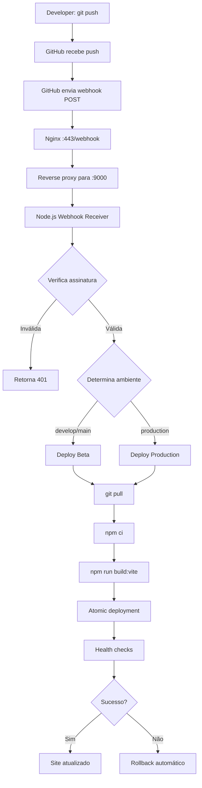

# GitHub Webhook Setup - Deployment Local no VPS

Este documento descreve o sistema de deploy automatizado via webhooks do GitHub, executando localmente no VPS sem necessidade de SSH.

## 📋 Visão Geral

**Arquitetura:**
```
GitHub Push → GitHub Webhook → Nginx Reverse Proxy → Node.js Webhook Receiver → Deployment Script
```

**Ambientes:**
- **Beta**: Deploy automático em push para `develop`, `main`, `feature/*`
- **Production**: Deploy manual (workflow separado)

## 🚀 Instalação

### 1. Instalar Webhook Receiver

```bash
cd /home/saraiva-vision-site
chmod +x scripts/install-webhook-receiver.sh
sudo ./scripts/install-webhook-receiver.sh
```

Este script irá:
- ✅ Criar diretório de logs
- ✅ Gerar secret para webhook
- ✅ Criar arquivo `.env.webhook`
- ✅ Instalar serviço systemd
- ✅ Configurar Nginx reverse proxy
- ✅ Iniciar o webhook receiver

### 2. Copiar o Webhook Secret

O script exibirá algo como:

```
🔐 Webhook Secret (configure in GitHub):
a1b2c3d4e5f6789012345678901234567890abcdef1234567890abcdef123456
```

**Copie este secret!** Você precisará dele no próximo passo.

### 3. Configurar Webhook no GitHub

1. Acesse: https://github.com/Sudo-psc/saraivavision-site-v2/settings/hooks
2. Clique em **"Add webhook"**
3. Configure:

   | Campo | Valor |
   |-------|-------|
   | **Payload URL** | `https://saraivavision.com.br/webhook` |
   | **Content type** | `application/json` |
   | **Secret** | Cole o secret gerado no passo 2 |
   | **SSL verification** | ✓ Enable SSL verification |
   | **Which events** | Just the push event |
   | **Active** | ✓ |

4. Clique em **"Add webhook"**

## ✅ Verificação

### Testar Health Check

```bash
curl https://saraivavision.com.br/webhook/health
```

**Resposta esperada:**
```json
{
  "status": "healthy",
  "uptime": 123.45,
  "port": 9000,
  "logFile": "/home/saraiva-vision-site/logs/webhook.log"
}
```

### Testar Webhook Manualmente

```bash
# Obter o secret
SECRET=$(grep GITHUB_WEBHOOK_SECRET /home/saraiva-vision-site/.env.webhook | cut -d'=' -f2)

# Criar payload de teste
PAYLOAD='{"ref":"refs/heads/develop","after":"abc123","pusher":{"name":"test"},"repository":{"full_name":"test/repo"}}'

# Gerar signature
SIGNATURE="sha256=$(echo -n "$PAYLOAD" | openssl dgst -sha256 -hmac "$SECRET" | cut -d' ' -f2)"

# Enviar webhook
curl -X POST https://saraivavision.com.br/webhook \
  -H "Content-Type: application/json" \
  -H "X-Hub-Signature-256: $SIGNATURE" \
  -H "X-GitHub-Event: push" \
  -d "$PAYLOAD"
```

**Resposta esperada:**
```json
{
  "message": "Deployment started",
  "environment": "beta",
  "branch": "refs/heads/develop",
  "commit": "abc123"
}
```

### Verificar Logs

**Webhook logs:**
```bash
tail -f /home/saraiva-vision-site/logs/webhook.log
```

**Service logs:**
```bash
sudo journalctl -u webhook-receiver -f
```

**Nginx logs:**
```bash
tail -f /var/log/nginx/saraivavision.access.log
```

## 🔄 Fluxo de Deploy

### 1. Push para GitHub

```bash
git push origin develop
```

### 2. GitHub Envia Webhook

GitHub automaticamente envia um POST request para:
```
https://saraivavision.com.br/webhook
```

### 3. Nginx Reverse Proxy

Nginx encaminha para o Node.js receiver em `localhost:9000`

### 4. Webhook Receiver

O receiver Node.js:
1. Verifica assinatura do webhook
2. Determina ambiente baseado no branch
3. Executa script de deploy
4. Retorna resposta HTTP 202 (Accepted)

### 5. Deploy Script

O script `/home/saraiva-vision-site/scripts/deploy-to-environment.sh`:
1. Puxa código do GitHub
2. Instala dependências (`npm ci`)
3. Executa build (`npm run build:vite`)
4. Cria release timestampada
5. Faz backup da versão anterior
6. Atualiza symlink atômico
7. Executa health checks
8. Limpa releases antigas

### 6. Verificação

O site é atualizado em:
- **Beta**: https://beta.saraivavision.com.br
- **Production**: https://saraivavision.com.br

## 🎯 Mapeamento Branch → Ambiente

| Branch | Ambiente | Deploy |
|--------|----------|--------|
| `develop` | Beta | Automático |
| `main` | Beta | Automático |
| `feature/*` | Beta | Automático |
| `production` | Production | Manual (workflow) |

## 🛠️ Gerenciamento do Serviço

### Comandos Systemd

```bash
# Status
sudo systemctl status webhook-receiver

# Iniciar
sudo systemctl start webhook-receiver

# Parar
sudo systemctl stop webhook-receiver

# Reiniciar
sudo systemctl restart webhook-receiver

# Ver logs
sudo journalctl -u webhook-receiver -f

# Ver logs recentes
sudo journalctl -u webhook-receiver --since "10 minutes ago"
```

### Reiniciar Após Mudanças

Se você modificar `webhook-receiver.js`:

```bash
sudo systemctl restart webhook-receiver
```

Se você modificar `webhook-receiver.service`:

```bash
sudo systemctl daemon-reload
sudo systemctl restart webhook-receiver
```

## 📊 Monitoramento

### Health Check Endpoint

```bash
# Local
curl http://localhost:9000/health

# Público
curl https://saraivavision.com.br/webhook/health
```

### Logs de Deploy

```bash
# Últimos 50 deploys
tail -n 50 /home/saraiva-vision-site/logs/webhook.log

# Deploys de hoje
grep "$(date +%Y-%m-%d)" /home/saraiva-vision-site/logs/webhook.log

# Deploys bem-sucedidos
grep "SUCCEEDED" /home/saraiva-vision-site/logs/webhook.log

# Deploys falhados
grep "FAILED" /home/saraiva-vision-site/logs/webhook.log
```

### Métricas de Uptime

```bash
# Uptime do serviço
sudo systemctl show webhook-receiver --property=ActiveEnterTimestamp

# Uso de recursos
ps aux | grep webhook-receiver.js
```

## 🔒 Segurança

### Rate Limiting

O Nginx limita webhooks a **10 requests/minuto** por IP:

```nginx
limit_req_zone $binary_remote_addr zone=webhook_limit:10m rate=10r/m;
```

### Verificação de Assinatura

O webhook receiver verifica a assinatura HMAC SHA-256 do GitHub usando o secret configurado:

```javascript
const hmac = crypto.createHmac('sha256', WEBHOOK_SECRET);
const digest = 'sha256=' + hmac.update(payload).digest('hex');
```

### Filtro de Métodos

Apenas POST requests são permitidos:

```nginx
if ($request_method !~ ^(POST)$ ) {
    return 405;
}
```

### Proteção Adicional (Opcional)

Para restringir apenas IPs do GitHub:

```nginx
location = /webhook {
    # GitHub webhook IPs
    allow 140.82.112.0/20;
    allow 143.55.64.0/20;
    allow 185.199.108.0/22;
    allow 192.30.252.0/22;
    deny all;

    # ... resto da configuração
}
```

## 🐛 Troubleshooting

### Webhook não funciona

**1. Verificar se o serviço está rodando:**
```bash
sudo systemctl status webhook-receiver
```

**2. Verificar logs:**
```bash
tail -f /home/saraiva-vision-site/logs/webhook.log
sudo journalctl -u webhook-receiver -f
```

**3. Testar health check:**
```bash
curl http://localhost:9000/health
```

**4. Verificar Nginx:**
```bash
sudo nginx -t
sudo systemctl status nginx
```

### Deploy falha

**1. Verificar logs do webhook:**
```bash
grep "FAILED" /home/saraiva-vision-site/logs/webhook.log
```

**2. Executar deploy manualmente:**
```bash
cd /home/saraiva-vision-site
sudo ./scripts/deploy-to-environment.sh beta
```

**3. Verificar permissões:**
```bash
ls -la /var/www/saraivavision/
ls -la /home/saraiva-vision-site/
```

### Assinatura inválida

**1. Verificar secret:**
```bash
grep GITHUB_WEBHOOK_SECRET /home/saraiva-vision-site/.env.webhook
```

**2. Reconfigurar webhook no GitHub** com o secret correto

**3. Reiniciar serviço:**
```bash
sudo systemctl restart webhook-receiver
```

## 📝 Estrutura de Arquivos

```
/home/saraiva-vision-site/
├── scripts/
│   ├── webhook-receiver.js          # Receptor Node.js
│   ├── install-webhook-receiver.sh  # Script de instalação
│   ├── deploy-to-environment.sh     # Script de deploy
│   └── systemd/
│       └── webhook-receiver.service # Serviço systemd
├── logs/
│   └── webhook.log                  # Logs do webhook
├── .env.webhook                     # Configuração (SECRET)
└── .env.webhook.example             # Template

/etc/nginx/sites-available/
└── saraivavision                    # Config Nginx com reverse proxy

/etc/systemd/system/
└── webhook-receiver.service         # Serviço instalado

/var/www/saraivavision/
├── beta/                            # Deploy beta (symlink)
├── current/                         # Deploy produção (symlink)
├── releases/
│   ├── beta/YYYYMMDD_HHMMSS/       # Releases beta
│   └── production/YYYYMMDD_HHMMSS/ # Releases produção
└── backups/
    ├── beta/                        # Backups beta
    └── production/                  # Backups produção
```

## 🔄 Workflow Completo



## 📞 Suporte

Em caso de problemas:

1. Verificar logs: `/home/saraiva-vision-site/logs/webhook.log`
2. Verificar service: `sudo systemctl status webhook-receiver`
3. Verificar Nginx: `sudo nginx -t`
4. Executar deploy manual para debug: `sudo ./scripts/deploy-to-environment.sh beta`

---

**Última atualização:** 2025-10-06
**Versão:** 1.0.0
