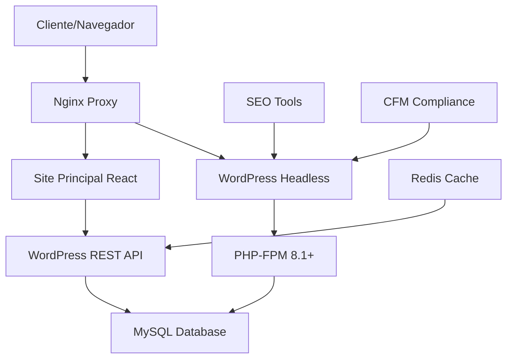

# Especificações: Blog WordPress Headless para Saraiva Vision

## 1. VISÃO GERAL DO SISTEMA

### 1.1 Contexto
Sistema de blog médico integrado ao website da Clínica Saraiva Vision, utilizando WordPress como backend headless para garantir:
- **SEO Otimizado**: Para melhor posicionamento em buscas médicas
- **Compliance CFM**: Conformidade com resoluções do Conselho Federal de Medicina
- **Performance**: Alta velocidade e escalabilidade

### 1.2 Arquitetura Híbrida



## 2. OBJETIVOS MENSURÁVEIS

### 2.1 Performance (Objetivo 1)
- **Meta**: Servidor < 30s inicialização, >100 req/s throughput
- **Ferramentas**: Apache Benchmark, Artillery.js
- **Baseline**: Testes com carga de 1000 usuários simultâneos

### 2.2 API Funcional (Objetivo 2)
- **Meta**: 100% taxa de sucesso para 100+ posts
- **Endpoint**: `/wp-json/wp/v2/posts`
- **Metadados**: título, conteúdo, autor, data, categorias, featured_image

### 2.3 Integração Frontend (Objetivo 3)
- **Meta**: 50% redução tempo carregamento, SEO >90/100
- **Ferramentas**: Lighthouse, Google PageSpeed Insights
- **Cache**: Redis com TTL 5 minutos

### 2.4 Segurança e Compliance (Objetivo 4)
- **Meta**: Zero vulnerabilidades críticas, 1000 usuários simultâneos
- **CFM**: 100% conformidade com resoluções médicas
- **Ferramentas**: OWASP ZAP, penetration testing

## 3. ESPECIFICAÇÕES FUNCIONAIS

### 3.1 Configuração do Servidor

#### 3.1.1 Nginx Configuration
```nginx
# /etc/nginx/sites-available/saraiva-blog
server {
    listen 80;
    server_name blog.saraivavision.com.br;

    # Health check endpoint
    location /health {
        access_log off;
        return 200 "healthy\n";
        add_header Content-Type text/plain;
    }

    # WordPress Admin
    location /wp-admin {
        proxy_pass http://127.0.0.1:9000;
        proxy_set_header Host $host;
        proxy_set_header X-Real-IP $remote_addr;
    }

    # WordPress API
    location /wp-json {
        proxy_pass http://127.0.0.1:9000;
        proxy_cache blog_cache;
        proxy_cache_valid 200 5m;
    }

    # Static files
    location ~* \.(jpg|jpeg|png|gif|css|js)$ {
        expires 1y;
        add_header Cache-Control "public, immutable";
    }
}
```

#### 3.1.2 PHP-FPM Configuration
```ini
; /etc/php/8.1/fpm/pool.d/wordpress.conf
[wordpress]
user = www-data
group = www-data
listen = 127.0.0.1:9000
pm = dynamic
pm.max_children = 50
pm.start_servers = 10
pm.min_spare_servers = 5
pm.max_spare_servers = 35
pm.max_requests = 500

; Performance settings
php_admin_value[memory_limit] = 256M
php_admin_value[max_execution_time] = 60
php_admin_value[upload_max_filesize] = 10M
```

### 3.2 WordPress Headless Setup

#### 3.2.1 Plugins Obrigatórios
1. **SEO**: Yoast SEO Premium ou Rank Math Pro
2. **API**: REST API extensions
3. **Security**: Wordfence Security
4. **CFM Compliance**: Custom plugin para validações médicas
5. **Performance**: W3 Total Cache + Redis

#### 3.2.2 Custom Post Types
```php
// Custom post type para artigos médicos
function register_medical_article_post_type() {
    register_post_type('medical_article', [
        'labels' => [
            'name' => 'Artigos Médicos',
            'singular_name' => 'Artigo Médico'
        ],
        'public' => true,
        'show_in_rest' => true,
        'rest_base' => 'medical-articles',
        'supports' => ['title', 'editor', 'thumbnail', 'excerpt', 'custom-fields'],
        'taxonomies' => ['category', 'post_tag', 'medical_specialty']
    ]);
}
```

### 3.3 SEO Otimizations

#### 3.3.1 Meta Tags Schema
```php
// Schema.org para artigos médicos
function add_medical_article_schema($post_id) {
    $schema = [
        '@context' => 'https://schema.org',
        '@type' => 'MedicalArticle',
        'headline' => get_the_title($post_id),
        'author' => [
            '@type' => 'Person',
            'name' => get_the_author_meta('display_name', get_post_field('post_author', $post_id))
        ],
        'datePublished' => get_the_date('c', $post_id),
        'medicalSpecialty' => get_post_meta($post_id, 'medical_specialty', true),
        'disclaimer' => 'Este conteúdo não substitui consulta médica. Procure sempre orientação profissional.'
    ];

    return json_encode($schema, JSON_UNESCAPED_UNICODE);
}
```

### 3.4 CFM Compliance

#### 3.4.1 Validações Obrigatórias
- **Disclaimer médico** em todos os posts
- **Identificação do responsável técnico** (CRM)
- **Proibição de autopromoção** sem registro CFM
- **Anonimização** de dados de pacientes
- **Linguagem técnica apropriada**

#### 3.4.2 Plugin CFM Compliance
```php
class CFM_Compliance_Validator {
    private $required_disclaimers = [
        'Este conteúdo não substitui consulta médica',
        'Procure sempre orientação médica qualificada',
        'Em caso de emergência, procure atendimento imediato'
    ];

    public function validate_post_content($content) {
        $violations = [];

        // Verificar disclaimer obrigatório
        if (!$this->has_medical_disclaimer($content)) {
            $violations[] = 'Disclaimer médico obrigatório ausente';
        }

        // Verificar dados sensíveis
        if ($this->contains_patient_data($content)) {
            $violations[] = 'Possível exposição de dados de pacientes';
        }

        return $violations;
    }
}
```

## 4. ESPECIFICAÇÕES DE INTEGRAÇÃO

### 4.1 Frontend API Client

#### 4.1.1 Blog Service Class
```javascript
class WordPressBlogService {
    constructor(baseURL, cacheEnabled = true) {
        this.baseURL = baseURL;
        this.cache = cacheEnabled ? new Map() : null;
        this.cacheTimeout = 5 * 60 * 1000; // 5 minutos
    }

    async getPosts(page = 1, perPage = 10, category = null) {
        const cacheKey = `posts_${page}_${perPage}_${category}`;

        if (this.cache && this.cache.has(cacheKey)) {
            const cached = this.cache.get(cacheKey);
            if (Date.now() - cached.timestamp < this.cacheTimeout) {
                return cached.data;
            }
        }

        const params = new URLSearchParams({
            page: page.toString(),
            per_page: perPage.toString(),
            ...(category && { categories: category })
        });

        const response = await fetch(`${this.baseURL}/wp-json/wp/v2/posts?${params}`);
        const data = await response.json();

        if (this.cache) {
            this.cache.set(cacheKey, {
                data,
                timestamp: Date.now()
            });
        }

        return data;
    }
}
```

### 4.2 SEO Integration

#### 4.2.1 Meta Tags Generator
```javascript
function generateSEOMetaTags(post) {
    return {
        title: `${post.title.rendered} | Blog Saraiva Vision`,
        description: post.excerpt.rendered.replace(/<[^>]*>/g, '').substring(0, 160),
        canonical: `https://saraivavision.com.br/blog/${post.slug}`,
        ogTitle: post.title.rendered,
        ogDescription: post.excerpt.rendered.replace(/<[^>]*>/g, ''),
        ogImage: post.featured_media_url,
        structuredData: {
            '@context': 'https://schema.org',
            '@type': 'BlogPosting',
            headline: post.title.rendered,
            author: post.author_name,
            datePublished: post.date,
            mainEntityOfPage: {
                '@type': 'WebPage',
                '@id': `https://saraivavision.com.br/blog/${post.slug}`
            }
        }
    };
}
```

## 5. MÉTRICAS E VALIDAÇÃO

### 5.1 Performance Benchmarks
- **Tempo de resposta API**: < 200ms para 50 posts
- **Throughput**: > 100 req/s em teste de carga
- **Uptime**: > 99.5% mensal
- **TTFB**: < 300ms
- **LCP**: < 2.5s

### 5.2 SEO Metrics
- **Google PageSpeed**: > 90/100
- **Core Web Vitals**: Verde em todas as métricas
- **Sitemap indexação**: > 95% dos posts
- **Structured data**: Zero erros no Google Search Console

### 5.3 CFM Compliance Metrics
- **Auditorias mensais**: 100% conformidade
- **Disclaimers**: Presentes em 100% dos posts médicos
- **Dados sensíveis**: Zero exposições detectadas
- **Linguagem técnica**: Aprovação por profissional médico

## 6. TESTES AUTOMATIZADOS

### 6.1 Testes de Performance
```bash
# Apache Benchmark test
ab -n 1000 -c 50 http://blog.saraivavision.com.br/wp-json/wp/v2/posts

# Artillery.js load test
artillery run load-test-config.yml
```

### 6.2 Testes de SEO
```javascript
describe('SEO Tests', () => {
    test('should have proper meta tags', async () => {
        const response = await fetch('/blog/artigo-test');
        const html = await response.text();

        expect(html).toContain('<title>');
        expect(html).toContain('meta name="description"');
        expect(html).toContain('meta property="og:title"');
    });
});
```

### 6.3 Testes de Compliance CFM
```javascript
describe('CFM Compliance Tests', () => {
    test('should have medical disclaimer', async () => {
        const posts = await wordpressAPI.getPosts();

        posts.forEach(post => {
            expect(post.content.rendered).toContain('não substitui consulta médica');
        });
    });
});
```

## 7. DEPLOY E MONITORAMENTO

### 7.1 Deploy Script
```bash
#!/bin/bash
# deploy-wordpress-blog.sh

set -e

echo "🚀 Deploying WordPress Blog..."

# Backup current installation
mysqldump -u $DB_USER -p$DB_PASS $DB_NAME > backup_$(date +%Y%m%d_%H%M%S).sql

# Update WordPress core
wp core update --allow-root

# Update plugins
wp plugin update --all --allow-root

# Clear cache
wp cache flush --allow-root

# Restart services
systemctl reload nginx
systemctl restart php8.1-fpm

# Health check
curl -f http://localhost/health || exit 1

echo "✅ Deploy completed successfully"
```

### 7.2 Monitoring Setup
```yaml
# prometheus.yml
scrape_configs:
  - job_name: 'wordpress-blog'
    static_configs:
      - targets: ['localhost:9090']
    metrics_path: '/metrics'
    scrape_interval: 30s
```

## 8. CRONOGRAMA DE IMPLEMENTAÇÃO

### Fase 1: Infraestrutura (Semana 1)
- [ ] Configuração Nginx + PHP-FPM
- [ ] Instalação WordPress headless
- [ ] Configuração banco de dados MySQL

### Fase 2: Desenvolvimento (Semana 2)
- [ ] Setup plugins SEO e segurança
- [ ] Desenvolvimento plugin CFM compliance
- [ ] Criação de custom post types

### Fase 3: Integração (Semana 3)
- [ ] Desenvolvimento API client frontend
- [ ] Implementação cache Redis
- [ ] Testes de integração

### Fase 4: Otimização e Deploy (Semana 4)
- [ ] Otimizações de performance
- [ ] Testes de carga e segurança
- [ ] Deploy em produção
- [ ] Configuração monitoramento

## 9. CRITÉRIOS DE ACEITAÇÃO

### ✅ Funcionalidade
- [ ] API REST funcional com todos os endpoints
- [ ] Integração frontend sem erros
- [ ] Cache funcionando corretamente

### ✅ Performance
- [ ] Todas as métricas de performance atingidas
- [ ] Testes de carga aprovados
- [ ] SEO score > 90/100

### ✅ Compliance
- [ ] 100% conformidade CFM
- [ ] Zero vulnerabilidades de segurança
- [ ] Auditoria de acessibilidade aprovada

### ✅ Documentação
- [ ] README.md completo
- [ ] Documentação API
- [ ] Guias de deploy e manutenção