# Next.js Migration - Task Dependencies & Critical Path

**Project:** Saraiva Vision Multi-Profile Migration
**Timeline:** 13 weeks (91 days)
**Last Updated:** October 2025

---

## Critical Path Analysis

The **critical path** represents the longest sequence of dependent tasks that determines the minimum project duration. Any delay on the critical path delays the entire project.

### Critical Path Tasks (46 days)

```
[TASK-001] Create Next.js Project (0.5d)
   ↓
[TASK-002] Configure TypeScript (0.5d)
   ↓
[TASK-003] Setup Tailwind (1d)
   ↓
[TASK-006] POC Familiar Layout (2d)
   ↓
[TASK-101] Audit Components (1d)
   ↓
[TASK-102] Migrate UI Components (3d)
   ↓
[TASK-105] Migrate Feature Components (4d)
   ↓
[TASK-108] Setup Data Fetching (2d)
   ↓
[TASK-111] Migrate Blog System (3d)
   ↓
[TASK-201] Advanced Middleware (2d)
   ↓
[TASK-204] Theme Configuration (2d)
   ↓
[TASK-205] Familiar Layout (2d)
   ↓
[TASK-209] Familiar Pages (3d)
   ↓
[TASK-305] WCAG AAA Audit (1d)
   ↓
[TASK-307] ARIA Implementation (2d)
   ↓
[TASK-401] Bundle Optimization (2d)
   ↓
[TASK-404] Critical Rendering Path (1d)
   ↓
[TASK-407] E2E Test Suite (3d)
   ↓
[TASK-410] Compliance Verification (1d)
   ↓
[TASK-503] Staging QA (2d)
   ↓
[TASK-505] Production Deployment (1d)
   ↓
[TASK-506] Monitoring Setup (1d)

TOTAL CRITICAL PATH: 46 days (with parallelization)
```

**Note:** With 2 developers working in parallel, the critical path is significantly shorter than the total effort (182 developer-days).

---

## Dependency Matrix

### Phase 0: Setup & POC (Week 1)

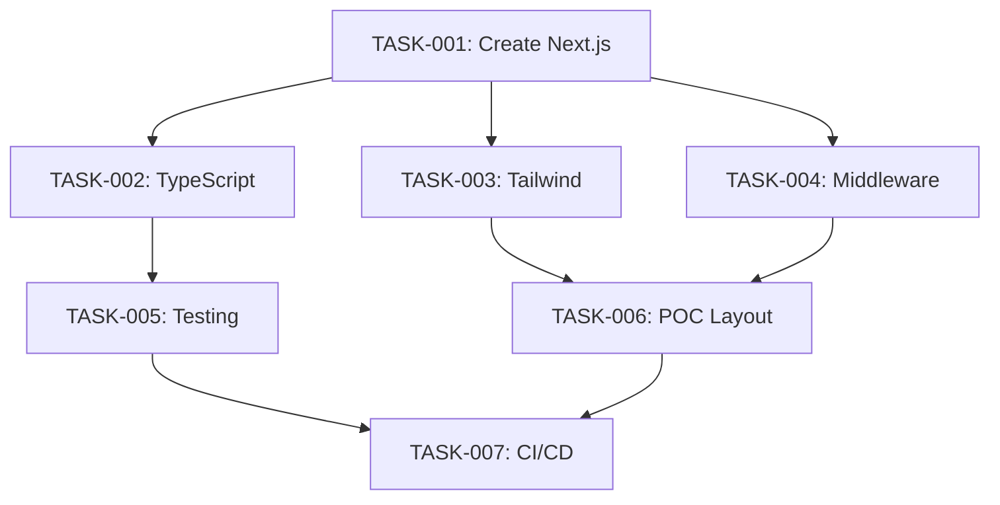

**Parallel Work Opportunities:**
- TASK-002 and TASK-003 can run in parallel after TASK-001
- TASK-004 and TASK-005 can start independently after TASK-001

**Blockers:**
- TASK-006 blocks all Phase 1 work
- TASK-007 must complete before merging any code

---

### Phase 1: Base Migration (Weeks 2-5)

#### Week 2: Component Migration

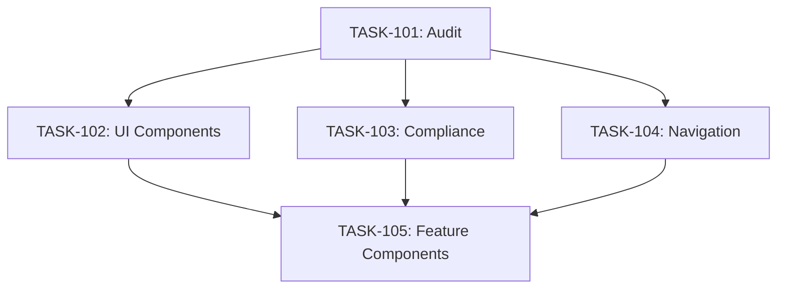

**Dependencies:**
- TASK-101 blocks all other component tasks
- TASK-102, 103, 104 can run in parallel
- TASK-105 depends on all three completing

**Resource Allocation:**
- Dev1: TASK-103, TASK-104 (3 days)
- Dev2: TASK-102 (3 days)
- Both: TASK-101 (1 day), TASK-105 (4 days)

#### Week 3: Hooks & Utilities

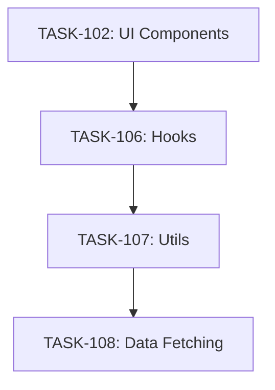

**Dependencies:**
- Linear progression: 102 → 106 → 107 → 108
- No parallelization possible within this chain
- TASK-108 blocks all page migrations

**Resource Allocation:**
- Dev2: TASK-106 (3 days)
- Dev1: TASK-107 (2 days), TASK-108 (2 days)

#### Week 4: Pages Migration

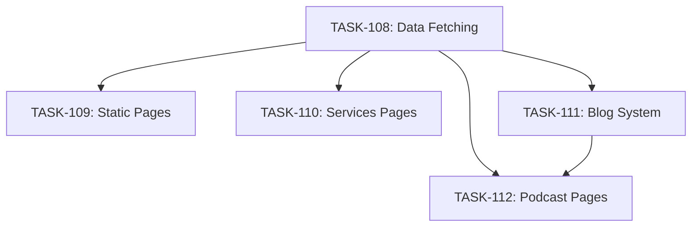

**Dependencies:**
- TASK-108 blocks all page tasks
- TASK-109, 110, 111 can start in parallel
- TASK-112 depends on TASK-111 (blog infrastructure)

**Resource Allocation:**
- Dev2: TASK-109 (2 days), TASK-112 (2 days)
- Dev1: TASK-110 (2 days)
- Both: TASK-111 (3 days)

#### Week 5: API Routes

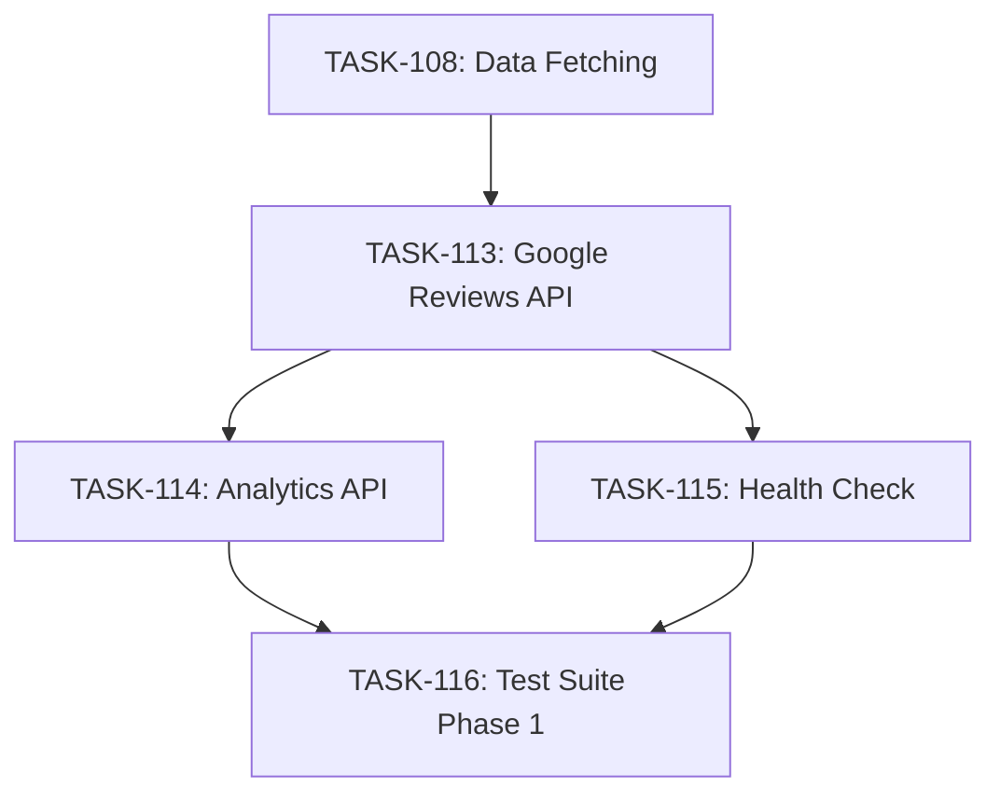

**Dependencies:**
- TASK-113 must complete first (template for other APIs)
- TASK-114 and TASK-115 can run in parallel
- TASK-116 requires all APIs complete

**Blockers:**
- TASK-116 blocks Phase 2 (multi-profile work)

---

### Phase 2: Multi-Profile System (Weeks 6-8)

#### Week 6: Profile Detection

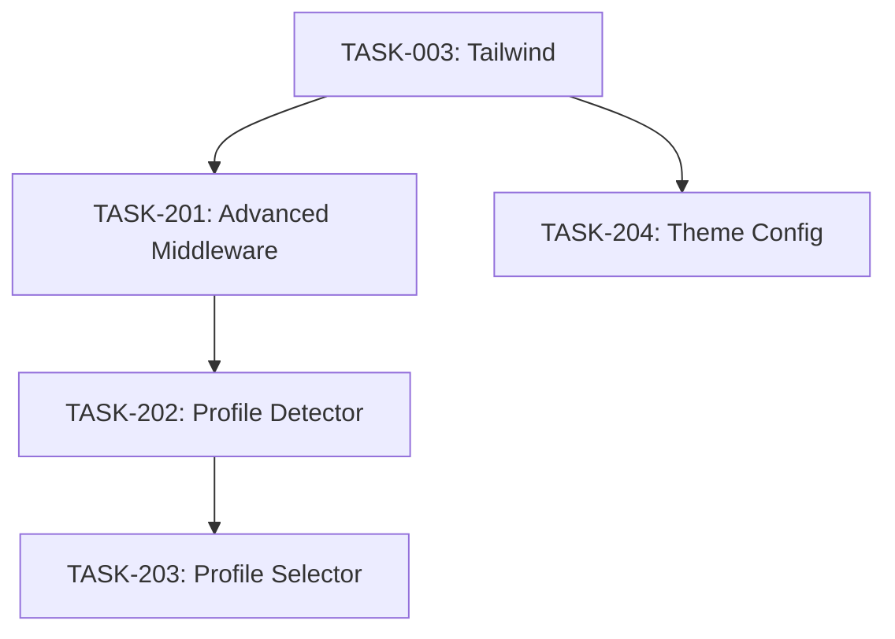

**Dependencies:**
- TASK-201 depends on TASK-004 (POC middleware)
- TASK-202 and TASK-204 can run in parallel
- TASK-203 depends on TASK-202

**Resource Allocation:**
- Dev1: TASK-201 (2 days), TASK-202 (1 day)
- Dev2: TASK-203 (1 day), TASK-204 (2 days)

#### Week 7: Layouts & Navigation

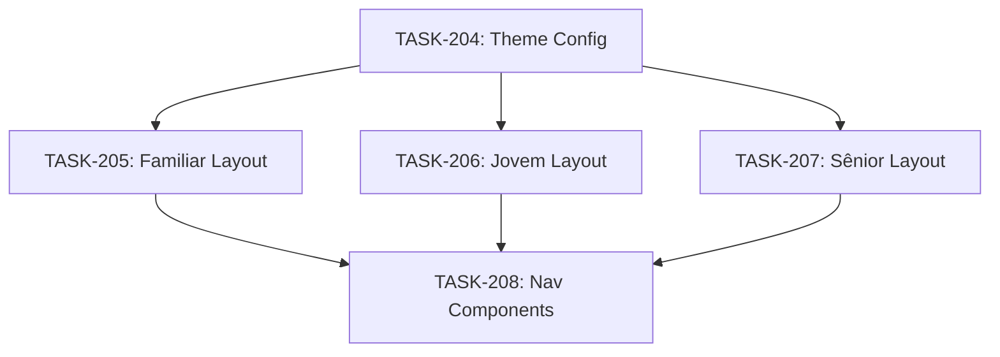

**Dependencies:**
- TASK-204 blocks all layout tasks
- TASK-205, 206, 207 can run in parallel
- TASK-208 requires all layouts complete

**Resource Allocation:**
- Dev1: TASK-205 (2 days), TASK-207 (2 days)
- Dev2: TASK-206 (2 days)
- Both: TASK-208 (1 day)

#### Week 8: Profile Pages

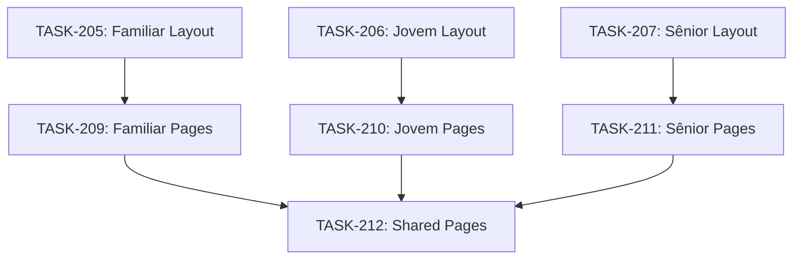

**Dependencies:**
- Each profile's pages depend on its layout
- TASK-209, 210, 211 can run in parallel
- TASK-212 requires all profile pages complete

**Resource Allocation:**
- Dev1: TASK-209 (3 days), TASK-211 (3 days)
- Dev2: TASK-210 (4 days)
- Both: TASK-212 (2 days)

---

### Phase 3: Advanced Features (Weeks 9-10)

#### Week 9: Subscription & Accessibility

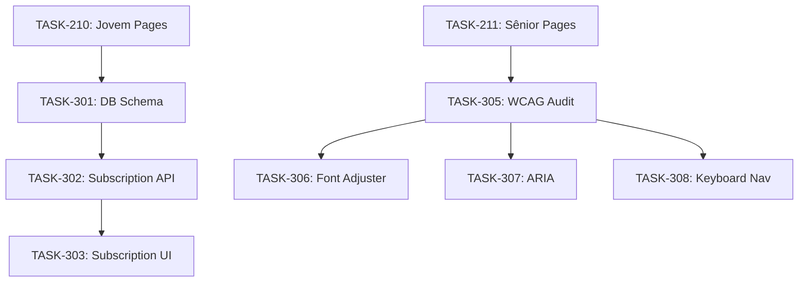

**Dependencies:**
- Subscription: Linear progression (301 → 302 → 303)
- Accessibility: TASK-305 blocks 306, 307, 308
- TASK-306, 307, 308 can run in parallel after 305

**Resource Allocation:**
- Dev1: TASK-301 (1 day), TASK-302 (2 days), TASK-306-308 (4 days)
- Dev2: TASK-303 (2 days), TASK-304 (3 days - optional)

#### Week 10: Finalization

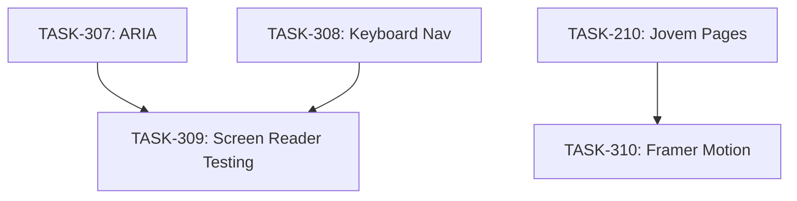

**Dependencies:**
- TASK-309 requires TASK-307 and TASK-308
- TASK-310 independent (Jovem animations)

**Resource Allocation:**
- Both: TASK-309 (2 days)
- Dev2: TASK-310 (2 days)

---

### Phase 4: Performance & QA (Weeks 11-12)

#### Week 11: Performance

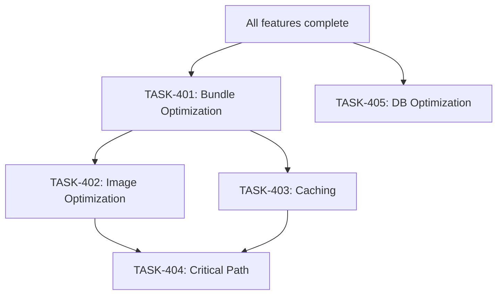

**Dependencies:**
- TASK-401 must complete first
- TASK-402 and TASK-403 can run in parallel
- TASK-404 requires both 402 and 403
- TASK-405 independent (if applicable)

**Resource Allocation:**
- Dev1: TASK-401 (2 days), TASK-403 (2 days), TASK-405 (1 day)
- Dev2: TASK-402 (1 day), TASK-404 (1 day)

#### Week 12: QA

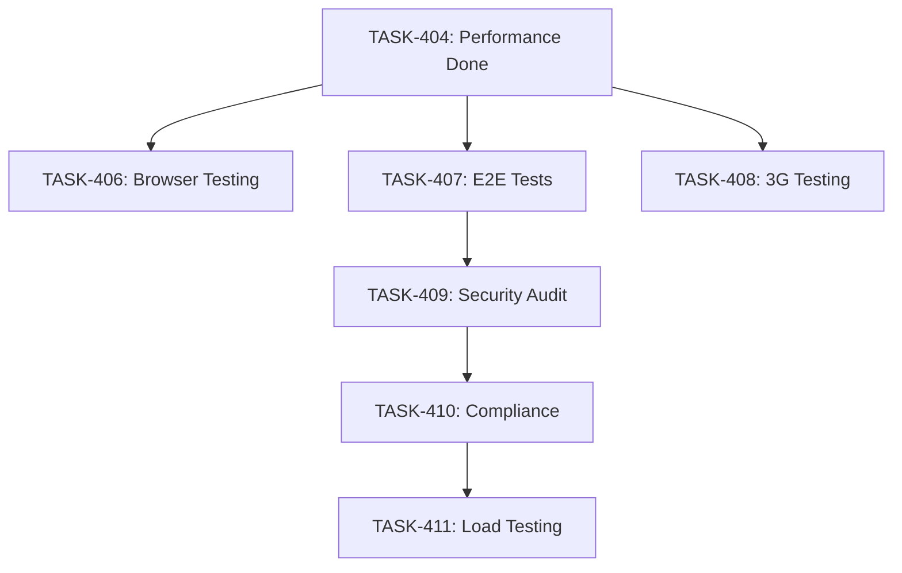

**Dependencies:**
- TASK-406, 407, 408 can run in parallel
- TASK-409 depends on TASK-407 (tests secure flows)
- TASK-410 depends on TASK-409
- TASK-411 depends on TASK-410 (final validation)

**Resource Allocation:**
- Both: TASK-406 (2 days)
- Dev1: TASK-407 (3 days), TASK-409 (1 day), TASK-411 (1 day)
- Dev2: TASK-408 (1 day)
- Both: TASK-410 (1 day)

---

### Phase 5: Deploy & Monitoring (Week 13)

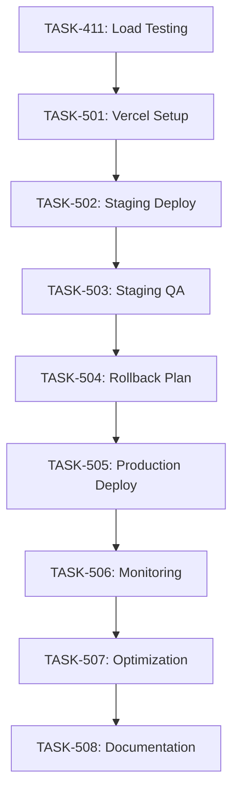

**Dependencies:**
- Fully linear progression
- No parallelization possible (deployment gates)

**Resource Allocation:**
- Dev1: TASK-501-505 (2.5 days)
- Dev2: TASK-506 (1 day)
- Both: TASK-503 (2 days), TASK-507 (2 days), TASK-508 (1 day)

---

## Blocking Relationships

### High-Impact Blockers

Tasks that block the most downstream work:

1. **[TASK-001] Create Next.js Project**
   - **Blocks:** Everything (108 tasks)
   - **Impact:** P0 - Critical
   - **Mitigation:** None (must be first)

2. **[TASK-101] Component Audit**
   - **Blocks:** All component migrations (5 tasks)
   - **Impact:** P0 - Critical
   - **Mitigation:** Allocate both devs, use automated tools

3. **[TASK-108] Data Fetching Setup**
   - **Blocks:** All page migrations (12 tasks)
   - **Impact:** P0 - Critical
   - **Mitigation:** Front-load this task, thorough testing

4. **[TASK-116] Test Suite Phase 1**
   - **Blocks:** Multi-profile work (Phase 2)
   - **Impact:** P0 - Critical
   - **Mitigation:** Continuous testing during Phase 1

5. **[TASK-204] Theme Configuration**
   - **Blocks:** All profile layouts (8 tasks)
   - **Impact:** P0 - Critical
   - **Mitigation:** Allocate senior dev, design system ready

6. **[TASK-305] WCAG AAA Audit**
   - **Blocks:** Accessibility features (4 tasks)
   - **Impact:** P0 - Critical for Sênior profile
   - **Mitigation:** External a11y consultant if needed

7. **[TASK-401] Bundle Optimization**
   - **Blocks:** Performance tasks (3 tasks)
   - **Impact:** P1 - High
   - **Mitigation:** Use webpack-bundle-analyzer early

8. **[TASK-410] Compliance Verification**
   - **Blocks:** Production deployment
   - **Impact:** P0 - Critical (legal requirement)
   - **Mitigation:** Legal review scheduled in advance

### Low-Impact Blockers

Tasks with minimal downstream dependencies:

- TASK-304 (Virtual Try-On) - Optional, no dependents
- TASK-310 (Framer Motion) - Jovem profile only
- TASK-405 (DB Optimization) - Independent

---

## Parallel Work Opportunities

### Maximum Parallelization Scenarios

**Week 1 (Setup):**
- Dev1: TASK-001 → TASK-002 → TASK-004 → TASK-007
- Dev2: TASK-003 → TASK-005 → TASK-006

**Week 2 (Components):**
- Dev1: TASK-103 + TASK-104
- Dev2: TASK-102
- Both: TASK-101 (kick-off), TASK-105 (integration)

**Week 4 (Pages):**
- Dev1: TASK-110
- Dev2: TASK-109
- Both: TASK-111 (complex)

**Week 7 (Layouts):**
- Dev1: TASK-205 + TASK-207
- Dev2: TASK-206
- Both: TASK-208 (integration)

**Week 8 (Profile Pages):**
- Dev1: TASK-209 (Familiar) + TASK-211 (Sênior)
- Dev2: TASK-210 (Jovem - most complex)

**Week 11 (Performance):**
- Dev1: TASK-401 → TASK-403 → TASK-405
- Dev2: TASK-402 → TASK-404

---

## Dependency Constraints

### Technical Dependencies

1. **Next.js Version:**
   - Requires: v14.0.0 or higher
   - Reason: App Router, Server Actions, Edge Runtime

2. **Node.js Version:**
   - Requires: v22.0.0 or higher (already in package.json)
   - Reason: Native fetch, ES modules

3. **React Version:**
   - Requires: v18.2.0 (current)
   - Reason: Server Components compatibility

4. **Tailwind CSS:**
   - Requires: v3.3.0 or higher
   - Reason: Multi-theme support

### External Dependencies

1. **Google APIs:**
   - TASK-113 depends on Google Places API key
   - Mitigation: Obtain key in Week 1

2. **Payment Processor:**
   - TASK-303 depends on Stripe/PagSeguro account
   - Mitigation: Setup during Week 8

3. **Domain & SSL:**
   - TASK-501 depends on domain access
   - Mitigation: Ensure DNS control early

4. **Legal Review:**
   - TASK-410 depends on legal team availability
   - Mitigation: Schedule review in Week 10

### Resource Dependencies

1. **Design Assets:**
   - Profile-specific imagery needed by Week 7
   - Mitigation: Design team works in parallel

2. **Content:**
   - Blog Markdown conversion (99 posts)
   - Mitigation: Script-automated (TASK-111)

3. **Testing Devices:**
   - Real devices for browser testing (TASK-406)
   - Mitigation: BrowserStack subscription

---

## Risk Mitigation Strategies

### Dependency-Related Risks

| Risk | Probability | Impact | Mitigation |
|------|------------|--------|------------|
| **Middleware blocking** | Medium | High | Early POC (TASK-004), load testing in Phase 4 |
| **Component migration delays** | High | High | Automated scripts (NEXTJS_CONVERSION_SCRIPTS.md), buffer time |
| **Theme config bottleneck** | Low | High | Senior dev on TASK-204, design system pre-approved |
| **WCAG AAA not achievable** | Medium | Critical | External consultant, continuous testing |
| **API integration failures** | Low | Medium | Mock data fallbacks, error boundaries |
| **Bundle size overflow** | Medium | High | Continuous monitoring, aggressive code splitting |
| **Legal review delays** | Medium | Critical | Early scheduling, parallel legal work |

### Buffer Time Allocation

Total timeline: 13 weeks (91 days)
Built-in buffer: ~8 days distributed across phases

- **Phase 1:** 2 days buffer (component migrations)
- **Phase 2:** 1 day buffer (profile system)
- **Phase 3:** 1 day buffer (advanced features)
- **Phase 4:** 2 days buffer (QA)
- **Phase 5:** 2 days buffer (deployment)

**Recommended:** Keep 5 days unallocated for emergencies

---

## Fast-Track Scenarios

### If Timeline Needs Compression (9-10 weeks)

**Cut Scope:**
- TASK-304: Virtual Try-On (3 days saved) - P3
- TASK-310: Framer Motion polish (1 day saved) - P2
- TASK-405: Database optimization (1 day saved) - P2
- TASK-408: 3G testing (reduce to 0.5 days)

**Increase Parallelization:**
- Add 3rd developer for Week 8-10
- Outsource accessibility audit (TASK-305)
- Use automated testing tools more aggressively

**Total Savings:** 10-12 days → 10-11 week timeline

### If Additional Time Available (15-16 weeks)

**Add Features:**
- Advanced analytics (profile-specific dashboards)
- A/B testing infrastructure
- Progressive Web App (full offline support)
- Multi-language support (i18n)
- Advanced subscription features (tiered plans)

---

## Gantt Chart (High-Level)

```
Week 1   [========] Phase 0: Setup & POC
Week 2-5 [================================] Phase 1: Base Migration
Week 6-8 [========================] Phase 2: Multi-Profile
Week 9-10[================] Phase 3: Advanced Features
Week 11-12[================] Phase 4: Performance & QA
Week 13  [========] Phase 5: Deploy & Monitoring

Legend:
[====] Dev1
[----] Dev2
[####] Both
```

**Detailed Gantt:** See `/docs/nextjs-roadmap/gantt.xlsx` (if created)

---

## Dependency Review Checkpoints

### Weekly Review Questions

1. **Are all dependencies for next week's tasks resolved?**
2. **Are there new blockers identified?**
3. **Is any task at risk of overrunning?**
4. **Can we parallelize more work?**
5. **Do we need to escalate any external dependencies?**

### Escalation Triggers

- Any P0 task delayed >1 day → Immediate escalation
- External dependency not resolved 1 week before needed → Escalate
- Critical path task at 80% time with <50% completion → Escalate
- Scope creep adds >5% to timeline → Stakeholder review

---

## Dependency Resolution Playbook

### Blocked Task Protocol

1. **Identify blocker:** Which task(s) are blocking progress?
2. **Assess impact:** Is it on critical path?
3. **Explore alternatives:**
   - Can work proceed with mock data?
   - Can blocker be worked around temporarily?
   - Can we parallelize related tasks?
4. **Escalate if needed:** >1 day block on critical path
5. **Document:** Update dependency matrix

### External Dependency Protocol

1. **Early identification:** Week 1 audit
2. **Ownership:** Assign single point of contact
3. **Follow-up cadence:** Weekly check-ins
4. **Contingency:** Identify alternatives/workarounds
5. **Lead time:** Request 2 weeks before needed

---

**Last Updated:** October 2025
**Status:** Ready for Project Kickoff
**Next Action:** Import into project management tool (Linear/Jira)
