# WordPress Headless CMS - Saraiva Vision

Documentação completa para implementação de WordPress Headless CMS hospedado em servidor dedicado no subdomínio `cms.saraivavision.com.br` para o site médico Saraiva Vision.

## 📋 Índice

1. [Arquitetura e Fluxos](#1-arquitetura-e-fluxos)
2. [Autenticação e Segurança](#2-autenticação-e-segurança)
3. [Mapeamento de Dados](#3-mapeamento-de-dados)
4. [Rotinas de Sincronização](#4-rotinas-de-sincronização)
5. [Fallback e Resiliência](#5-fallback-e-resiliência)
6. [Instalação e Configuração do Servidor](#6-instalação-e-configuração-do-servidor)
7. [Operação e Manutenção](#7-operação-e-manutenção)

---

## 1. Arquitetura e Fluxos

### 1.1 Modelo Headless

```
┌─────────────────┐    HTTP/REST    ┌─────────────────┐
│  React Frontend │ ────────────── │ WordPress CMS   │
│ saraivavision   │                 │ cms.saraivavi   │
│     .com.br     │                 │   sion.com.br   │
└─────────────────┘                 └─────────────────┘
        │                                     │
        └─── Consome: /wp-json/wp/v2/ ───────┘
```

**Características:**
- **Frontend**: React 18 + TypeScript na Vercel/VPS
- **Backend CMS**: WordPress no servidor dedicado
- **Comunicação**: Exclusivamente via API REST
- **Domínios**: Frontend (saraivavision.com.br) + CMS (cms.saraivavision.com.br)

### 1.2 Fluxos de Sincronização

#### Fluxo 1: Primeira Importação Completa

```mermaid
sequenceDiagram
    participant F as Frontend
    participant W as WordPress API
    participant C as Cache

    F->>W: GET /wp/v2/posts?per_page=100&page=1
    W->>F: Posts batch 1
    F->>C: Store posts

    F->>W: GET /wp/v2/posts?per_page=100&page=2
    W->>F: Posts batch 2
    F->>C: Store posts

    Note over F,C: Continua até importar todos os posts
```


#### Fluxo 2: Sincronização Incremental


#### Fluxo 3: Webhooks em Tempo Real


---

## 2. Autenticação e Segurança

### 2.1 Estratégia de Autenticação

**Método Preferido: JWT Authentication**

```javascript
// Registro e obtenção de token
const authentication = {
  method: 'JWT',
  endpoint: 'https://cms.saraivavision.com.br/wp-json/jwt-auth/v1/token',
  credentials: {
    username: process.env.WP_USERNAME,
    password: process.env.WP_APP_PASSWORD
  }
}
```

### 2.2 Fluxo de Autenticação

```javascript
// 1. Obter Token
async function getAuthToken() {
  const response = await fetch('https://cms.saraivavision.com.br/wp-json/jwt-auth/v1/token', {
    method: 'POST',
    headers: {
      'Content-Type': 'application/json'
    },
    body: JSON.stringify({
      username: process.env.WP_USERNAME,
      password: process.env.WP_APP_PASSWORD
    })
  });

  const { token, user_email, user_nicename } = await response.json();
  return token;
}

// 2. Usar Token em Requisições
async function fetchPosts(token) {
  return fetch('https://cms.saraivavision.com.br/wp-json/wp/v2/posts', {
    headers: {
      'Authorization': `Bearer ${token}`,
      'Content-Type': 'application/json'
    }
  });
}

// 3. Renovar Token (antes de expirar - padrão 7 dias)
async function renewToken(token) {
  return fetch('https://cms.saraivavision.com.br/wp-json/jwt-auth/v1/token/refresh', {
    method: 'POST',
    headers: {
      'Authorization': `Bearer ${token}`
    }
  });
}
```

### 2.3 Políticas de Segurança

#### Variáveis de Ambiente (Nunca no Repositório)
```bash
# .env.production
WORDPRESS_API_URL=https://cms.saraivavision.com.br
WP_USERNAME=api_user_saraiva
WP_APP_PASSWORD=secure_generated_password
JWT_SECRET=complex_jwt_secret_key
CORS_ALLOWED_ORIGINS=https://saraivavision.com.br,https://www.saraivavision.com.br
```

#### CORS Configuration (WordPress)
```php
// wp-config.php ou plugin
add_action('init', function() {
    $allowed_origins = [
        'https://saraivavision.com.br',
        'https://www.saraivavision.com.br'
    ];

    $origin = $_SERVER['HTTP_ORIGIN'] ?? '';
    if (in_array($origin, $allowed_origins)) {
        header('Access-Control-Allow-Origin: ' . $origin);
        header('Access-Control-Allow-Credentials: true');
        header('Access-Control-Allow-Methods: GET, POST, OPTIONS');
        header('Access-Control-Allow-Headers: Authorization, Content-Type');
    }
});
```

---

## 3. Mapeamento de Dados

### 3.1 Schema de Posts

```javascript
// WordPress API Response -> Frontend Data
const postMapping = {
  // Campos básicos
  id: 'id',
  slug: 'slug',
  title: 'title.rendered',
  content: 'content.rendered',
  excerpt: 'excerpt.rendered',

  // Status e datas
  status: 'status', // publish, draft, private
  publishedAt: 'date',
  modifiedAt: 'modified',

  // URL e SEO
  link: 'link',
  canonicalUrl: 'yoast_head_json.canonical',

  // Autor
  author: {
    id: 'author',
    name: '_embedded["wp:author"][0].name',
    slug: '_embedded["wp:author"][0].slug',
    avatar: '_embedded["wp:author"][0].avatar_urls.96'
  },

  // Taxonomias
  categories: '_embedded["wp:term"][0]', // Categorias
  tags: '_embedded["wp:term"][1]',      // Tags

  // Mídia
  featuredImage: {
    id: 'featured_media',
    url: '_embedded["wp:featuredmedia"][0].source_url',
    sizes: '_embedded["wp:featuredmedia"][0].media_details.sizes',
    alt: '_embedded["wp:featuredmedia"][0].alt_text',
    caption: '_embedded["wp:featuredmedia"][0].caption.rendered'
  },

  // Campos personalizados (ACF)
  customFields: 'acf', // Todos os campos ACF

  // SEO (Yoast/RankMath)
  seo: {
    title: 'yoast_head_json.title',
    description: 'yoast_head_json.description',
    openGraph: 'yoast_head_json.og_*',
    twitter: 'yoast_head_json.twitter_*'
  }
};
```

### 3.2 Normalização de Dados

```javascript
// src/lib/wordpress-data-mapper.js
export function normalizeWordPressPost(wpPost) {
  return {
    id: wpPost.id,
    slug: wpPost.slug,
    title: wpPost.title?.rendered || '',
    content: wpPost.content?.rendered || '',
    excerpt: wpPost.excerpt?.rendered || '',

    status: wpPost.status,
    publishedAt: new Date(wpPost.date).toISOString(),
    modifiedAt: new Date(wpPost.modified).toISOString(),

    url: wpPost.link,
    canonicalUrl: wpPost.yoast_head_json?.canonical || wpPost.link,

    // Autor com fallback
    author: {
      id: wpPost._embedded?.['wp:author']?.[0]?.id || wpPost.author,
      name: wpPost._embedded?.['wp:author']?.[0]?.name || 'Autor Desconhecido',
      slug: wpPost._embedded?.['wp:author']?.[0]?.slug || 'autor',
      avatar: wpPost._embedded?.['wp:author']?.[0]?.avatar_urls?.['96'] || '/img/default-avatar.jpg'
    },

    // Taxonomias normalizadas
    categories: (wpPost._embedded?.['wp:term']?.[0] || []).map(cat => ({
      id: cat.id,
      name: cat.name,
      slug: cat.slug
    })),

    tags: (wpPost._embedded?.['wp:term']?.[1] || []).map(tag => ({
      id: tag.id,
      name: tag.name,
      slug: tag.slug
    })),

    // Imagem destacada
    featuredImage: wpPost._embedded?.['wp:featuredmedia']?.[0] ? {
      id: wpPost._embedded['wp:featuredmedia'][0].id,
      url: wpPost._embedded['wp:featuredmedia'][0].source_url,
      alt: wpPost._embedded['wp:featuredmedia'][0].alt_text || wpPost.title?.rendered || '',
      caption: wpPost._embedded['wp:featuredmedia'][0].caption?.rendered || '',
      sizes: wpPost._embedded['wp:featuredmedia'][0].media_details?.sizes || {}
    } : null,

    // Campos personalizados (ACF)
    customFields: wpPost.acf || {},

    // SEO metadata
    seo: {
      title: wpPost.yoast_head_json?.title || wpPost.title?.rendered,
      description: wpPost.yoast_head_json?.description || wpPost.excerpt?.rendered,
      canonical: wpPost.yoast_head_json?.canonical || wpPost.link,
      openGraph: {
        title: wpPost.yoast_head_json?.og_title,
        description: wpPost.yoast_head_json?.og_description,
        image: wpPost.yoast_head_json?.og_image?.[0]?.url,
        type: wpPost.yoast_head_json?.og_type || 'article'
      },
      twitter: {
        card: wpPost.yoast_head_json?.twitter_card || 'summary',
        title: wpPost.yoast_head_json?.twitter_title,
        description: wpPost.yoast_head_json?.twitter_description,
        image: wpPost.yoast_head_json?.twitter_image
      }
    },

    // Metadados internos
    _metadata: {
      importedAt: new Date().toISOString(),
      wordpressId: wpPost.id,
      checksum: generateChecksum(wpPost)
    }
  };
}
```

---

## 4. Rotinas de Sincronização

### 4.1 Importação Inicial

```javascript
// src/lib/wordpress-initial-import.js
export class WordPressInitialImport {
  constructor(apiConfig) {
    this.apiUrl = apiConfig.url;
    this.token = null;
    this.batchSize = 100;
    this.maxRetries = 3;
    this.backoffMultiplier = 2;
  }

  async performInitialImport() {
    console.log('🚀 Iniciando importação completa do WordPress');

    // 1. Autenticar
    this.token = await this.authenticate();

    // 2. Descobrir total de posts
    const totalPosts = await this.getTotalPostsCount();
    const totalPages = Math.ceil(totalPosts / this.batchSize);

    console.log(`📊 Total: ${totalPosts} posts em ${totalPages} páginas`);

    // 3. Importar em lotes com backoff exponencial
    const allPosts = [];
    for (let page = 1; page <= totalPages; page++) {
      try {
        const posts = await this.fetchPostsPage(page);
        allPosts.push(...posts);

        console.log(`✅ Página ${page}/${totalPages} importada (${posts.length} posts)`);

        // Rate limiting suave
        await this.delay(500);

      } catch (error) {
        console.error(`❌ Erro na página ${page}:`, error);

        // Backoff exponencial
        const delay = 1000 * Math.pow(this.backoffMultiplier, page % 5);
        await this.delay(delay);

        // Retry
        page--; // Tentar novamente
      }
    }

    // 4. Salvar no cache/storage
    await this.saveToCache(allPosts);

    console.log(`🎉 Importação completa: ${allPosts.length} posts importados`);
    return allPosts;
  }

  async fetchPostsPage(page) {
    const params = new URLSearchParams({
      per_page: this.batchSize,
      page: page,
      status: 'publish',
      _embed: 'true', // Incluir dados embedados
      _fields: 'id,slug,title,content,excerpt,date,modified,author,featured_media,categories,tags,acf,yoast_head_json,_embedded'
    });

    const response = await fetch(`${this.apiUrl}/wp-json/wp/v2/posts?${params}`, {
      headers: {
        'Authorization': `Bearer ${this.token}`,
        'Content-Type': 'application/json'
      }
    });

    if (!response.ok) {
      throw new Error(`HTTP ${response.status}: ${response.statusText}`);
    }

    const posts = await response.json();
    return posts.map(normalizeWordPressPost);
  }
}
```

### 4.2 Sincronização Incremental

```javascript
// src/lib/wordpress-sync.js
export class WordPressIncrementalSync {
  constructor(apiConfig, storage) {
    this.apiUrl = apiConfig.url;
    this.storage = storage;
    this.token = null;
  }

  async performIncrementalSync() {
    console.log('🔄 Iniciando sincronização incremental');

    // 1. Obter timestamp da última sincronização
    const lastSync = await this.storage.getLastSyncTimestamp();
    const lastSyncISO = lastSync ? new Date(lastSync).toISOString() : null;

    if (!lastSyncISO) {
      console.warn('⚠️ Nenhuma sincronização anterior encontrada');
      return [];
    }

    // 2. Buscar posts modificados
    const modifiedPosts = await this.fetchModifiedPosts(lastSyncISO);

    // 3. Buscar posts excluídos (se API suportar)
    const deletedPosts = await this.fetchDeletedPosts(lastSyncISO);

    // 4. Atualizar cache
    await this.updateCache(modifiedPosts, deletedPosts);

    // 5. Atualizar timestamp
    await this.storage.setLastSyncTimestamp(Date.now());

    console.log(`✅ Sincronização incremental: ${modifiedPosts.length} modificados, ${deletedPosts.length} excluídos`);

    return { modified: modifiedPosts, deleted: deletedPosts };
  }

  async fetchModifiedPosts(afterDate) {
    const params = new URLSearchParams({
      modified_after: afterDate,
      per_page: 100,
      status: 'publish,trash', // Incluir posts excluídos
      _embed: 'true',
      _fields: 'id,slug,title,content,excerpt,date,modified,status,author,featured_media,categories,tags,acf,yoast_head_json,_embedded'
    });

    const response = await fetch(`${this.apiUrl}/wp-json/wp/v2/posts?${params}`, {
      headers: {
        'Authorization': `Bearer ${this.token}`,
        'Content-Type': 'application/json'
      }
    });

    if (!response.ok) {
      throw new Error(`HTTP ${response.status}: ${response.statusText}`);
    }

    const posts = await response.json();
    return posts.map(normalizeWordPressPost);
  }
}
```

### 4.3 Sistema de Webhooks

```javascript
// api/wordpress-webhook.js - Endpoint para receber webhooks
import { WordPressSync } from '../lib/wordpress-sync.js';

export default async function handler(req, res) {
  // Verificar método
  if (req.method !== 'POST') {
    return res.status(405).json({ error: 'Method not allowed' });
  }

  // Verificar autenticação do webhook
  const webhookSecret = req.headers['x-webhook-secret'];
  if (webhookSecret !== process.env.WORDPRESS_WEBHOOK_SECRET) {
    return res.status(401).json({ error: 'Unauthorized' });
  }

  try {
    const { action, post_id, post } = req.body;

    console.log(`📥 Webhook recebido: ${action} para post ${post_id}`);

    switch (action) {
      case 'save_post':
      case 'publish_post':
        await handlePostUpdate(post_id, post);
        break;

      case 'trash_post':
      case 'delete_post':
        await handlePostDeletion(post_id);
        break;

      case 'attachment_updated':
        await handleMediaUpdate(post_id);
        break;

      default:
        console.log(`ℹ️ Ação não tratada: ${action}`);
    }

    res.status(200).json({ success: true });

  } catch (error) {
    console.error('❌ Erro no webhook:', error);
    res.status(500).json({ error: 'Internal server error' });
  }
}

async function handlePostUpdate(postId, postData) {
  const sync = new WordPressSync();

  // Buscar dados atualizados do post
  const updatedPost = await sync.fetchSinglePost(postId);

  // Atualizar no cache/storage
  await sync.updatePostInCache(updatedPost);

  // Invalidar cache de páginas relacionadas
  await sync.invalidateRelatedPages(updatedPost);

  console.log(`✅ Post ${postId} atualizado no cache`);
}

async function handlePostDeletion(postId) {
  const sync = new WordPressSync();

  // Remover do cache
  await sync.removePostFromCache(postId);

  console.log(`🗑️ Post ${postId} removido do cache`);
}
```

---

## 5. Fallback e Resiliência

### 5.1 Sistema de Cache Estático

```javascript
// src/lib/wordpress-cache.js
export class WordPressStaticCache {
  constructor() {
    this.cacheDir = 'cache/wordpress';
    this.ttl = 24 * 60 * 60 * 1000; // 24 horas
  }

  async getCachedPosts() {
    try {
      const cacheFile = `${this.cacheDir}/posts.json`;
      const cacheStats = await fs.stat(cacheFile);

      // Verificar se cache ainda é válido
      const cacheAge = Date.now() - cacheStats.mtime.getTime();
      if (cacheAge > this.ttl) {
        console.log('⚠️ Cache expirado, tentando sincronizar...');
        return null;
      }

      const cachedData = await fs.readFile(cacheFile, 'utf-8');
      const posts = JSON.parse(cachedData);

      console.log(`✅ Posts carregados do cache (${posts.length} posts)`);
      return posts;

    } catch (error) {
      console.log('ℹ️ Cache não encontrado ou inválido');
      return null;
    }
  }

  async saveCachedPosts(posts) {
    try {
      await fs.mkdir(this.cacheDir, { recursive: true });

      const cacheData = {
        posts,
        cachedAt: new Date().toISOString(),
        totalPosts: posts.length
      };

      await fs.writeFile(
        `${this.cacheDir}/posts.json`,
        JSON.stringify(cacheData, null, 2)
      );

      console.log(`💾 Cache atualizado com ${posts.length} posts`);

    } catch (error) {
      console.error('❌ Erro ao salvar cache:', error);
    }
  }
}
```

### 5.2 Degradação Graciosa

```javascript
// src/hooks/useWordPressBlog.js
import { useState, useEffect } from 'react';
import { WordPressAPI } from '../lib/wordpress-api';
import { WordPressStaticCache } from '../lib/wordpress-cache';

export function useWordPressBlog() {
  const [posts, setPosts] = useState([]);
  const [loading, setLoading] = useState(true);
  const [error, setError] = useState(null);
  const [isOffline, setIsOffline] = useState(false);

  useEffect(() => {
    loadBlogPosts();
  }, []);

  async function loadBlogPosts() {
    const api = new WordPressAPI();
    const cache = new WordPressStaticCache();

    try {
      setLoading(true);
      setError(null);

      // 1. Tentar API primeiro
      try {
        const freshPosts = await api.fetchPosts();
        setPosts(freshPosts);
        setIsOffline(false);

        // Salvar no cache para uso offline
        await cache.saveCachedPosts(freshPosts);

      } catch (apiError) {
        console.warn('⚠️ API indisponível, tentando cache:', apiError);

        // 2. Fallback para cache
        const cachedPosts = await cache.getCachedPosts();

        if (cachedPosts && cachedPosts.length > 0) {
          setPosts(cachedPosts);
          setIsOffline(true);

          // Mostrar aviso discreto para o usuário
          setError({
            type: 'offline',
            message: 'Exibindo conteúdo em cache. Algumas informações podem estar desatualizadas.'
          });

        } else {
          // 3. Fallback final - posts estáticos
          const staticPosts = getStaticFallbackPosts();
          setPosts(staticPosts);
          setIsOffline(true);

          setError({
            type: 'fallback',
            message: 'Blog temporariamente indisponível. Exibindo conteúdo de exemplo.'
          });
        }
      }

    } catch (error) {
      console.error('❌ Erro ao carregar posts:', error);
      setError({
        type: 'critical',
        message: 'Não foi possível carregar o blog. Tente novamente mais tarde.'
      });

    } finally {
      setLoading(false);
    }
  }

  return {
    posts,
    loading,
    error,
    isOffline,
    refresh: loadBlogPosts
  };
}

function getStaticFallbackPosts() {
  return [
    {
      id: 'fallback-1',
      title: 'Blog Temporariamente Indisponível',
      excerpt: 'Nosso blog está passando por manutenção. Em breve, novos conteúdos sobre saúde ocular estarão disponíveis.',
      content: '<p>Nosso blog está temporariamente indisponível para manutenção...</p>',
      publishedAt: new Date().toISOString(),
      author: { name: 'Equipe Saraiva Vision' },
      categories: [{ name: 'Avisos' }],
      featuredImage: { url: '/img/manutencao-blog.jpg' }
    }
  ];
}
```

### 5.3 Circuit Breaker e Retry Logic

```javascript
// src/lib/wordpress-circuit-breaker.js
export class WordPressCircuitBreaker {
  constructor() {
    this.state = 'CLOSED'; // CLOSED, OPEN, HALF_OPEN
    this.failureCount = 0;
    this.failureThreshold = 5;
    this.timeout = 60000; // 1 minuto
    this.lastFailureTime = null;
  }

  async execute(operation) {
    if (this.state === 'OPEN') {
      if (Date.now() - this.lastFailureTime < this.timeout) {
        throw new Error('Circuit breaker is OPEN');
      } else {
        this.state = 'HALF_OPEN';
      }
    }

    try {
      const result = await this.executeWithRetry(operation);
      this.onSuccess();
      return result;

    } catch (error) {
      this.onFailure();
      throw error;
    }
  }

  async executeWithRetry(operation, maxRetries = 3) {
    let lastError;

    for (let attempt = 1; attempt <= maxRetries; attempt++) {
      try {
        return await operation();

      } catch (error) {
        lastError = error;

        if (attempt === maxRetries) {
          throw error;
        }

        // Backoff exponencial com jitter
        const baseDelay = Math.pow(2, attempt) * 1000;
        const jitter = Math.random() * 0.1 * baseDelay;
        const delay = baseDelay + jitter;

        console.log(`⏳ Tentativa ${attempt}/${maxRetries} falhou. Aguardando ${Math.round(delay)}ms...`);
        await new Promise(resolve => setTimeout(resolve, delay));
      }
    }

    throw lastError;
  }

  onSuccess() {
    this.failureCount = 0;
    this.state = 'CLOSED';
  }

  onFailure() {
    this.failureCount++;
    this.lastFailureTime = Date.now();

    if (this.failureCount >= this.failureThreshold) {
      this.state = 'OPEN';
      console.warn(`⚠️ Circuit breaker OPEN após ${this.failureCount} falhas`);
    }
  }
}
```

Continuarei com as próximas seções da documentação...