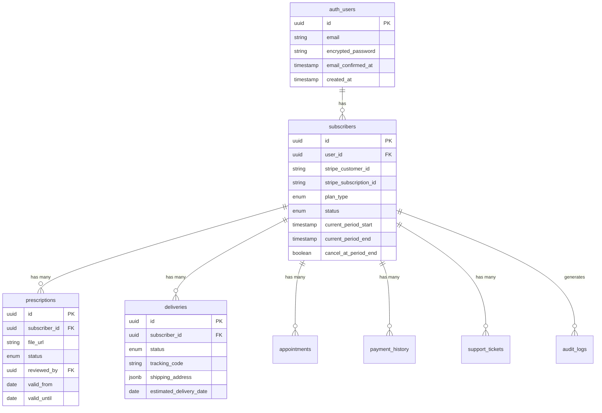
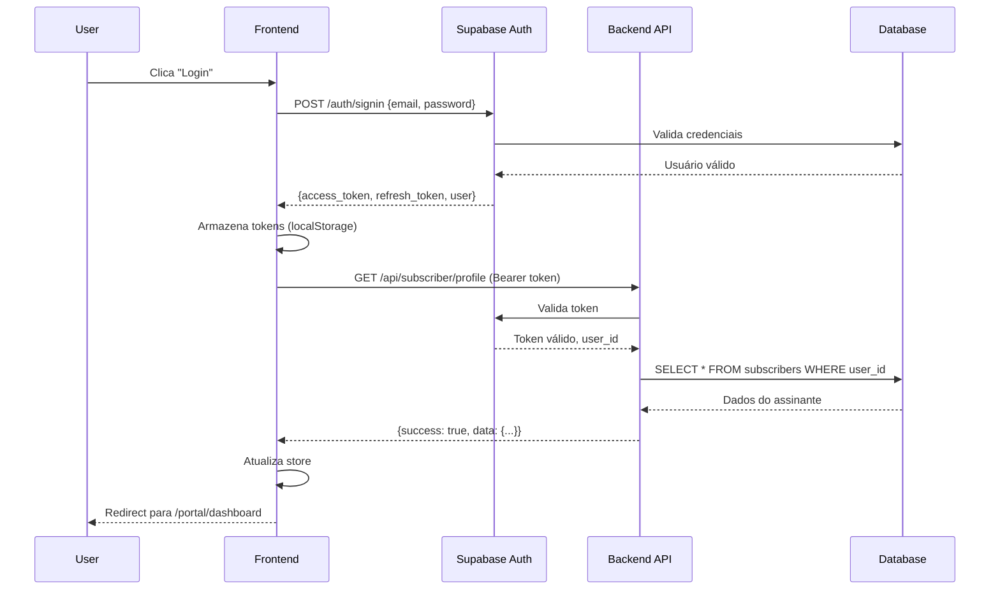
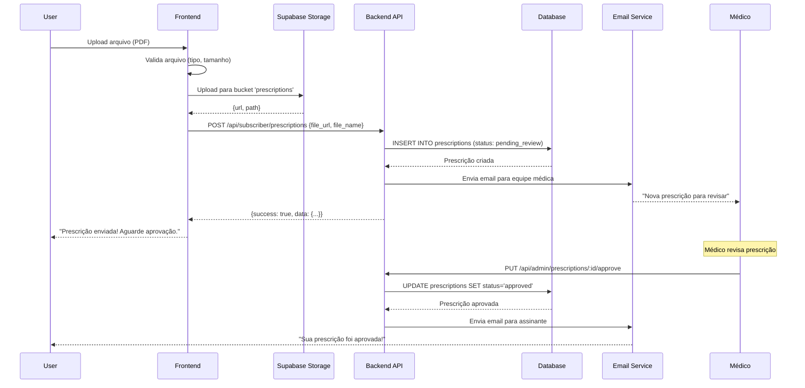
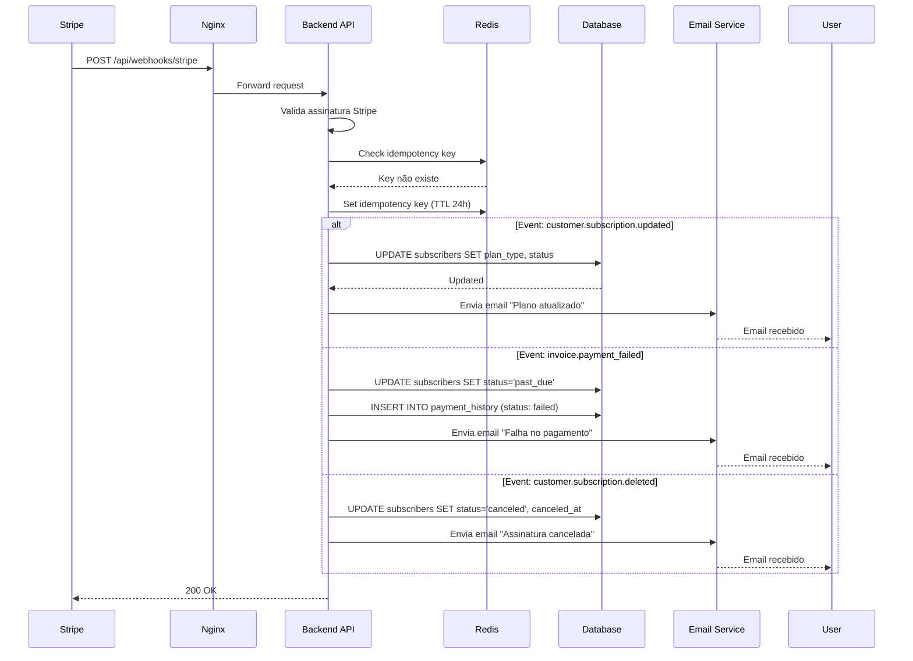

# System Design - Área do Assinante

**Projeto**: Saraiva Vision - Portal do Assinante
**Versão**: 1.0.0
**Data**: 2025-10-25
**Autor**: Dr. Philipe Saraiva Cruz

---

## Sumário

1. [Visão Geral da Arquitetura](#visão-geral-da-arquitetura)
2. [Componentes do Sistema](#componentes-do-sistema)
3. [Fluxo de Dados](#fluxo-de-dados)
4. [Autenticação e Autorização](#autenticação-e-autorização)
5. [Banco de Dados](#banco-de-dados)
6. [APIs e Integrações](#apis-e-integrações)
7. [Caching e Performance](#caching-e-performance)
8. [Segurança](#segurança)
9. [Escalabilidade](#escalabilidade)
10. [Monitoramento e Observabilidade](#monitoramento-e-observabilidade)

---

## Visão Geral da Arquitetura

### Diagrama de Alto Nível

```
┌────────────────────────────────────────────────────────────────┐
│                         Client Layer                           │
│  ┌──────────────┐  ┌──────────────┐  ┌──────────────┐        │
│  │   Browser    │  │    Mobile    │  │     PWA      │        │
│  │   (React)    │  │   (React)    │  │  (Installed) │        │
│  └──────────────┘  └──────────────┘  └──────────────┘        │
└────────────────────────────────────────────────────────────────┘
                            ▼
┌────────────────────────────────────────────────────────────────┐
│                         CDN Layer                              │
│                    (Static Assets)                             │
│            /dist/ → Nginx → Browser Cache                      │
└────────────────────────────────────────────────────────────────┘
                            ▼
┌────────────────────────────────────────────────────────────────┐
│                      Web Server (Nginx)                        │
│  ┌──────────────────────────────────────────────────────┐     │
│  │  • Reverse Proxy                                     │     │
│  │  • Rate Limiting (100 req/min geral, 30 API)        │     │
│  │  • SSL Termination (TLS 1.3)                        │     │
│  │  • Request Routing                                   │     │
│  │    - /portal/* → Frontend (SPA)                     │     │
│  │    - /api/* → Backend API (Express)                 │     │
│  │    - /auth/* → Supabase Auth                        │     │
│  └──────────────────────────────────────────────────────┘     │
└────────────────────────────────────────────────────────────────┘
            ▼                            ▼
┌─────────────────────┐      ┌─────────────────────────┐
│   Frontend (SPA)    │      │   Backend API (Node)    │
│                     │      │                         │
│  • React 18 + TS    │      │  • Express.js           │
│  • React Router     │      │  • Port 3001            │
│  • Zustand + RQ     │      │  • JWT Validation       │
│  • Tailwind CSS     │      │  • Business Logic       │
│                     │      │  • Webhook Handlers     │
└─────────────────────┘      └─────────────────────────┘
            ▼                            ▼
┌─────────────────────────────────────────────────────────────┐
│                    Service Layer                            │
│  ┌────────────┐  ┌────────────┐  ┌────────────┐          │
│  │  Supabase  │  │   Stripe   │  │   Resend   │          │
│  │   Auth     │  │  Payments  │  │   Email    │          │
│  └────────────┘  └────────────┘  └────────────┘          │
│  ┌────────────┐  ┌────────────┐  ┌────────────┐          │
│  │  Supabase  │  │   Redis    │  │  WhatsApp  │          │
│  │  Database  │  │   Cache    │  │  Business  │          │
│  └────────────┘  └────────────┘  └────────────┘          │
└─────────────────────────────────────────────────────────────┘
```

---

## Componentes do Sistema

### 1. Frontend (React SPA)

#### Estrutura de Diretórios
```
src/
├── modules/
│   └── subscriber/                    # Módulo do portal do assinante
│       ├── pages/                     # Páginas do portal
│       │   ├── DashboardPage.jsx      # Dashboard principal
│       │   ├── SubscriptionPage.jsx   # Gerenciar assinatura
│       │   ├── DeliveriesPage.jsx     # Entregas
│       │   ├── PrescriptionsPage.jsx  # Prescrições
│       │   ├── AppointmentsPage.jsx   # Consultas
│       │   ├── SettingsPage.jsx       # Configurações
│       │   └── SupportPage.jsx        # Suporte
│       ├── components/                # Componentes do módulo
│       │   ├── SubscriptionCard.jsx   # Card de assinatura
│       │   ├── DeliveryTracker.jsx    # Rastreamento
│       │   ├── PrescriptionUpload.jsx # Upload de prescrição
│       │   └── ...
│       ├── hooks/                     # Hooks customizados
│       │   ├── useSubscriber.js       # Hook para dados do assinante
│       │   ├── useSubscription.js     # Hook para assinatura
│       │   ├── useDeliveries.js       # Hook para entregas
│       │   └── ...
│       ├── services/                  # Serviços de API
│       │   ├── subscriberService.js   # API do assinante
│       │   ├── deliveryService.js     # API de entregas
│       │   └── ...
│       └── store/                     # Estado global (Zustand)
│           ├── subscriberStore.js     # Store do assinante
│           └── uiStore.js             # Store de UI
├── lib/
│   └── supabase.js                    # Cliente Supabase
└── routes/
    └── SubscriberRoutes.jsx           # Rotas protegidas
```

#### Roteamento

```jsx
// src/routes/SubscriberRoutes.jsx
import { Routes, Route, Navigate } from 'react-router-dom';
import { ProtectedRoute } from '@/components/ProtectedRoute';

export default function SubscriberRoutes() {
  return (
    <Routes>
      <Route path="/portal" element={<ProtectedRoute />}>
        <Route index element={<Navigate to="/portal/dashboard" replace />} />
        <Route path="dashboard" element={<DashboardPage />} />
        <Route path="subscription" element={<SubscriptionPage />} />
        <Route path="deliveries" element={<DeliveriesPage />} />
        <Route path="prescriptions" element={<PrescriptionsPage />} />
        <Route path="appointments" element={<AppointmentsPage />} />
        <Route path="settings" element={<SettingsPage />} />
        <Route path="support" element={<SupportPage />} />
      </Route>

      {/* Rotas públicas de autenticação */}
      <Route path="/auth/login" element={<LoginPage />} />
      <Route path="/auth/register" element={<RegisterPage />} />
      <Route path="/auth/forgot-password" element={<ForgotPasswordPage />} />
      <Route path="/auth/reset-password" element={<ResetPasswordPage />} />
      <Route path="/auth/verify-email" element={<VerifyEmailPage />} />
    </Routes>
  );
}
```

#### State Management

**Zustand Stores:**

```javascript
// src/modules/subscriber/store/subscriberStore.js
import { create } from 'zustand';
import { persist } from 'zustand/middleware';

export const useSubscriberStore = create(
  persist(
    (set, get) => ({
      subscriber: null,
      subscription: null,
      isLoading: false,
      error: null,

      // Actions
      setSubscriber: (subscriber) => set({ subscriber }),
      setSubscription: (subscription) => set({ subscription }),
      clearSubscriber: () => set({ subscriber: null, subscription: null }),

      // Async actions
      fetchSubscriber: async () => {
        set({ isLoading: true, error: null });
        try {
          const response = await subscriberService.getProfile();
          set({ subscriber: response.data, isLoading: false });
        } catch (error) {
          set({ error: error.message, isLoading: false });
        }
      },
    }),
    {
      name: 'subscriber-storage',
      partialize: (state) => ({ subscriber: state.subscriber }), // Apenas persiste subscriber
    }
  )
);
```

**React Query para fetching:**

```javascript
// src/modules/subscriber/hooks/useSubscription.js
import { useQuery, useMutation, useQueryClient } from '@tanstack/react-query';
import { subscriptionService } from '../services/subscriptionService';

export function useSubscription() {
  const queryClient = useQueryClient();

  // Fetch subscription
  const { data: subscription, isLoading, error } = useQuery({
    queryKey: ['subscription'],
    queryFn: subscriptionService.getSubscription,
    staleTime: 5 * 60 * 1000, // 5 minutos
    cacheTime: 10 * 60 * 1000, // 10 minutos
  });

  // Cancel subscription mutation
  const cancelMutation = useMutation({
    mutationFn: (reason) => subscriptionService.cancelSubscription(reason),
    onSuccess: () => {
      queryClient.invalidateQueries(['subscription']);
      queryClient.invalidateQueries(['subscriber']);
    },
  });

  return {
    subscription,
    isLoading,
    error,
    cancelSubscription: cancelMutation.mutate,
    isCanceling: cancelMutation.isLoading,
  };
}
```

---

### 2. Backend API (Express.js)

#### Estrutura de Diretórios
```
api/src/
├── routes/
│   ├── subscriber/                    # Rotas do assinante
│   │   ├── index.js                   # Router principal
│   │   ├── profile.js                 # GET/PUT /api/subscriber/profile
│   │   ├── subscription.js            # /api/subscriber/subscription
│   │   ├── deliveries.js              # /api/subscriber/deliveries
│   │   ├── prescriptions.js           # /api/subscriber/prescriptions
│   │   └── appointments.js            # /api/subscriber/appointments
│   └── webhooks/
│       ├── stripe.js                  # POST /api/webhooks/stripe
│       └── supabase.js                # POST /api/webhooks/supabase
├── middleware/
│   ├── auth.js                        # Validação JWT
│   ├── rateLimiter.js                 # Rate limiting
│   ├── validator.js                   # Validação Zod
│   └── errorHandler.js                # Error handling
├── services/
│   ├── SubscriberService.js           # Lógica de negócio
│   ├── SubscriptionService.js
│   ├── DeliveryService.js
│   ├── PrescriptionService.js
│   └── AppointmentService.js
├── lib/
│   ├── supabase.js                    # Cliente Supabase (service role)
│   ├── stripe.js                      # Cliente Stripe
│   ├── redis.js                       # Cliente Redis
│   └── email.js                       # Cliente Resend
└── server.js                          # Entry point
```

#### Middleware de Autenticação

```javascript
// api/src/middleware/auth.js
import { createClient } from '@supabase/supabase-js';

const supabase = createClient(
  process.env.VITE_SUPABASE_URL,
  process.env.SUPABASE_SERVICE_ROLE_KEY // Backend usa service role
);

export async function authenticateUser(req, res, next) {
  try {
    const authHeader = req.headers.authorization;

    if (!authHeader || !authHeader.startsWith('Bearer ')) {
      return res.status(401).json({
        success: false,
        error: 'Missing or invalid authorization header'
      });
    }

    const token = authHeader.substring(7);

    // Verifica token JWT com Supabase
    const { data: { user }, error } = await supabase.auth.getUser(token);

    if (error || !user) {
      return res.status(401).json({
        success: false,
        error: 'Invalid or expired token'
      });
    }

    // Adiciona user ao request
    req.user = user;
    next();

  } catch (error) {
    console.error('Auth middleware error:', error);
    return res.status(500).json({
      success: false,
      error: 'Authentication failed'
    });
  }
}
```

#### Exemplo de Route Handler

```javascript
// api/src/routes/subscriber/subscription.js
import express from 'express';
import { z } from 'zod';
import { authenticateUser } from '../../middleware/auth.js';
import { validate } from '../../middleware/validator.js';
import { SubscriptionService } from '../../services/SubscriptionService.js';

const router = express.Router();
const subscriptionService = new SubscriptionService();

// GET /api/subscriber/subscription
router.get('/', authenticateUser, async (req, res) => {
  try {
    const userId = req.user.id;
    const subscription = await subscriptionService.getByUserId(userId);

    if (!subscription) {
      return res.status(404).json({
        success: false,
        error: 'Subscription not found'
      });
    }

    return res.json({
      success: true,
      data: subscription
    });
  } catch (error) {
    console.error('Get subscription error:', error);
    return res.status(500).json({
      success: false,
      error: 'Failed to fetch subscription'
    });
  }
});

// PUT /api/subscriber/subscription/cancel
const cancelSchema = z.object({
  reason: z.enum([
    'too_expensive',
    'not_using',
    'switching_provider',
    'quality_issues',
    'other'
  ]),
  feedback: z.string().max(500).optional()
});

router.put(
  '/cancel',
  authenticateUser,
  validate(cancelSchema),
  async (req, res) => {
    try {
      const userId = req.user.id;
      const { reason, feedback } = req.body;

      const result = await subscriptionService.cancel(userId, reason, feedback);

      return res.json({
        success: true,
        data: result
      });
    } catch (error) {
      console.error('Cancel subscription error:', error);
      return res.status(500).json({
        success: false,
        error: 'Failed to cancel subscription'
      });
    }
  }
);

export default router;
```

---

### 3. Banco de Dados (Supabase PostgreSQL)

#### Schema Overview

```sql
-- Enable UUID extension
CREATE EXTENSION IF NOT EXISTS "uuid-ossp";

-- Enable Row Level Security
ALTER DATABASE postgres SET row_security = on;
```

#### Tabelas e Relações



#### Row Level Security (RLS)

**Política: Usuário só acessa seus próprios dados**

```sql
-- subscribers table
ALTER TABLE subscribers ENABLE ROW LEVEL SECURITY;

CREATE POLICY "Users can view own subscription"
  ON subscribers FOR SELECT
  USING (auth.uid() = user_id);

CREATE POLICY "Users can update own subscription"
  ON subscribers FOR UPDATE
  USING (auth.uid() = user_id)
  WITH CHECK (auth.uid() = user_id);

-- prescriptions table
ALTER TABLE prescriptions ENABLE ROW LEVEL SECURITY;

CREATE POLICY "Users can view own prescriptions"
  ON prescriptions FOR SELECT
  USING (
    subscriber_id IN (
      SELECT id FROM subscribers WHERE user_id = auth.uid()
    )
  );

CREATE POLICY "Users can insert own prescriptions"
  ON prescriptions FOR INSERT
  WITH CHECK (
    subscriber_id IN (
      SELECT id FROM subscribers WHERE user_id = auth.uid()
    )
  );

-- deliveries table
ALTER TABLE deliveries ENABLE ROW LEVEL SECURITY;

CREATE POLICY "Users can view own deliveries"
  ON deliveries FOR SELECT
  USING (
    subscriber_id IN (
      SELECT id FROM subscribers WHERE user_id = auth.uid()
    )
  );

-- Médicos podem aprovar prescrições
CREATE POLICY "Doctors can approve prescriptions"
  ON prescriptions FOR UPDATE
  USING (
    EXISTS (
      SELECT 1 FROM auth.users
      WHERE id = auth.uid()
      AND raw_user_meta_data->>'role' = 'doctor'
    )
  );
```

#### Indexes para Performance

```sql
-- subscribers
CREATE INDEX idx_subscribers_user_id ON subscribers(user_id);
CREATE INDEX idx_subscribers_stripe_customer_id ON subscribers(stripe_customer_id);
CREATE INDEX idx_subscribers_status ON subscribers(status);
CREATE INDEX idx_subscribers_current_period_end ON subscribers(current_period_end);

-- prescriptions
CREATE INDEX idx_prescriptions_subscriber_id ON prescriptions(subscriber_id);
CREATE INDEX idx_prescriptions_status ON prescriptions(status);
CREATE INDEX idx_prescriptions_valid_until ON prescriptions(valid_until);

-- deliveries
CREATE INDEX idx_deliveries_subscriber_id ON deliveries(subscriber_id);
CREATE INDEX idx_deliveries_status ON deliveries(status);
CREATE INDEX idx_deliveries_estimated_delivery_date ON deliveries(estimated_delivery_date);

-- appointments
CREATE INDEX idx_appointments_subscriber_id ON appointments(subscriber_id);
CREATE INDEX idx_appointments_scheduled_at ON appointments(scheduled_at);
CREATE INDEX idx_appointments_status ON appointments(status);
```

#### Triggers e Functions

**1. Auto-update `updated_at`**

```sql
CREATE OR REPLACE FUNCTION update_updated_at_column()
RETURNS TRIGGER AS $$
BEGIN
   NEW.updated_at = NOW();
   RETURN NEW;
END;
$$ LANGUAGE plpgsql;

CREATE TRIGGER update_subscribers_updated_at
  BEFORE UPDATE ON subscribers
  FOR EACH ROW
  EXECUTE FUNCTION update_updated_at_column();

-- Repetir para todas as tabelas
```

**2. Notificar expiração de prescrição**

```sql
CREATE OR REPLACE FUNCTION notify_prescription_expiring()
RETURNS void AS $$
BEGIN
  -- Seleciona prescrições expirando em 30 dias
  INSERT INTO notifications (subscriber_id, type, message, created_at)
  SELECT
    p.subscriber_id,
    'prescription_expiring',
    'Sua prescrição expira em ' || (p.valid_until - CURRENT_DATE) || ' dias',
    NOW()
  FROM prescriptions p
  WHERE p.valid_until BETWEEN CURRENT_DATE AND CURRENT_DATE + INTERVAL '30 days'
    AND p.status = 'approved'
    AND NOT EXISTS (
      SELECT 1 FROM notifications n
      WHERE n.subscriber_id = p.subscriber_id
        AND n.type = 'prescription_expiring'
        AND n.created_at > CURRENT_DATE - INTERVAL '7 days'
    );
END;
$$ LANGUAGE plpgsql;

-- Cron job (pg_cron extension)
SELECT cron.schedule(
  'notify-prescription-expiring',
  '0 9 * * *', -- Todo dia às 9h
  $$SELECT notify_prescription_expiring()$$
);
```

---

## Fluxo de Dados

### 1. Fluxo de Autenticação



### 2. Fluxo de Upload de Prescrição



### 3. Fluxo de Stripe Webhook



---

## Autenticação e Autorização

### JWT Token Flow

```
┌─────────────────────────────────────────────────────────────────┐
│                        JWT Token Structure                      │
├─────────────────────────────────────────────────────────────────┤
│ Header:                                                         │
│   {                                                             │
│     "alg": "HS256",                                             │
│     "typ": "JWT"                                                │
│   }                                                             │
├─────────────────────────────────────────────────────────────────┤
│ Payload:                                                        │
│   {                                                             │
│     "sub": "uuid-do-usuario",                                   │
│     "email": "usuario@exemplo.com",                             │
│     "role": "authenticated",                                    │
│     "aud": "authenticated",                                     │
│     "iat": 1698765432,                                          │
│     "exp": 1698851832  // 24h de validade                       │
│   }                                                             │
├─────────────────────────────────────────────────────────────────┤
│ Signature:                                                      │
│   HMACSHA256(                                                   │
│     base64UrlEncode(header) + "." +                             │
│     base64UrlEncode(payload),                                   │
│     SUPABASE_JWT_SECRET                                         │
│   )                                                             │
└─────────────────────────────────────────────────────────────────┘
```

### Refresh Token Strategy

```javascript
// src/lib/supabase.js
import { createClient } from '@supabase/supabase-js';

const supabase = createClient(
  import.meta.env.VITE_SUPABASE_URL,
  import.meta.env.VITE_SUPABASE_ANON_KEY,
  {
    auth: {
      autoRefreshToken: true, // Auto-refresh antes de expirar
      persistSession: true,   // Persiste no localStorage
      detectSessionInUrl: true // Detecta token em URL (magic link, OAuth)
    }
  }
);

// Interceptor para renovar token em requisições
supabase.auth.onAuthStateChange((event, session) => {
  if (event === 'TOKEN_REFRESHED') {
    console.log('Token renovado automaticamente');
  }

  if (event === 'SIGNED_OUT') {
    // Limpa cache e redireciona para login
    queryClient.clear();
    window.location.href = '/auth/login';
  }
});

export { supabase };
```

### Proteção de Rotas

```jsx
// src/components/ProtectedRoute.jsx
import { Navigate, Outlet } from 'react-router-dom';
import { useAuth } from '@/hooks/useAuth';
import { Spinner } from '@/components/ui/Spinner';

export function ProtectedRoute() {
  const { user, loading } = useAuth();

  if (loading) {
    return (
      <div className="min-h-screen flex items-center justify-center">
        <Spinner size="lg" />
      </div>
    );
  }

  if (!user) {
    // Redireciona para login, salvando URL de destino
    return <Navigate to="/auth/login" state={{ from: location }} replace />;
  }

  // Renderiza rotas filhas
  return <Outlet />;
}
```

---

## APIs e Integrações

### API Endpoints

#### Subscriber Profile
```
GET    /api/subscriber/profile
PUT    /api/subscriber/profile
DELETE /api/subscriber/profile
```

#### Subscription Management
```
GET    /api/subscriber/subscription
PUT    /api/subscriber/subscription/upgrade
PUT    /api/subscriber/subscription/downgrade
PUT    /api/subscriber/subscription/pause
PUT    /api/subscriber/subscription/resume
PUT    /api/subscriber/subscription/cancel
POST   /api/subscriber/subscription/reactivate
```

#### Payment History
```
GET    /api/subscriber/payments
GET    /api/subscriber/payments/:id
GET    /api/subscriber/payments/:id/invoice-pdf
```

#### Deliveries
```
GET    /api/subscriber/deliveries
GET    /api/subscriber/deliveries/:id
PUT    /api/subscriber/deliveries/:id/address
POST   /api/subscriber/deliveries/:id/confirm-receipt
```

#### Prescriptions
```
GET    /api/subscriber/prescriptions
GET    /api/subscriber/prescriptions/:id
POST   /api/subscriber/prescriptions
DELETE /api/subscriber/prescriptions/:id
```

#### Appointments
```
GET    /api/subscriber/appointments
POST   /api/subscriber/appointments
PUT    /api/subscriber/appointments/:id/reschedule
DELETE /api/subscriber/appointments/:id/cancel
```

#### Support
```
GET    /api/subscriber/support/tickets
POST   /api/subscriber/support/tickets
PUT    /api/subscriber/support/tickets/:id
```

#### LGPD Compliance
```
GET    /api/subscriber/data-export      # Exportar dados
POST   /api/subscriber/data-deletion    # Solicitar exclusão
GET    /api/subscriber/consents         # Gerenciar consentimentos
PUT    /api/subscriber/consents/:id
```

---

## Caching e Performance

### Estratégia de Cache (Redis)

```javascript
// api/src/lib/redis.js
import Redis from 'ioredis';

const redis = new Redis({
  host: process.env.REDIS_HOST || 'localhost',
  port: process.env.REDIS_PORT || 6379,
  password: process.env.REDIS_PASSWORD,
  retryStrategy: (times) => Math.min(times * 50, 2000),
});

// Padrões de cache key
export const CACHE_KEYS = {
  subscription: (userId) => `subscriber:${userId}:subscription`,
  profile: (userId) => `subscriber:${userId}:profile`,
  deliveries: (userId) => `subscriber:${userId}:deliveries`,
  prescriptions: (userId) => `subscriber:${userId}:prescriptions`,
};

// TTLs (Time To Live)
export const CACHE_TTL = {
  subscription: 5 * 60,      // 5 minutos
  profile: 10 * 60,          // 10 minutos
  deliveries: 2 * 60,        // 2 minutos (muda frequentemente)
  prescriptions: 30 * 60,    // 30 minutos
};

// Helper para get/set com cache
export async function cacheGet(key, fetchFn, ttl = 300) {
  // Tenta buscar do cache
  const cached = await redis.get(key);

  if (cached) {
    return JSON.parse(cached);
  }

  // Se não existe, busca da fonte
  const data = await fetchFn();

  // Salva no cache
  await redis.setex(key, ttl, JSON.stringify(data));

  return data;
}

// Invalidar cache
export async function cacheInvalidate(pattern) {
  const keys = await redis.keys(pattern);

  if (keys.length > 0) {
    await redis.del(...keys);
  }
}
```

### Cache em Requisições

```javascript
// api/src/routes/subscriber/subscription.js
import { cacheGet, cacheInvalidate, CACHE_KEYS, CACHE_TTL } from '../../lib/redis.js';

router.get('/', authenticateUser, async (req, res) => {
  try {
    const userId = req.user.id;
    const cacheKey = CACHE_KEYS.subscription(userId);

    // Busca com cache
    const subscription = await cacheGet(
      cacheKey,
      async () => {
        return await subscriptionService.getByUserId(userId);
      },
      CACHE_TTL.subscription
    );

    return res.json({ success: true, data: subscription });
  } catch (error) {
    // Error handling
  }
});

router.put('/cancel', authenticateUser, async (req, res) => {
  try {
    const userId = req.user.id;

    // Cancela assinatura
    const result = await subscriptionService.cancel(userId, req.body.reason);

    // Invalida cache
    await cacheInvalidate(CACHE_KEYS.subscription(userId));
    await cacheInvalidate(CACHE_KEYS.profile(userId));

    return res.json({ success: true, data: result });
  } catch (error) {
    // Error handling
  }
});
```

### Frontend Cache (React Query)

```javascript
// src/lib/queryClient.js
import { QueryClient } from '@tanstack/react-query';

export const queryClient = new QueryClient({
  defaultOptions: {
    queries: {
      staleTime: 5 * 60 * 1000,       // 5 minutos
      cacheTime: 10 * 60 * 1000,      // 10 minutos
      refetchOnWindowFocus: false,    // Não refetch ao focar janela
      refetchOnReconnect: true,       // Refetch ao reconectar
      retry: 2,                       // Retry 2x em caso de erro
    },
  },
});
```

---

## Segurança

### Camadas de Segurança

```
┌──────────────────────────────────────────────────────────┐
│ Layer 1: Network Security (Nginx)                       │
│  • Rate Limiting (100 req/min geral, 30 API)           │
│  • DDoS Protection                                      │
│  • SSL/TLS 1.3                                          │
│  • Content Security Policy (CSP)                        │
└──────────────────────────────────────────────────────────┘
                         ▼
┌──────────────────────────────────────────────────────────┐
│ Layer 2: Authentication (Supabase Auth)                 │
│  • JWT Token Validation                                 │
│  • Session Management                                   │
│  • 2FA (opcional)                                       │
│  • Password Hashing (bcrypt)                            │
└──────────────────────────────────────────────────────────┘
                         ▼
┌──────────────────────────────────────────────────────────┐
│ Layer 3: Authorization (RLS + Backend)                  │
│  • Row Level Security (PostgreSQL)                      │
│  • User-specific data isolation                         │
│  • Role-based access control                            │
└──────────────────────────────────────────────────────────┘
                         ▼
┌──────────────────────────────────────────────────────────┐
│ Layer 4: Data Validation (Zod)                          │
│  • Input sanitization                                   │
│  • Type checking                                        │
│  • Schema validation                                    │
└──────────────────────────────────────────────────────────┘
                         ▼
┌──────────────────────────────────────────────────────────┐
│ Layer 5: Audit & Monitoring                             │
│  • Audit logs (todas as ações)                          │
│  • Error tracking (Sentry)                              │
│  • Security monitoring                                  │
└──────────────────────────────────────────────────────────┘
```

### Rate Limiting (Nginx)

```nginx
# /etc/nginx/sites-enabled/saraivavision

# Rate limiting zones
limit_req_zone $binary_remote_addr zone=subscriber_login:10m rate=5r/m;
limit_req_zone $binary_remote_addr zone=subscriber_api:10m rate=30r/m;
limit_req_zone $binary_remote_addr zone=subscriber_general:10m rate=100r/m;

server {
    # Auth endpoints - Mais restritivo
    location /auth/ {
        limit_req zone=subscriber_login burst=3 nodelay;
        proxy_pass http://localhost:3001;
    }

    # API endpoints - Moderado
    location /api/subscriber/ {
        limit_req zone=subscriber_api burst=10 nodelay;
        proxy_pass http://localhost:3001;
    }

    # Static assets - Menos restritivo
    location /portal/ {
        limit_req zone=subscriber_general burst=20 nodelay;
        try_files $uri $uri/ /index.html;
    }
}
```

### Input Validation (Zod)

```javascript
// api/src/middleware/validator.js
import { z } from 'zod';

export function validate(schema) {
  return (req, res, next) => {
    try {
      schema.parse(req.body);
      next();
    } catch (error) {
      if (error instanceof z.ZodError) {
        return res.status(400).json({
          success: false,
          error: 'Validation failed',
          details: error.errors
        });
      }
      next(error);
    }
  };
}

// Uso em rotas
const updateProfileSchema = z.object({
  name: z.string().min(2).max(100),
  phone: z.string().regex(/^\+55\d{10,11}$/),
  address: z.object({
    street: z.string(),
    number: z.string(),
    city: z.string(),
    state: z.string().length(2),
    zip: z.string().regex(/^\d{5}-\d{3}$/)
  })
});

router.put('/profile', authenticateUser, validate(updateProfileSchema), handler);
```

### Audit Logging

```javascript
// api/src/middleware/auditLogger.js
export async function auditLog(req, res, next) {
  // Captura dados da requisição
  const logData = {
    user_id: req.user?.id,
    action: `${req.method} ${req.path}`,
    resource_type: req.path.split('/')[3], // Ex: 'subscription', 'deliveries'
    resource_id: req.params.id,
    changes: req.method === 'PUT' ? req.body : null,
    ip_address: req.ip,
    user_agent: req.get('user-agent'),
    created_at: new Date()
  };

  // Intercepta response para capturar resultado
  const originalSend = res.send;
  res.send = function(data) {
    // Registra log apenas em operações sensíveis
    if (['PUT', 'POST', 'DELETE'].includes(req.method)) {
      supabase.from('audit_logs').insert(logData);
    }

    originalSend.apply(res, arguments);
  };

  next();
}
```

---

## Escalabilidade

### Horizontal Scaling

```
┌──────────────────────────────────────────────────────────┐
│                   Load Balancer (Nginx)                  │
│            (Round-robin or Least Connections)            │
└──────────────────────────────────────────────────────────┘
                         │
         ┌───────────────┼───────────────┐
         ▼               ▼               ▼
   ┌─────────┐     ┌─────────┐     ┌─────────┐
   │ Node 1  │     │ Node 2  │     │ Node 3  │
   │ (3001)  │     │ (3002)  │     │ (3003)  │
   └─────────┘     └─────────┘     └─────────┘
         │               │               │
         └───────────────┼───────────────┘
                         ▼
                 ┌───────────────┐
                 │  Redis Cache  │
                 │  (Shared)     │
                 └───────────────┘
                         ▼
                 ┌───────────────┐
                 │   Supabase    │
                 │   Database    │
                 │ (PostgreSQL)  │
                 └───────────────┘
```

### Database Scaling

**Read Replicas:**
```javascript
// api/src/lib/supabase.js
import { createClient } from '@supabase/supabase-js';

// Master (Write)
export const supabaseMaster = createClient(
  process.env.VITE_SUPABASE_URL,
  process.env.SUPABASE_SERVICE_ROLE_KEY
);

// Replica (Read) - Se Supabase oferece read replicas
export const supabaseReplica = createClient(
  process.env.VITE_SUPABASE_REPLICA_URL,
  process.env.SUPABASE_SERVICE_ROLE_KEY
);

// Helper para escolher conexão
export function getDB(operation = 'read') {
  return operation === 'write' ? supabaseMaster : supabaseReplica;
}
```

**Connection Pooling:**
```javascript
// Supabase automaticamente faz pooling, mas podemos ajustar:
const supabase = createClient(url, key, {
  db: {
    poolSize: 10, // Máximo de conexões
  },
  global: {
    headers: {
      'x-application-name': 'subscriber-portal'
    }
  }
});
```

---

## Monitoramento e Observabilidade

### Métricas Chave (KPIs)

```javascript
// api/src/services/MetricsService.js
export class MetricsService {
  async getSystemMetrics() {
    return {
      // Métricas de negócio
      activeSubscribers: await this.countActiveSubscribers(),
      totalRevenueMRR: await this.calculateMRR(),
      churnRate: await this.calculateChurnRate(),

      // Métricas técnicas
      apiResponseTime: await this.getAvgResponseTime(),
      errorRate: await this.calculateErrorRate(),
      cacheHitRate: await this.getCacheHitRate(),

      // Métricas de uso
      dailyActiveUsers: await this.countDAU(),
      monthlyActiveUsers: await this.countMAU(),
      mostUsedFeatures: await this.getMostUsedFeatures(),
    };
  }
}
```

### Logging Estruturado

```javascript
// api/src/lib/logger.js
import winston from 'winston';

export const logger = winston.createLogger({
  level: process.env.LOG_LEVEL || 'info',
  format: winston.format.combine(
    winston.format.timestamp(),
    winston.format.errors({ stack: true }),
    winston.format.json()
  ),
  defaultMeta: { service: 'subscriber-portal' },
  transports: [
    new winston.transports.File({ filename: 'logs/error.log', level: 'error' }),
    new winston.transports.File({ filename: 'logs/combined.log' }),
  ],
});

// Development logging
if (process.env.NODE_ENV !== 'production') {
  logger.add(new winston.transports.Console({
    format: winston.format.combine(
      winston.format.colorize(),
      winston.format.simple()
    )
  }));
}

// Uso
logger.info('User logged in', { userId: user.id, email: user.email });
logger.error('Database connection failed', { error: error.message });
```

### Error Tracking (Sentry)

```javascript
// api/src/lib/sentry.js
import * as Sentry from '@sentry/node';

Sentry.init({
  dsn: process.env.SENTRY_DSN,
  environment: process.env.NODE_ENV,
  tracesSampleRate: 1.0,
});

// Middleware para capturar erros
export function sentryErrorHandler(err, req, res, next) {
  Sentry.captureException(err, {
    user: { id: req.user?.id, email: req.user?.email },
    tags: { path: req.path, method: req.method },
  });
  next(err);
}
```

### Health Check Endpoint

```javascript
// api/src/routes/health.js
import express from 'express';
import { supabase } from '../lib/supabase.js';
import { redis } from '../lib/redis.js';

const router = express.Router();

router.get('/health', async (req, res) => {
  const checks = {
    status: 'healthy',
    timestamp: new Date().toISOString(),
    uptime: process.uptime(),
    services: {}
  };

  // Check Database
  try {
    const { error } = await supabase.from('subscribers').select('count').limit(1);
    checks.services.database = error ? 'unhealthy' : 'healthy';
  } catch {
    checks.services.database = 'unhealthy';
    checks.status = 'degraded';
  }

  // Check Redis
  try {
    await redis.ping();
    checks.services.redis = 'healthy';
  } catch {
    checks.services.redis = 'unhealthy';
    checks.status = 'degraded';
  }

  // Check Stripe
  try {
    await stripe.customers.list({ limit: 1 });
    checks.services.stripe = 'healthy';
  } catch {
    checks.services.stripe = 'unhealthy';
    checks.status = 'degraded';
  }

  const statusCode = checks.status === 'healthy' ? 200 : 503;
  res.status(statusCode).json(checks);
});

export default router;
```

---

## Apêndices

### A. Diagramas de Sequência Completos

Ver documentação separada em `docs/diagrams/`

### B. API Contract Examples

Ver documentação separada em `specs/006-subscriber-area/contracts/`

### C. Database Migration Scripts

Ver `database/migrations/`

---

**Aprovação**:
- [ ] Arquiteto de Software
- [ ] Tech Lead
- [ ] Security Officer
- [ ] DevOps Engineer

**Última Revisão**: 2025-10-25
