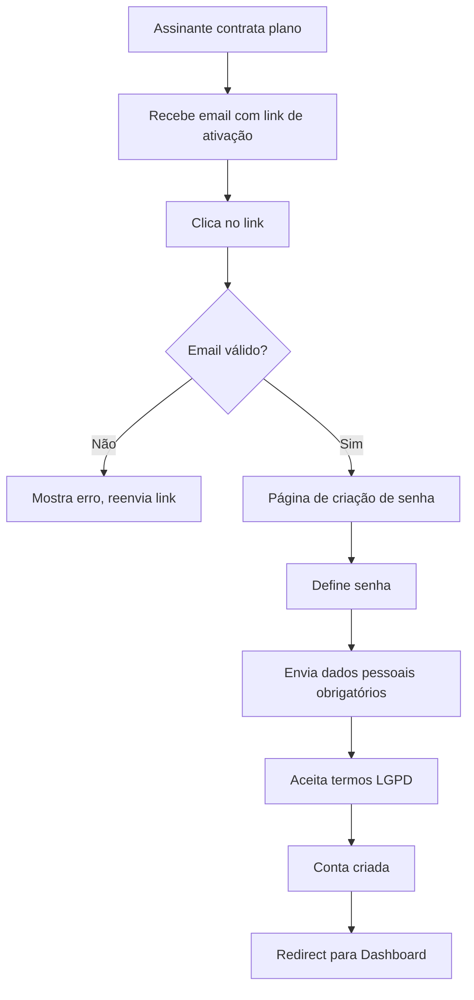
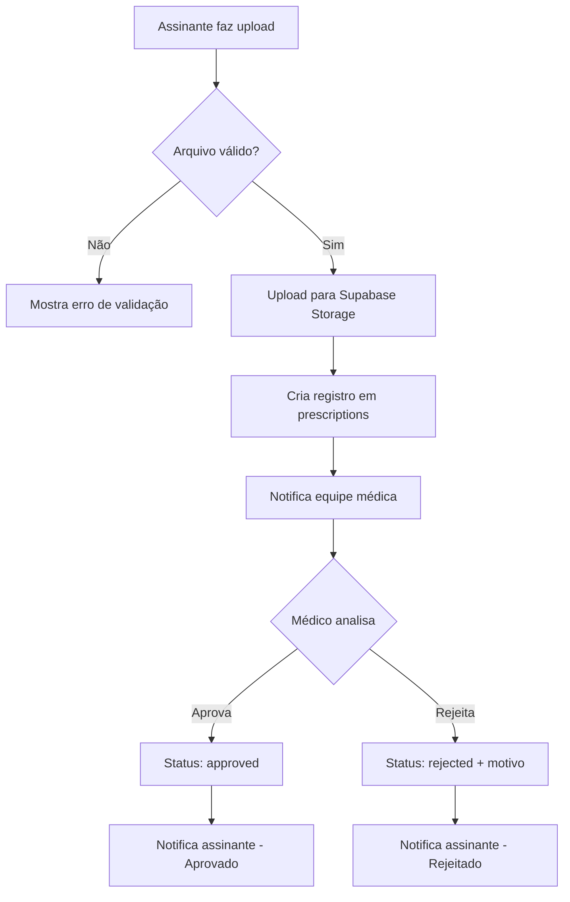

# Spec 006 - Área do Assinante

**Autor**: Dr. Philipe Saraiva Cruz
**Data de Criação**: 2025-10-25
**Última Atualização**: 2025-10-25
**Status**: ⏳ Planejamento
**Versão**: 1.0.0

## Sumário Executivo

A área do assinante é um portal completo de autoatendimento para pacientes com planos de assinatura de lentes de contato (Presencial, Flex, Online). O sistema permitirá que assinantes gerenciem suas assinaturas, acompanhem entregas, agendem consultas, atualizem prescrições e acessem histórico médico, tudo com conformidade LGPD/CFM.

## Objetivos

### Objetivos de Negócio
- **Reduzir carga operacional**: Automatizar 70% das solicitações de suporte relacionadas a assinaturas
- **Aumentar retenção**: Melhorar experiência do cliente com transparência total sobre assinatura
- **Aumentar lifetime value**: Facilitar upgrades de plano e renovações
- **Compliance**: Garantir conformidade LGPD/CFM em todos os acessos a dados médicos

### Objetivos Técnicos
- **Autenticação segura**: Implementar auth com Supabase (magic link, OAuth, 2FA)
- **Performance**: Área do assinante deve carregar em <2s (FCP) e <3s (LCP)
- **Responsividade**: Layout otimizado para mobile-first (80% dos acessos via mobile)
- **Integração Stripe**: Sincronização bidirecional de status de assinatura e pagamentos

## Escopo

### In Scope

#### 1. Autenticação e Acesso
- [ ] Login/Registro com Supabase Auth
- [ ] Magic Link (email)
- [ ] OAuth (Google, Facebook)
- [ ] Two-Factor Authentication (2FA)
- [ ] Recuperação de senha
- [ ] Gerenciamento de sessão segura

#### 2. Dashboard do Assinante
- [ ] Visão geral da assinatura ativa
- [ ] Status de entrega atual
- [ ] Próximas consultas agendadas
- [ ] Notificações importantes
- [ ] Atalhos rápidos para ações comuns

#### 3. Gerenciamento de Assinatura
- [ ] Visualizar detalhes do plano atual
- [ ] Histórico de pagamentos
- [ ] Faturas/recibos (download PDF)
- [ ] Upgrade/downgrade de plano
- [ ] Pausar/retomar assinatura (Flex apenas)
- [ ] Cancelar assinatura (self-service)
- [ ] Reativar assinatura cancelada

#### 4. Gerenciamento de Entregas
- [ ] Acompanhar status de entrega atual
- [ ] Histórico de entregas
- [ ] Atualizar endereço de entrega
- [ ] Reagendar entrega (Presencial)
- [ ] Confirmar recebimento

#### 5. Prescrição e Histórico Médico
- [ ] Visualizar prescrição atual
- [ ] Histórico de prescrições
- [ ] Upload de nova prescrição
- [ ] Solicitar renovação de prescrição
- [ ] Histórico de consultas

#### 6. Agendamento de Consultas
- [ ] Agendar nova consulta (Presencial/Online)
- [ ] Reagendar consulta existente
- [ ] Cancelar consulta
- [ ] Visualizar histórico de consultas
- [ ] Integração com WhatsApp para confirmação

#### 7. Configurações de Conta
- [ ] Editar informações pessoais
- [ ] Atualizar dados de contato
- [ ] Gerenciar preferências de comunicação
- [ ] Configurar notificações (email, SMS, push)
- [ ] Gerenciar consentimentos LGPD
- [ ] Solicitar exportação de dados (LGPD Art. 18)
- [ ] Solicitar exclusão de dados (LGPD Art. 18)

#### 8. Suporte e Ajuda
- [ ] Central de ajuda integrada
- [ ] Chat direto com suporte via WhatsApp
- [ ] Sistema de tickets
- [ ] FAQs contextuais
- [ ] Histórico de interações com suporte

### Out of Scope (Futuro)
- ❌ Programa de indicação (referral)
- ❌ Marketplace de produtos oftalmológicos
- ❌ Telemedicina integrada (videochamada no portal)
- ❌ Gamificação e recompensas
- ❌ Comunidade de assinantes (forum)

## Requisitos Funcionais

### RF-001: Autenticação e Autorização
**Prioridade**: P0 (Crítico)

**Descrição**: Sistema de autenticação seguro com múltiplos métodos de acesso.

**Critérios de Aceitação**:
- ✅ Usuário pode se registrar com email/senha
- ✅ Usuário pode fazer login com magic link
- ✅ Usuário pode fazer login com Google OAuth
- ✅ Usuário pode habilitar 2FA
- ✅ Sessão expira após 30 dias de inatividade
- ✅ Tentativas de login falhas são limitadas (5 tentativas/15min)
- ✅ Recuperação de senha funciona via email

**Regras de Negócio**:
- Apenas assinantes ativos ou com assinatura cancelada nos últimos 90 dias podem acessar
- Primeiro acesso requer validação de email
- 2FA é opcional mas recomendado para planos Premium

---

### RF-002: Dashboard do Assinante
**Prioridade**: P0 (Crítico)

**Descrição**: Dashboard centralizado com visão geral da conta do assinante.

**Critérios de Aceitação**:
- ✅ Dashboard carrega em <2s (FCP)
- ✅ Exibe status da assinatura (ativo, pausado, cancelado)
- ✅ Mostra próxima data de entrega
- ✅ Lista próximas consultas (máx 3)
- ✅ Exibe notificações importantes (máx 5)
- ✅ Mostra atalhos para ações comuns (mín 4)
- ✅ Responsivo em mobile (320px+)

**Widgets do Dashboard**:
1. **Status da Assinatura** (sempre visível)
   - Plano atual
   - Status (ativo/pausado/cancelado)
   - Próxima cobrança
   - Ação rápida: Gerenciar plano

2. **Próxima Entrega** (se houver)
   - Data estimada
   - Status de envio
   - Rastreamento (se disponível)
   - Ação rápida: Ver detalhes

3. **Consultas Agendadas** (se houver)
   - Próxima consulta
   - Data e hora
   - Tipo (presencial/online)
   - Ação rápida: Reagendar/Cancelar

4. **Notificações** (se houver)
   - Prescrição expirando
   - Pagamento pendente
   - Nova fatura disponível
   - Ação rápida: Ver todas

---

### RF-003: Gerenciamento de Assinatura
**Prioridade**: P0 (Crítico)

**Descrição**: Controle completo da assinatura pelo assinante.

**Critérios de Aceitação**:
- ✅ Usuário pode visualizar detalhes completos do plano
- ✅ Usuário pode ver histórico de pagamentos (últimos 12 meses)
- ✅ Usuário pode baixar faturas em PDF
- ✅ Usuário pode fazer upgrade/downgrade de plano
- ✅ Usuário pode pausar assinatura (Flex apenas, máx 2 meses)
- ✅ Usuário pode cancelar assinatura (self-service)
- ✅ Cancelamento mostra retenção modal com ofertas

**Fluxo de Upgrade/Downgrade**:
1. Usuário seleciona novo plano
2. Sistema calcula diferença proporcional
3. Exibe resumo de mudanças e novo valor
4. Usuário confirma
5. Stripe processa alteração
6. Webhook atualiza status no sistema
7. Email de confirmação enviado

**Fluxo de Cancelamento**:
1. Usuário clica "Cancelar assinatura"
2. Modal de retenção exibe:
   - Motivo do cancelamento (select)
   - Oferta de desconto (se aplicável)
   - Opção de pausar ao invés de cancelar (Flex)
3. Se usuário confirma:
   - Assinatura marcada para cancelamento ao fim do período pago
   - Email de confirmação enviado
   - Opção de feedback (pesquisa NPS)

---

### RF-004: Gerenciamento de Entregas
**Prioridade**: P1 (Alto)

**Descrição**: Rastreamento e gestão de entregas de lentes de contato.

**Critérios de Aceitação**:
- ✅ Usuário vê status em tempo real da entrega atual
- ✅ Usuário pode atualizar endereço de entrega
- ✅ Usuário pode reagendar entrega (Presencial, até 48h antes)
- ✅ Usuário pode confirmar recebimento
- ✅ Histórico de entregas mostra últimas 12 entregas

**Status de Entrega Possíveis**:
- `pending` - Aguardando processamento
- `preparing` - Lentes separadas para envio
- `shipped` - Enviado (com código rastreamento)
- `out_for_delivery` - Saiu para entrega
- `delivered` - Entregue
- `failed` - Falha na entrega
- `returned` - Devolvido ao remetente

**Atualização de Endereço**:
- Validação de CEP via ViaCEP API
- Confirmação obrigatória
- Afeta apenas próximas entregas (não retroativo)
- Validação de área de cobertura (Planos Presenciais: Caratinga e região)

---

### RF-005: Prescrição e Histórico Médico
**Prioridade**: P1 (Alto)

**Descrição**: Gerenciamento de prescrições e acesso a histórico médico.

**Critérios de Aceitação**:
- ✅ Usuário visualiza prescrição atual com validade
- ✅ Usuário pode fazer upload de nova prescrição
- ✅ Sistema valida formato do arquivo (PDF, JPG, PNG, max 5MB)
- ✅ Prescrição requer aprovação médica antes de ativar
- ✅ Sistema alerta quando prescrição está próxima de expirar (30 dias)
- ✅ Histórico mostra todas as prescrições (últimos 5 anos)
- ✅ Conformidade CFM: apenas profissional habilitado pode editar

**Fluxo de Upload de Prescrição**:
1. Usuário faz upload do arquivo
2. Sistema valida formato e tamanho
3. Sistema envia para revisão médica
4. Médico recebe notificação
5. Médico aprova/rejeita prescrição
6. Usuário é notificado do resultado
7. Se aprovado: prescrição ativa atualizada

**Alertas de Prescrição**:
- 30 dias antes do vencimento: Email + notificação in-app
- 7 dias antes: Email + SMS + notificação in-app
- No vencimento: Assinatura pausada automaticamente até nova prescrição

---

### RF-006: Agendamento de Consultas
**Prioridade**: P1 (Alto)

**Descrição**: Sistema de agendamento integrado para consultas presenciais e online.

**Critérios de Aceitação**:
- ✅ Usuário vê calendário com disponibilidade em tempo real
- ✅ Usuário pode agendar consulta (presencial ou online conforme plano)
- ✅ Usuário pode reagendar até 24h antes
- ✅ Usuário pode cancelar até 24h antes
- ✅ Sistema envia confirmação por email e WhatsApp
- ✅ Sistema envia lembrete 24h antes da consulta

**Integração com Sistema Existente**:
- Reusa componente `AgendamentoPage.jsx` existente
- Adiciona contexto de autenticação
- Pré-preenche dados do assinante
- Histórico de consultas salvo no perfil

**Regras de Cancelamento**:
- Presencial: Cancelamento até 24h antes (sem penalidade)
- Online: Cancelamento até 2h antes (sem penalidade)
- Cancelamento tardio: 1 falta registrada
- 3 faltas consecutivas: Revisão da assinatura

---

### RF-007: Configurações de Conta
**Prioridade**: P2 (Médio)

**Descrição**: Gerenciamento completo de dados pessoais e preferências.

**Critérios de Aceitação**:
- ✅ Usuário pode editar informações pessoais (nome, CPF, telefone)
- ✅ Usuário pode atualizar email (requer confirmação)
- ✅ Usuário pode configurar preferências de comunicação
- ✅ Usuário pode gerenciar consentimentos LGPD
- ✅ Usuário pode exportar dados (JSON/PDF)
- ✅ Usuário pode solicitar exclusão de conta

**Preferências de Comunicação**:
- [ ] Email de marketing
- [ ] SMS de lembrete
- [ ] WhatsApp para notificações
- [ ] Push notifications
- [ ] Newsletter mensal

**Conformidade LGPD**:
- Consentimento granular por finalidade
- Histórico de consentimentos
- Exportação de dados em 15 dias (LGPD Art. 18)
- Exclusão de dados em 30 dias (LGPD Art. 18)
- Log de acesso aos dados pessoais

---

### RF-008: Suporte e Ajuda
**Prioridade**: P2 (Médio)

**Descrição**: Central de suporte integrada ao portal.

**Critérios de Aceitação**:
- ✅ Central de ajuda com FAQs contextuais
- ✅ Chat via WhatsApp integrado
- ✅ Sistema de tickets para problemas complexos
- ✅ Histórico de interações com suporte
- ✅ Avaliação de atendimento (NPS)

**Categorias de Suporte**:
1. **Assinatura e Pagamentos**
2. **Entregas e Logística**
3. **Prescrições e Exames**
4. **Agendamento de Consultas**
5. **Problemas Técnicos**
6. **Outros**

**SLA de Resposta**:
- Tickets críticos: 4h úteis
- Tickets normais: 24h úteis
- Tickets baixa prioridade: 72h úteis

---

## Requisitos Não-Funcionais

### RNF-001: Performance
- **Tempo de carregamento inicial**: <2s (FCP), <3s (LCP)
- **Tempo de resposta API**: <500ms (p95)
- **Suporte a concorrência**: 500 usuários simultâneos
- **Cache**: Redis para sessões e dados frequentes

### RNF-002: Segurança
- **Autenticação**: Supabase Auth com JWT
- **Criptografia**: HTTPS/TLS 1.3 obrigatório
- **Dados sensíveis**: Criptografia at-rest (AES-256)
- **Rate limiting**: 100 req/min por usuário
- **CSP**: Content Security Policy ativo
- **OWASP Top 10**: Mitigações implementadas

### RNF-003: Privacidade (LGPD/CFM)
- **Consentimento**: Granular por finalidade
- **Minimização de dados**: Coletar apenas necessário
- **Anonimização**: Logs sem PII
- **Auditoria**: Log de acessos a dados médicos
- **DPO**: Contato visível em todas as páginas
- **Retenção**: Dados médicos por 20 anos (CFM), dados de marketing até revogação

### RNF-004: Disponibilidade
- **Uptime**: 99.5% (SLA)
- **Backup**: Diário (retenção 30 dias)
- **Disaster Recovery**: RTO 4h, RPO 1h
- **Monitoramento**: 24/7 com alertas

### RNF-005: Usabilidade
- **Acessibilidade**: WCAG 2.1 AA
- **Mobile-first**: Otimizado para 320px+
- **PWA**: Instalável como app
- **Offline**: Cache de dados críticos
- **i18n**: Preparado para internacionalização (pt-BR inicial)

### RNF-006: Compatibilidade
- **Navegadores**: Chrome 90+, Firefox 88+, Safari 14+, Edge 90+
- **Mobile**: iOS 14+, Android 10+
- **Resolução**: 320px a 2560px

---

## Histórias de Usuário

### HU-001: Login via Magic Link
**Como** assinante
**Quero** fazer login usando apenas meu email
**Para que** eu não precise lembrar de senhas

**Critérios de Aceitação**:
- [ ] Quando eu informo meu email, recebo um link mágico
- [ ] O link expira em 15 minutos
- [ ] Ao clicar no link, sou autenticado automaticamente
- [ ] Se o link expirou, vejo mensagem clara e posso solicitar novo

---

### HU-002: Visualizar Status de Entrega
**Como** assinante
**Quero** acompanhar onde estão minhas lentes
**Para que** eu saiba quando vou receber

**Critérios de Aceitação**:
- [ ] Vejo status atual da entrega no dashboard
- [ ] Recebo notificação quando status muda
- [ ] Posso ver código de rastreamento (se disponível)
- [ ] Vejo estimativa de data de entrega

---

### HU-003: Cancelar Assinatura
**Como** assinante
**Quero** cancelar minha assinatura facilmente
**Para que** eu não precise ligar ou enviar email

**Critérios de Aceitação**:
- [ ] Encontro opção "Cancelar assinatura" facilmente
- [ ] Vejo modal explicando consequências
- [ ] Posso informar motivo do cancelamento
- [ ] Recebo confirmação por email
- [ ] Assinatura continua até o fim do período pago

---

### HU-004: Upload de Nova Prescrição
**Como** assinante
**Quero** enviar minha prescrição atualizada
**Para que** minhas lentes sejam fabricadas corretamente

**Critérios de Aceitação**:
- [ ] Posso fazer upload de PDF, JPG ou PNG
- [ ] Sistema valida tamanho máximo (5MB)
- [ ] Recebo confirmação de recebimento
- [ ] Sou notificado quando prescrição é aprovada
- [ ] Vejo claramente status de aprovação

---

### HU-005: Atualizar Endereço de Entrega
**Como** assinante
**Quero** mudar meu endereço de entrega
**Para que** minhas lentes cheguem no local correto

**Critérios de Aceitação**:
- [ ] Sistema valida CEP automaticamente
- [ ] Vejo endereço completo antes de confirmar
- [ ] Mudança afeta apenas próximas entregas
- [ ] Recebo confirmação da atualização
- [ ] Sistema valida área de cobertura (Planos Presenciais)

---

## Stack Tecnológica

### Frontend
- **Framework**: React 18 + TypeScript
- **Build**: Vite 5
- **Routing**: React Router v6
- **State Management**: Zustand + React Query
- **UI Library**: shadcn/ui + Tailwind CSS
- **Forms**: React Hook Form + Zod
- **Auth**: Supabase Auth Client

### Backend
- **Runtime**: Node.js 20 (Express)
- **Database**: Supabase (PostgreSQL)
- **Cache**: Redis
- **Payments**: Stripe API
- **Email**: Resend
- **Storage**: Supabase Storage (prescrições, documentos)

### Infraestrutura
- **Server**: VPS 31.97.129.78 (existente)
- **Web Server**: Nginx
- **Process Manager**: systemd
- **Monitoring**: Sentry (errors) + PostHog (analytics)
- **Backups**: Daily automated backups

---

## Integrações

### INT-001: Supabase Auth
**Descrição**: Autenticação e gerenciamento de usuários

**Endpoints**:
- `POST /auth/signup` - Registro
- `POST /auth/signin` - Login
- `POST /auth/signout` - Logout
- `POST /auth/recover` - Recuperação de senha
- `POST /auth/verify` - Verificação de email
- `POST /auth/mfa/enroll` - Habilitar 2FA
- `POST /auth/mfa/challenge` - Verificar 2FA

**Dados Armazenados**:
```sql
users (
  id uuid PRIMARY KEY,
  email text UNIQUE NOT NULL,
  encrypted_password text,
  email_confirmed_at timestamp,
  phone text,
  phone_confirmed_at timestamp,
  created_at timestamp,
  updated_at timestamp,
  last_sign_in_at timestamp
)
```

---

### INT-002: Stripe Subscriptions
**Descrição**: Gerenciamento de assinaturas e pagamentos

**Webhooks**:
- `customer.subscription.created` - Nova assinatura
- `customer.subscription.updated` - Mudança de plano
- `customer.subscription.deleted` - Cancelamento
- `invoice.paid` - Pagamento recebido
- `invoice.payment_failed` - Falha no pagamento
- `charge.refunded` - Reembolso processado

**Sincronização**:
- Status da assinatura: Bidirecional (Stripe ↔ DB)
- Webhooks processados com idempotência (Redis)
- Retry automático para webhooks falhados (3x)

---

### INT-003: Supabase Storage
**Descrição**: Armazenamento de prescrições e documentos

**Buckets**:
- `prescriptions/` - Prescrições médicas (privado)
- `invoices/` - Faturas em PDF (privado)
- `documents/` - Documentos gerais (privado)

**Políticas RLS** (Row Level Security):
```sql
-- Usuário só pode acessar seus próprios arquivos
CREATE POLICY "Users can view own files"
  ON storage.objects FOR SELECT
  USING (auth.uid() = owner_id);

-- Upload permitido apenas para usuários autenticados
CREATE POLICY "Authenticated users can upload"
  ON storage.objects FOR INSERT
  WITH CHECK (auth.role() = 'authenticated');
```

---

### INT-004: WhatsApp Business API
**Descrição**: Notificações e suporte via WhatsApp

**Templates**:
- `appointment_confirmation` - Confirmação de consulta
- `delivery_shipped` - Lentes enviadas
- `prescription_expiring` - Prescrição expirando
- `payment_failed` - Falha no pagamento

**Limitações**:
- Rate limit: 1000 msgs/dia
- Templates devem ser pré-aprovados pelo Meta
- Janela de 24h para resposta

---

## Modelo de Dados

### Tabela: `subscribers`
```sql
CREATE TABLE subscribers (
  id uuid PRIMARY KEY DEFAULT gen_random_uuid(),
  user_id uuid REFERENCES auth.users(id) NOT NULL,
  stripe_customer_id text UNIQUE,
  stripe_subscription_id text,
  plan_type text NOT NULL CHECK (plan_type IN ('presencial_basico', 'presencial_padrao', 'presencial_premium', 'flex_basico', 'flex_padrao', 'flex_premium', 'online_basico', 'online_padrao', 'online_premium')),
  status text NOT NULL CHECK (status IN ('active', 'paused', 'canceled', 'past_due', 'unpaid')) DEFAULT 'active',
  current_period_start timestamp NOT NULL,
  current_period_end timestamp NOT NULL,
  cancel_at_period_end boolean DEFAULT false,
  canceled_at timestamp,
  pause_start_date timestamp,
  pause_end_date timestamp,
  created_at timestamp DEFAULT now(),
  updated_at timestamp DEFAULT now()
);

CREATE INDEX idx_subscribers_user_id ON subscribers(user_id);
CREATE INDEX idx_subscribers_stripe_customer_id ON subscribers(stripe_customer_id);
CREATE INDEX idx_subscribers_status ON subscribers(status);
```

---

### Tabela: `prescriptions`
```sql
CREATE TABLE prescriptions (
  id uuid PRIMARY KEY DEFAULT gen_random_uuid(),
  subscriber_id uuid REFERENCES subscribers(id) NOT NULL,
  file_url text NOT NULL,
  file_name text NOT NULL,
  file_size integer NOT NULL,
  status text NOT NULL CHECK (status IN ('pending_review', 'approved', 'rejected')) DEFAULT 'pending_review',
  reviewed_by uuid REFERENCES auth.users(id),
  reviewed_at timestamp,
  rejection_reason text,
  valid_from date,
  valid_until date,
  notes text,
  created_at timestamp DEFAULT now(),
  updated_at timestamp DEFAULT now()
);

CREATE INDEX idx_prescriptions_subscriber_id ON prescriptions(subscriber_id);
CREATE INDEX idx_prescriptions_status ON prescriptions(status);
CREATE INDEX idx_prescriptions_valid_until ON prescriptions(valid_until);
```

---

### Tabela: `deliveries`
```sql
CREATE TABLE deliveries (
  id uuid PRIMARY KEY DEFAULT gen_random_uuid(),
  subscriber_id uuid REFERENCES subscribers(id) NOT NULL,
  subscription_period_start date NOT NULL,
  status text NOT NULL CHECK (status IN ('pending', 'preparing', 'shipped', 'out_for_delivery', 'delivered', 'failed', 'returned')) DEFAULT 'pending',
  tracking_code text,
  carrier text,
  shipping_address jsonb NOT NULL,
  estimated_delivery_date date,
  actual_delivery_date date,
  delivery_confirmed_at timestamp,
  delivery_confirmed_by uuid REFERENCES auth.users(id),
  notes text,
  created_at timestamp DEFAULT now(),
  updated_at timestamp DEFAULT now()
);

CREATE INDEX idx_deliveries_subscriber_id ON deliveries(subscriber_id);
CREATE INDEX idx_deliveries_status ON deliveries(status);
CREATE INDEX idx_deliveries_estimated_delivery_date ON deliveries(estimated_delivery_date);
```

---

### Tabela: `appointments`
```sql
CREATE TABLE appointments (
  id uuid PRIMARY KEY DEFAULT gen_random_uuid(),
  subscriber_id uuid REFERENCES subscribers(id) NOT NULL,
  appointment_type text NOT NULL CHECK (appointment_type IN ('presencial', 'online')),
  scheduled_at timestamp NOT NULL,
  duration_minutes integer DEFAULT 30,
  status text NOT NULL CHECK (status IN ('scheduled', 'confirmed', 'canceled', 'completed', 'no_show')) DEFAULT 'scheduled',
  canceled_at timestamp,
  cancellation_reason text,
  notes text,
  created_at timestamp DEFAULT now(),
  updated_at timestamp DEFAULT now()
);

CREATE INDEX idx_appointments_subscriber_id ON appointments(subscriber_id);
CREATE INDEX idx_appointments_scheduled_at ON appointments(scheduled_at);
CREATE INDEX idx_appointments_status ON appointments(status);
```

---

### Tabela: `payment_history`
```sql
CREATE TABLE payment_history (
  id uuid PRIMARY KEY DEFAULT gen_random_uuid(),
  subscriber_id uuid REFERENCES subscribers(id) NOT NULL,
  stripe_invoice_id text UNIQUE NOT NULL,
  stripe_payment_intent_id text,
  amount_cents integer NOT NULL,
  currency text DEFAULT 'BRL',
  status text NOT NULL CHECK (status IN ('paid', 'open', 'void', 'uncollectible')) DEFAULT 'open',
  invoice_pdf_url text,
  paid_at timestamp,
  period_start date,
  period_end date,
  created_at timestamp DEFAULT now(),
  updated_at timestamp DEFAULT now()
);

CREATE INDEX idx_payment_history_subscriber_id ON payment_history(subscriber_id);
CREATE INDEX idx_payment_history_stripe_invoice_id ON payment_history(stripe_invoice_id);
CREATE INDEX idx_payment_history_status ON payment_history(status);
```

---

### Tabela: `support_tickets`
```sql
CREATE TABLE support_tickets (
  id uuid PRIMARY KEY DEFAULT gen_random_uuid(),
  subscriber_id uuid REFERENCES subscribers(id) NOT NULL,
  category text NOT NULL CHECK (category IN ('subscription', 'delivery', 'prescription', 'appointment', 'technical', 'other')),
  subject text NOT NULL,
  description text NOT NULL,
  priority text NOT NULL CHECK (priority IN ('low', 'normal', 'high', 'critical')) DEFAULT 'normal',
  status text NOT NULL CHECK (status IN ('open', 'in_progress', 'waiting_user', 'resolved', 'closed')) DEFAULT 'open',
  assigned_to uuid REFERENCES auth.users(id),
  resolved_at timestamp,
  closed_at timestamp,
  created_at timestamp DEFAULT now(),
  updated_at timestamp DEFAULT now()
);

CREATE INDEX idx_support_tickets_subscriber_id ON support_tickets(subscriber_id);
CREATE INDEX idx_support_tickets_status ON support_tickets(status);
CREATE INDEX idx_support_tickets_priority ON support_tickets(priority);
```

---

### Tabela: `audit_logs`
```sql
CREATE TABLE audit_logs (
  id uuid PRIMARY KEY DEFAULT gen_random_uuid(),
  user_id uuid REFERENCES auth.users(id),
  action text NOT NULL,
  resource_type text NOT NULL,
  resource_id uuid,
  changes jsonb,
  ip_address inet,
  user_agent text,
  created_at timestamp DEFAULT now()
);

CREATE INDEX idx_audit_logs_user_id ON audit_logs(user_id);
CREATE INDEX idx_audit_logs_resource_type ON audit_logs(resource_type);
CREATE INDEX idx_audit_logs_created_at ON audit_logs(created_at);
```

---

## Wireframes e UI

### Telas Principais

#### 1. Dashboard
```
┌─────────────────────────────────────────────────┐
│  Logo                          👤 João Silva ▼ │
├─────────────────────────────────────────────────┤
│                                                 │
│  🏠 Dashboard                                   │
│                                                 │
│  ┌──────────────────┐  ┌──────────────────┐   │
│  │ Assinatura Ativa │  │ Próxima Entrega  │   │
│  │                  │  │                  │   │
│  │ Plano Premium    │  │ 📦 Em trânsito  │   │
│  │ R$ 297/mês       │  │                  │   │
│  │                  │  │ Chegará em 2 dias│   │
│  │ [Gerenciar]      │  │ [Rastrear]       │   │
│  └──────────────────┘  └──────────────────┘   │
│                                                 │
│  ┌──────────────────┐  ┌──────────────────┐   │
│  │ Próxima Consulta │  │ Notificações     │   │
│  │                  │  │                  │   │
│  │ 📅 15/11/2025   │  │ 🔔 2 novas       │   │
│  │ 14:00 - Online   │  │                  │   │
│  │                  │  │ • Prescrição OK  │   │
│  │ [Reagendar]      │  │ • Fatura dispo.  │   │
│  └──────────────────┘  └──────────────────┘   │
│                                                 │
│  Ações Rápidas                                  │
│  ┌──────────────────────────────────────────┐  │
│  │ 📋 Atualizar Prescrição                  │  │
│  │ 📍 Mudar Endereço                        │  │
│  │ 💳 Ver Faturas                           │  │
│  │ 💬 Falar com Suporte                     │  │
│  └──────────────────────────────────────────┘  │
│                                                 │
└─────────────────────────────────────────────────┘
```

#### 2. Gerenciar Assinatura
```
┌─────────────────────────────────────────────────┐
│  ← Voltar          Minha Assinatura            │
├─────────────────────────────────────────────────┤
│                                                 │
│  Plano Atual                                    │
│  ┌──────────────────────────────────────────┐  │
│  │ 💎 Plano Premium Presencial              │  │
│  │                                          │  │
│  │ Status: ✅ Ativo                         │  │
│  │ Valor: R$ 297,00/mês                     │  │
│  │ Próxima cobrança: 01/11/2025             │  │
│  │                                          │  │
│  │ Benefícios:                              │  │
│  │ ✓ 6 pares de lentes/ano                  │  │
│  │ ✓ Consultas ilimitadas                   │  │
│  │ ✓ Exames incluídos                       │  │
│  │                                          │  │
│  │ [Fazer Upgrade] [Pausar] [Cancelar]      │  │
│  └──────────────────────────────────────────┘  │
│                                                 │
│  Histórico de Pagamentos                        │
│  ┌──────────────────────────────────────────┐  │
│  │ 01/10/2025 - R$ 297,00 - ✅ Pago        │  │
│  │ 01/09/2025 - R$ 297,00 - ✅ Pago        │  │
│  │ 01/08/2025 - R$ 297,00 - ✅ Pago        │  │
│  └──────────────────────────────────────────┘  │
│                                                 │
└─────────────────────────────────────────────────┘
```

#### 3. Rastreamento de Entrega
```
┌─────────────────────────────────────────────────┐
│  ← Voltar          Rastreamento                │
├─────────────────────────────────────────────────┤
│                                                 │
│  📦 Entrega em Trânsito                        │
│                                                 │
│  Pedido #12345 • Código: BR123456789           │
│  Previsão: 12/11/2025                          │
│                                                 │
│  ┌──────────────────────────────────────────┐  │
│  │                                          │  │
│  │  ●──────●──────●──────○──────○           │  │
│  │  │      │      │                         │  │
│  │  Criado Preparo Enviado Saiu  Entregue   │  │
│  │                       Para                │  │
│  │                       Entrega             │  │
│  └──────────────────────────────────────────┘  │
│                                                 │
│  Histórico                                      │
│  ┌──────────────────────────────────────────┐  │
│  │ 10/11 14:23 - 📦 Saiu para entrega       │  │
│  │ 09/11 16:45 - 🚚 Em trânsito             │  │
│  │ 08/11 10:12 - 📋 Pedido enviado          │  │
│  │ 07/11 09:00 - ✓ Pedido criado            │  │
│  └──────────────────────────────────────────┘  │
│                                                 │
│  Endereço de Entrega                            │
│  Rua Exemplo, 123 - Caratinga/MG               │
│  [Atualizar Endereço]                          │
│                                                 │
└─────────────────────────────────────────────────┘
```

---

## Fluxos de Trabalho

### Fluxo 1: Primeiro Acesso


### Fluxo 2: Upload de Prescrição


### Fluxo 3: Cancelamento de Assinatura
```mermaid
graph TD
    A[Clica "Cancelar Assinatura"] --> B[Modal de retenção]
    B --> C{Escolhe ação}
    C -->|Pausar| D[Pausa assinatura por X meses]
    C -->|Aceita oferta| E[Aplica desconto]
    C -->|Confirma cancelamento| F[Seleciona motivo]
    F --> G[Confirma decisão]
    G --> H[Stripe: cancel_at_period_end = true]
    H --> I[DB: cancel_at_period_end = true]
    I --> J[Email de confirmação]
    J --> K[Pesquisa NPS opcional]
```

---

## Roadmap de Implementação

### Fase 1 - MVP (4 semanas)
**Objetivo**: Portal funcional com features essenciais

**Semana 1-2: Infraestrutura**
- [ ] Setup Supabase Auth
- [ ] Setup Supabase Database (migrations)
- [ ] Setup Stripe Webhooks
- [ ] Criar estrutura de rotas frontend
- [ ] Implementar layout base (sidebar, navbar)

**Semana 3-4: Features Core**
- [ ] Login/Registro (email/senha + magic link)
- [ ] Dashboard básico
- [ ] Visualizar detalhes da assinatura
- [ ] Visualizar histórico de pagamentos
- [ ] Baixar faturas em PDF

**Deliverables**:
- ✅ Assinantes podem acessar o portal
- ✅ Assinantes veem status da assinatura
- ✅ Assinantes baixam faturas

---

### Fase 2 - Self-Service (3 semanas)
**Objetivo**: Permitir gerenciamento completo da assinatura

**Semana 5-6: Gerenciamento de Assinatura**
- [ ] Upgrade/Downgrade de plano
- [ ] Pausar assinatura (Flex)
- [ ] Cancelar assinatura (self-service)
- [ ] Modal de retenção
- [ ] Reativar assinatura

**Semana 7: Entregas**
- [ ] Rastreamento de entrega
- [ ] Atualizar endereço de entrega
- [ ] Histórico de entregas
- [ ] Confirmar recebimento

**Deliverables**:
- ✅ Redução de 50% em tickets de suporte relacionados a assinaturas
- ✅ Assinantes podem gerenciar plano sem contato humano

---

### Fase 3 - Prescrições e Consultas (3 semanas)
**Objetivo**: Gestão de prescrições e agendamento

**Semana 8-9: Prescrições**
- [ ] Upload de prescrição
- [ ] Visualizar prescrição atual
- [ ] Histórico de prescrições
- [ ] Alertas de expiração
- [ ] Fluxo de aprovação médica

**Semana 10: Agendamento**
- [ ] Agendar consulta (integração com AgendamentoPage)
- [ ] Reagendar/Cancelar consulta
- [ ] Histórico de consultas
- [ ] Lembretes automáticos (WhatsApp + Email)

**Deliverables**:
- ✅ Assinantes podem atualizar prescrição online
- ✅ Redução de 40% em ligações para agendamento

---

### Fase 4 - Suporte e Ajuda (2 semanas)
**Objetivo**: Central de suporte integrada

**Semana 11: FAQs e Chat**
- [ ] Central de ajuda com FAQs
- [ ] Integração WhatsApp para chat
- [ ] Sistema de tickets
- [ ] Histórico de interações

**Semana 12: Configurações**
- [ ] Editar dados pessoais
- [ ] Preferências de comunicação
- [ ] Gerenciar consentimentos LGPD
- [ ] Exportar/Excluir dados

**Deliverables**:
- ✅ 70% das dúvidas resolvidas via FAQs
- ✅ Conformidade LGPD 100%

---

### Fase 5 - Otimizações e PWA (2 semanas)
**Objetivo**: Performance e experiência mobile

**Semana 13: Performance**
- [ ] Code splitting otimizado
- [ ] Cache agressivo (Redis)
- [ ] Lazy loading de imagens
- [ ] Prefetch de rotas

**Semana 14: PWA**
- [ ] Service Worker
- [ ] Offline support
- [ ] Push notifications
- [ ] Instalável como app

**Deliverables**:
- ✅ FCP <2s, LCP <3s
- ✅ 80%+ dos acessos via PWA instalado

---

## Critérios de Sucesso

### Métricas de Negócio
- **Redução de tickets de suporte**: 70% (baseline: atual)
- **Taxa de retenção**: +15% (assinantes com acesso ao portal vs sem acesso)
- **NPS**: ≥8.0 (assinantes com portal vs geral)
- **Self-service rate**: 80% das ações feitas sem contato humano
- **Lifetime value**: +20% (facilidade de upgrade/renovação)

### Métricas Técnicas
- **Uptime**: 99.5%
- **FCP**: <2s (p75)
- **LCP**: <3s (p75)
- **CLS**: <0.1
- **Tempo de resposta API**: <500ms (p95)
- **Taxa de erro**: <0.5%

### Métricas de Adoção
- **Cadastro**: 90% dos assinantes criam conta em 7 dias
- **Uso ativo**: 60% fazem login pelo menos 1x/mês
- **Features mais usadas**: Dashboard (100%), Entregas (80%), Faturas (70%)

---

## Riscos e Mitigações

### R-001: Baixa adoção inicial
**Probabilidade**: Média
**Impacto**: Alto
**Mitigação**:
- Campanha de email marketing educativa
- Tutorial interativo no primeiro acesso
- Incentivo: R$ 20 de desconto na próxima fatura ao completar perfil

### R-002: Problemas de sincronização com Stripe
**Probabilidade**: Média
**Impacto**: Alto
**Mitigação**:
- Webhooks com retry exponencial
- Sincronização manual via admin (fallback)
- Monitoramento 24/7 de discrepâncias

### R-003: Vazamento de dados (LGPD)
**Probabilidade**: Baixa
**Impacto**: Crítico
**Mitigação**:
- Auditoria de segurança externa
- Penetration testing trimestral
- Criptografia at-rest e in-transit
- Rate limiting agressivo
- Monitoramento de acessos anormais

### R-004: Performance ruim em picos de acesso
**Probabilidade**: Média
**Impacto**: Médio
**Mitigação**:
- Cache Redis agressivo
- CDN para assets estáticos
- Auto-scaling do backend (se migrar para cloud)
- Load testing antes do lançamento

### R-005: Complexidade de cancelamento impacta conversão
**Probabilidade**: Alta
**Impacto**: Médio
**Mitigação**:
- A/B testing de fluxo de cancelamento
- Modal de retenção com ofertas personalizadas
- Opção de pausar ao invés de cancelar

---

## Apêndices

### A. Glossário
- **Magic Link**: Link único de autenticação enviado por email
- **2FA**: Two-Factor Authentication (autenticação de dois fatores)
- **RLS**: Row Level Security (políticas de acesso em nível de linha)
- **PWA**: Progressive Web App (aplicativo web progressivo)
- **FCP**: First Contentful Paint (primeira renderização de conteúdo)
- **LCP**: Largest Contentful Paint (renderização do maior conteúdo)
- **CLS**: Cumulative Layout Shift (mudança cumulativa de layout)

### B. Referências
- [Stripe API Documentation](https://stripe.com/docs/api)
- [Supabase Documentation](https://supabase.com/docs)
- [LGPD - Lei Geral de Proteção de Dados](http://www.planalto.gov.br/ccivil_03/_ato2015-2018/2018/lei/l13709.htm)
- [CFM - Resolução 1643/2002](https://www.in.gov.br/materia/-/asset_publisher/Kujrw0TZC2Mb/content/id/775819)
- [WCAG 2.1 Guidelines](https://www.w3.org/WAI/WCAG21/quickref/)

### C. Changelog
- **v1.0.0** (2025-10-25): Versão inicial da especificação

---

**Aprovação Necessária**:
- [ ] Dr. Philipe Saraiva Cruz (Product Owner)
- [ ] Equipe de Desenvolvimento
- [ ] DPO (Data Protection Officer)
- [ ] Equipe Médica (validação de fluxos de prescrição)

**Próximos Passos**:
1. Revisar e aprovar especificação
2. Criar tasks detalhadas no GitHub Projects
3. Setup de ambiente Supabase
4. Kickoff da Fase 1 (MVP)
